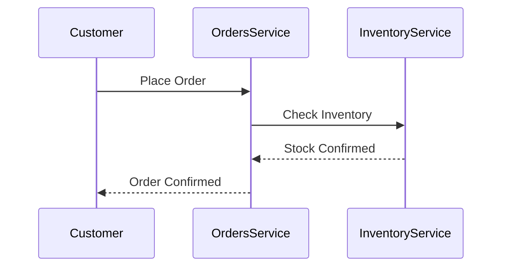

# Components and Features

EventCatalog provides built-in components and features you can use in any `.mdx` file to create rich, interactive documentation.

## Resource References (Wiki-style Links)

Use double square brackets to create inline links to any resource. These render as styled, interactive elements with hover tooltips showing resource details.

**Syntax:** `[[type|ResourceName]]`

| Resource Type | Syntax                           | Example                            |
| ------------- | -------------------------------- | ---------------------------------- |
| Service       | `[[service\|Name]]`              | `[[service\|OrdersService]]`       |
| Event         | `[[event\|Name]]`                | `[[event\|OrderCreated]]`          |
| Command       | `[[command\|Name]]`              | `[[command\|CreateOrder]]`         |
| Query         | `[[query\|Name]]`                | `[[query\|GetOrderStatus]]`        |
| Domain        | `[[domain\|Name]]`               | `[[domain\|E-Commerce]]`           |
| Flow          | `[[flow\|Name]]`                 | `[[flow\|PaymentFlow]]`            |
| Channel       | `[[channel\|Name]]`              | `[[channel\|OrderChannel]]`        |
| Entity        | `[[entity\|Name]]` or `[[Name]]` | `[[entity\|Order]]` or `[[Order]]` |
| Container     | `[[container\|Name]]`            | `[[container\|payments-db]]`       |
| User          | `[[user\|Name]]`                 | `[[user\|dboyne]]`                 |
| Team          | `[[team\|Name]]`                 | `[[team\|backend-team]]`           |
| Custom Doc    | `[[doc\|path]]`                  | `[[doc\|guides/getting-started]]`  |

**Version pinning:** `[[service|OrdersService@1.0.0]]` links to a specific version.

**Entity shorthand:** `[[Customer]]` resolves to `[[entity|Customer]]`.

**Example in context:**

```markdown
The [[service|OrdersService]] handles all order processing and publishes
[[event|OrderCreated]] when an order is placed. It integrates with
[[service|PaymentService]] for payment processing and writes to the
[[container|orders-db]] database.
```

Use resource references liberally in documentation body text to create a connected, navigable catalog.

---

## Mermaid Diagrams

EventCatalog supports Mermaid v11.x diagrams inline in any `.mdx` file.

### Code Block Approach

````markdown

````

### File-Based Loading

Place `.mmd` or `.mermaid` files alongside the `index.mdx` and load them:

```markdown
<MermaidFileLoader file="architecture.mmd" />
```

### Supported Diagram Types

- **Sequence diagrams** — show message flow between services
- **Class diagrams** — show data models and relationships
- **Entity Relationship diagrams** — show database schemas
- **Architecture diagrams** — show infrastructure with icons (supports 200,000+ icons from icones.js.org)

### Architecture Diagram with Icons

```mermaid
architecture-beta
    group api(logos:aws)

    service db(logos:aws-aurora)[Order DB] in api
    service disk1(logos:aws-s3)[Order Metadata] in api
    service server(logos:aws-lambda)[Order Handler] in api

    db:L -- R:server
    disk1:T -- B:server
```



Use when documenting service infrastructure. Icon packs must be configured in `eventcatalog.config.js`:

```javascript
mermaid: {
  iconPacks: ["logos"];
}
```

---

## Built-in Components

### `<NodeGraph />`

Renders an interactive architecture visualization showing the resource and its relationships (sends/receives, producers/consumers, read/write dependencies).

```markdown
<NodeGraph />
```

Props:

- `mode="full"` — expanded view showing all connections
- `search="false"` — hide search bar
- `legend="false"` — hide legend
- `title="My Title"` — custom title
- Can render a specific resource: `<NodeGraph id="Orders" version="0.0.3" type="domain" />`

**Use in:** Every resource type. This is the primary visualization component.

### `<Schema />` and `<SchemaViewer />`

Render schema files (JSON Schema, Avro, Protobuf, YAML).

```markdown
<!-- Raw schema display -->
<Schema file="schema.json" title="Order Schema" />

<!-- Interactive schema browser -->
<SchemaViewer file="schema.json" title="JSON Schema" maxHeight="500" showRequired="true" expand="true" search="true" />
```

Schema files must be in the same directory as the `index.mdx`.

**Use in:** Events, commands, queries — any resource with a schema.

### `<MessageTable />`

Renders a table of messages (events, commands, queries) that a service sends and receives.

```markdown
<MessageTable format="all" limit={4} />
```

**Use in:** Services and domains to show message summary.

### `<ChannelInformation />`

Renders channel metadata (protocols, delivery guarantee, parameters, routing).

```markdown
<ChannelInformation />
```

**Use in:** Channels only.

### `<Flow />`

Embeds a flow visualization from another flow resource into any page.

```markdown
<Flow id="CancelSubscription" version="latest" includeKey={false} mode="full" />
```

**Use in:** Domain or service pages to show related business flows.

### `<Tiles />` and `<Tile />`

Render clickable tile cards for navigation.

```markdown
<Tiles>
    <Tile icon="DocumentIcon" href="/docs/..." title="View changelog" description="See history" />
    <Tile icon="UserGroupIcon" href="/docs/teams/..." title="Contact team" description="Questions?" />
</Tiles>
```

**Use in:** Any resource to provide quick navigation to related pages.

### `<Steps />` and `<Step />`

Render numbered step-by-step instructions.

````markdown
<Steps title="How to connect">
  <Step title="Install the SDK">
    ```bash
    npm install my-sdk
    ```
  </Step>
  <Step title="Initialize the client">
    ```js
    const client = new Client({ apiKey: 'YOUR_KEY' });
    ```
  </Step>
</Steps>
````

**Use in:** Services to document how other teams can integrate.

### `<Tabs />` and `<TabItem />`

Render tabbed content for showing alternatives (e.g., code in multiple languages).

````markdown
<Tabs>
  <TabItem title="Python">
    ```python
    producer.send('topic', event_data)
    ```
  </TabItem>
  <TabItem title="TypeScript">
    ```typescript
    await producer.send({ topic: 'topic', messages: [{ value: data }] });
    ```
  </TabItem>
</Tabs>
````

**Use in:** Events and services to show multi-language code examples.

### `<Accordion />` and `<AccordionGroup />`

Collapsible content sections.

```markdown
<AccordionGroup>
  <Accordion title="How do I get access?">
    Submit a request via ServiceNow...
  </Accordion>
  <Accordion title="What about staging?">
    Use the staging connection string...
  </Accordion>
</AccordionGroup>
```

**Use in:** Containers, services — for FAQ-style content.

### `<ResourceLink />`

Creates a styled link to a resource (alternative to wiki-style references).

```markdown
<ResourceLink id="Orders" type="domain">Orders Domain</ResourceLink>
```

**Use in:** When you need more control over the link text than `[[type|name]]` provides.

### `<OpenAPI />`

Renders an OpenAPI/Swagger specification.

```markdown
<OpenAPI file="openapi.yml" />
```

**Use in:** Services with REST APIs.

---

## When to Use What

| Need                            | Component                            |
| ------------------------------- | ------------------------------------ |
| Show architecture relationships | `<NodeGraph />`                      |
| Link to another resource inline | `[[type\|Name]]` resource references |
| Show a schema                   | `<SchemaViewer />` or `<Schema />`   |
| Show infrastructure             | Mermaid architecture diagram         |
| Show message flow sequence      | Mermaid sequence diagram             |
| Show database schema            | Mermaid ER diagram or PlantUML       |
| List service messages           | `<MessageTable />`                   |
| Show channel details            | `<ChannelInformation />`             |
| Multi-language code examples    | `<Tabs />`                           |
| Step-by-step integration guide  | `<Steps />`                          |
| Embed a business flow           | `<Flow />`                           |
| Quick navigation cards          | `<Tiles />`                          |
