# Services

## Format

**File:** `index.mdx` inside a service folder
**Location:** `services/{ServiceName}/index.mdx` or `domains/{Domain}/services/{ServiceName}/index.mdx`

## Frontmatter Fields

| Field            | Required | Description                                                     |
| ---------------- | -------- | --------------------------------------------------------------- |
| `id`             | Yes      | Unique identifier, typically PascalCase (e.g., `OrdersService`) |
| `name`           | Yes      | Human-readable name                                             |
| `version`        | Yes      | Semver string (e.g., `0.0.1`)                                   |
| `summary`        | Yes      | 1-2 sentence description of the service                         |
| `owners`         | Yes      | Array of team or user IDs                                       |
| `sends`          | No       | Array of messages this service produces                         |
| `receives`       | No       | Array of messages this service consumes                         |
| `repository`     | No       | Object with `language` and `url`                                |
| `schemaPath`     | No       | Path to OpenAPI/AsyncAPI spec file                              |
| `specifications` | No       | Array of spec objects with `type`, `path`, `name`               |
| `writesTo`       | No       | Array of containers/databases the service writes to             |
| `readsFrom`      | No       | Array of containers/databases the service reads from            |
| `badges`         | No       | Array of badge objects                                          |
| `deprecated`     | No       | Object with `date` and `message` for deprecated services        |

## Channel Routing

Services can route messages through channels using `to` and `from` fields:

**Sending a message TO a channel:**

```yaml
sends:
  - id: OrderConfirmed
    to:
      - id: orders-domain-eventbus
```

**Receiving a message FROM a channel:**

```yaml
receives:
  - id: OrderConfirmed
    from:
      - id: inventory-service-filter-by-orders-over-100
```

**Sending to multiple channels:**

```yaml
sends:
  - id: OrderAmended
    to:
      - id: orders-domain-eventbus
      - id: analytics-eventbus
```

## Example 1: Service with Channel Routing

This is the recommended pattern for services with message routing through channels.

```mdx
---
id: OrdersService
version: 0.0.3
name: Orders Service
summary: |
  Service that handles orders
owners:
  - order-management
receives:
  - id: InventoryAdjusted
    version: 1.x
    from:
      - id: orders-service-sqs-channel
writesTo:
  - id: orders-db
    version: 0.0.1
  - id: order-metadata-store
    version: 0.0.1
readsFrom:
  - id: orders-db
  - id: inventory-readmodel
  - id: order-metadata-store
sends:
  - id: OrderAmended
    to:
      - id: orders-domain-eventbus
  - id: OrderCancelled
    to:
      - id: orders-domain-eventbus
  - id: OrderConfirmed
    to:
      - id: orders-domain-eventbus
repository:
  language: JavaScript
  url: "https://github.com/event-catalog/pretend-shipping-service"
schemaPath: openapi-v1.yml
specifications:
  - type: asyncapi
    path: order-service-asyncapi.yaml
    name: AsyncAPI
  - type: openapi
    path: openapi-v1.yml
    name: v1 API
---

## Overview

The Orders Service is responsible for managing customer orders within the system. It handles order creation, updating, status tracking, and interactions with other services such as [[service|InventoryService]], [[service|PaymentService]], and [[service|NotificationService]] to ensure smooth order processing and fulfillment.

### Core features

| Feature               | Description                                                     |
| --------------------- | --------------------------------------------------------------- | ----------------------- | ----------------------------- | ----------------------- |
| Order Management      | Handles order creation, updates, and status tracking            |
| Inventory Integration | Validates and processes inventory, receives [[event             | InventoryAdjusted]]     |
| Payment Processing    | Integrates with payment gateways to handle payment transactions |
| Event Publishing      | Publishes [[event                                               | OrderAmended]], [[event | OrderCancelled]], and [[event | OrderConfirmed]] events |

## Architecture diagram

<NodeGraph />

<MessageTable format="all" limit={4} />
```

## Example 2: Service with Infrastructure Details

````mdx
---
id: InventoryService
version: 0.0.2
name: Inventory Service
summary: |
  Service that handles the inventory
owners:
  - order-management
receives:
  - id: UserSignedUp
  - id: OrderConfirmed
    from:
      - id: inventory-service-filter-by-orders-over-100
  - id: OrderAmended
    from:
      - id: orders-domain-eventbus
  - id: UpdateInventory
  - id: AddInventory
  - id: DeleteInventory
sends:
  - id: InventoryAdjusted
    version: 1.0.0
    to:
      - id: orders-domain-eventbus
  - id: OutOfStock
    to:
      - id: orders-domain-eventbus
writesTo:
  - id: inventory-db
    version: 0.0.1
  - id: inventory-readmodel
    version: 0.0.1
readsFrom:
  - id: inventory-db
    version: 0.0.1
  - id: inventory-readmodel
    version: 0.0.1
repository:
  language: JavaScript
  url: "https://github.com/event-catalog/pretend-shipping-service"
---

## Overview

The Inventory Service manages real-time stock levels across all warehouse locations. It listens for order events to decrement stock and processes inventory commands to add new stock.

## Core features

| Feature                  | Description                                                              |
| ------------------------ | ------------------------------------------------------------------------ |
| Real-time Stock Tracking | Monitors inventory levels across all warehouses in real-time             |
| Automated Reordering     | Triggers purchase orders when stock levels fall below defined thresholds |
| Multi-warehouse Support  | Manages inventory across multiple warehouse locations                    |

## Architecture diagram

<NodeGraph />

<MessageTable format="all" limit={4} />

## Infrastructure

```mermaid
architecture-beta
    group api(logos:aws)

    service db(logos:aws-aurora)[Inventory DB] in api
    service disk1(logos:aws-s3)[Inventory Metadata] in api
    service server(logos:aws-lambda)[Inventory Handler] in api

    db:L -- R:server
    disk1:T -- B:server
```


````

```

## Key Conventions

- Use `[[service|ServiceName]]` syntax to link to other services in the body
- Use `[[event|EventName]]` syntax to link to events
- Use `[[domain|DomainName]]` syntax to link to domains
- Use `[[entity|EntityName]]` syntax to link to entities
- Include `<NodeGraph />` for architecture visualization
- Include `<MessageTable />` to show sends/receives in a table
- Version references in `sends`/`receives` can use semver ranges like `1.x`
```
