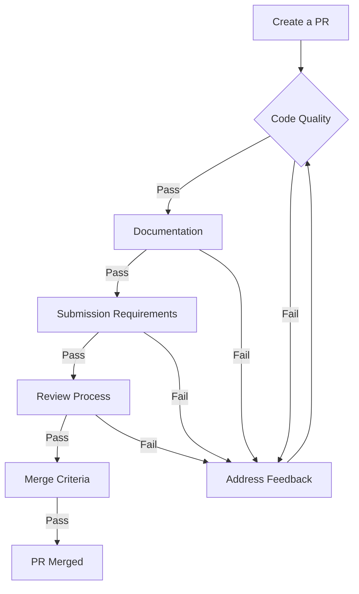

# Contributing to BookWorm

Thank you for your interest in contributing to BookWorm! This document provides guidelines for contributing to the project.

# Getting Started

1. **Fork the Repository**: Start by forking the main BookWorm repository.
2. **Clone Your Fork**: git clone `https://github.com/YOUR-USERNAME/BookWorm.git`
3. **Add Upstream Remote**: git remote add upstream `https://github.com/ORIGINAL-OWNER/BookWorm.git`
4. **Auto LFE**: Ensure your Git configuration is set to handle line endings correctly:
   ```bash
   git config --global core.autocrlf input
   ```

# Development Workflow

1. **Create a Branch**: `git checkout -b feature/your-feature-name`
2. **Make Changes**: Follow the coding conventions described below
3. **Commit Changes**: Use descriptive commit messages
4. **Push to Your Fork**: `git push origin feature/your-feature-name`
5. **Create a Pull Request**: Submit your changes for review

For the branching strategy, please refer to the [Git Flow](https://nvie.com/posts/a-successful-git-branching-model/) model.

# Coding Standards

- Follow DDD (Domain-Driven Design) principles
- Use the latest C# features and idioms
- Implement unit tests for all business logic
- Maintain service boundaries - avoid direct cross-service dependencies
- Use spaces for indentation (4 spaces per level, 2 spaces for csproj files)
- Prefer explicit type declarations when type isn't obvious
- Use primary constructors for classes with immutable properties
- Use expression-bodied members when appropriate

Example:

```csharp
public sealed class Book
{
   public string Title { get; private set; }
   public string Author { get; private set; }

   public Book(string title, string author)
   {
      Title = !string.IsNullOrWhiteSpace(title)
         ? title
         : throw new CatalogDomainException("Title cannot be empty.");
      Author = !string.IsNullOrWhiteSpace(author)
         ? author
         : throw new CatalogDomainException("Author cannot be empty.");
   }
}

public sealed class BookService
{
   public Book GetBook(string title, string author) => new Book(title, author);
}
```

# Integration Events Standards

When working with integration events for cross-service communication:

- Always use the `BookWorm.Contracts` namespace when declaring integration events
- Follow the naming convention `[Action][Entity]IntegrationEvent` (e.g., `BookCreatedIntegrationEvent`)
- Include only necessary data in integration events to minimize payload size
- Implement proper serialization attributes for all event properties

> [!CAUTION]
> Do not modify namespaces for `Integration Events` as it will disrupt the messaging system. The event bus relies on consistent namespace conventions for proper routing.

```csharp
namespace BookWorm.Contracts;

public sealed record UserCheckedOutIntegrationEvent(
   Guid OrderId,
   Guid BasketId,
   string? Email,
   decimal TotalMoney
) : IntegrationEvent;
```

# Design Patterns

- Use CQRS with MediatR when applicable
- Repository pattern for data access
- Domain Events for cross-service communication
- Avoid circular dependencies between services
- Keep services independently deployable
- Use Value Objects for immutable types
- Use Domain Events for side effects
- Use Domain Services for complex business logic
- Use Factories or Builders for object creation
- Use Specification pattern for complex queries

# Testing Guidelines

## Core Testing Principles

- **100% Business Logic Coverage**: Write unit tests for all domain and business logic components
- **Descriptive Test Names**: Use the `Given_When_Then` pattern for test naming (e.g., `Given_ValidBook_When_AddingToLibrary_Then_SuccessReturned`)
- **Isolation**: Mock all external dependencies including repositories, services, and infrastructure components
- **Comprehensive Scenarios**: Test both happy paths and edge cases, including validation failures and exception handling

## Test Organization

- Group tests by feature or domain entity
- Create separate test fixtures for different testing scenarios
- Use appropriate test attributes for categorization

## Test Quality

- Aim for high code coverage in domain logic (minimum 80%)
- Avoid testing implementation details; focus on behaviors
- Write deterministic tests that don't depend on environment or timing
- Keep tests fast, independent, and repeatable

## Tools and Resources

- Use xUnit for testing framework
- Utilize Moq or NSubstitute for mocking dependencies
- For automated test generation, refer to our [GitHub Copilot test prompts](./prompts/unit-test.prompt.md)

# Pull Request Process

## Pull Request Process

1. **Code Quality**:

   - Follow BookWorm's coding standards and conventions
   - Include comprehensive unit tests for new features and changes
   - Ensure all existing and new tests pass locally before submitting

2. **Documentation**:

   - Update relevant documentation when changing functionality
   - Add code comments for complex logic where necessary
   - Include clear examples for API changes

3. **Submission Requirements**:

   - Link related issues in your PR description using keywords (Fixes #123)
   - Provide a concise description of changes and their purpose
   - Ensure your PR passes all CI/CD pipeline checks, SonarQube analysis, and Snyk security scans

4. **Review Process**:

   - Request reviews from project maintainers
   - Address reviewer feedback promptly
   - Be prepared to make additional changes if requested

5. **Merge Criteria**:
   - PRs require approval from at least one maintainer
   - All automated checks must pass
   - No merge conflicts with the target branch

Here is flowchart of the PR process:



# Need Help?

If you have questions or need assistance, please:

- Check existing issues
- Create a new issue with a detailed description of your problem
- Reach out to the maintainers

Thank you for contributing to BookWorm!
