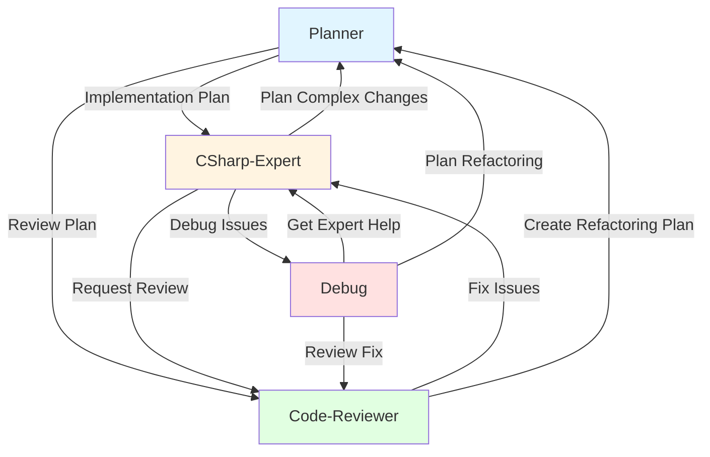
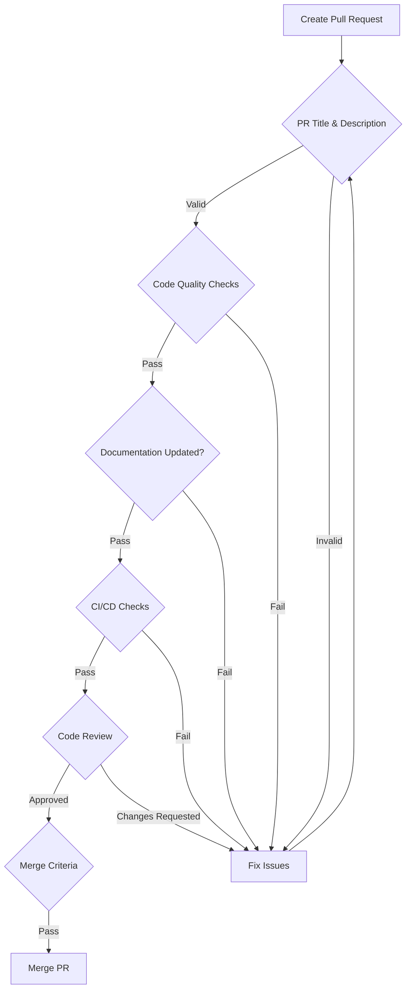

# Contributing to BookWorm

🎉 Thank you for your interest in contributing to BookWorm!

BookWorm is a cloud-native microservices application showcasing .NET Aspire, Domain-Driven Design, and AI integration. We welcome contributions of all kinds: bug fixes, features, documentation improvements, and more.

Whether you're a first-time contributor or an experienced developer, this guide will help you get started. Please follow these guidelines to ensure a smooth contribution process and maintain code quality across the project.

## Table of Contents

- [Contributing to BookWorm](#contributing-to-bookworm)
  - [Table of Contents](#table-of-contents)
  - [Getting Started](#getting-started)
  - [Development Workflow](#development-workflow)
  - [Agent Workflow](#agent-workflow)
    - [Available Agents](#available-agents)
    - [Agent Collaboration Workflow](#agent-collaboration-workflow)
    - [Typical Workflows](#typical-workflows)
    - [Using Agents in Your Workflow](#using-agents-in-your-workflow)
  - [Coding Standards](#coding-standards)
  - [Integration Events Standards](#integration-events-standards)
  - [Protocol Buffers (Proto) Schema Standards](#protocol-buffers-proto-schema-standards)
  - [Design Patterns](#design-patterns)
  - [Testing Guidelines](#testing-guidelines)
    - [Core Testing Principles](#core-testing-principles)
    - [Test Organization](#test-organization)
    - [Test Quality](#test-quality)
    - [Tools and Resources](#tools-and-resources)
  - [Pull Request Process](#pull-request-process)
  - [Need Help?](#need-help)
    - [Getting Support](#getting-support)
    - [Response Times](#response-times)
    - [Community Guidelines](#community-guidelines)

## Getting Started

1. **Fork the Repository**: Start by forking the main BookWorm repository.
2. **Clone Your Fork**:

   ```bash
   git clone https://github.com/YOUR-USERNAME/BookWorm.git
   cd BookWorm
   ```

3. **Add Upstream Remote**:

   ```bash
   git remote add upstream https://github.com/foxminchan/BookWorm.git
   ```

4. **Configure Line Endings**: Ensure consistent line endings across different operating systems:
   ```bash
   git config --global core.autocrlf input
   ```
5. **Review Project Guide**: See [AGENTS.md](../AGENTS.md) for detailed setup instructions, prerequisites, and project architecture overview.

## Development Workflow

1. **Create a Branch**: `git checkout -b feature/your-feature-name`
2. **Make Changes**: Follow the coding conventions described below
3. **Commit Changes**: Use descriptive commit messages following [Conventional Commits](https://www.conventionalcommits.org/):
   - `feat:` for new features
   - `fix:` for bug fixes
   - `docs:` for documentation changes
   - `refactor:` for code refactoring
   - `test:` for test additions or modifications
   - `chore:` for maintenance tasks
4. **Push to Your Fork**: `git push origin feature/your-feature-name`
5. **Create a Pull Request**: Submit your changes for review. Use a Conventional Commits-style title (e.g., `feat: add book search endpoint`) and fill out the [PR template](./pull_request_template.md) completely

For the branching strategy, please refer to the [Git Flow](https://nvie.com/posts/a-successful-git-branching-model/) model.

## Agent Workflow

BookWorm includes AI agents to assist with development tasks. These agents work collaboratively through a structured handoff system:

### Available Agents

1. **CSharp-Expert** - Assists with C#/.NET development tasks
   - Provides clean, well-designed code following .NET conventions
   - Covers security, design patterns, SOLID principles
   - Helps with async programming, performance optimization

2. **Debug** - Systematic debugging and bug resolution
   - Identifies and analyzes bugs methodically
   - Implements targeted fixes with verification
   - Ensures no regressions through comprehensive testing

3. **Planner** - Creates implementation plans for features/refactoring
   - Generates detailed implementation plans
   - Breaks down complex tasks into actionable steps
   - Documents requirements and testing strategies

4. **Code-Reviewer** - Reviews code for quality and security
   - Performs systematic code quality reviews
   - Checks security vulnerabilities and best practices
   - Validates architecture and Aspire-specific patterns

### Agent Collaboration Workflow

The agents collaborate through handoffs to provide comprehensive development support:



### Typical Workflows

**Feature Development:**

1. Start with **Planner** to create implementation plan
2. Hand off to **CSharp-Expert** for implementation
3. Use **Code-Reviewer** to validate changes
4. Use **Debug** if issues arise

**Bug Fixing:**

1. Start with **Debug** to identify and fix bugs
2. Hand off to **CSharp-Expert** for complex solutions
3. Use **Code-Reviewer** to review the fix
4. Use **Planner** if architectural changes needed

**Code Review:**

1. Start with **Code-Reviewer** for systematic review
2. Hand off to **CSharp-Expert** to address issues
3. Use **Planner** for major refactoring recommendations

### Using Agents in Your Workflow

- Agents are available in the `.github/agents/` directory
- Each agent has specific expertise and tools
- Agents can hand off work to other agents based on task requirements
- Follow agent recommendations for maintaining code quality and consistency

> [!TIP]
> When working on complex features, start with the **Planner** agent to create a comprehensive implementation plan before coding.

## Coding Standards

- Follow DDD (Domain-Driven Design) principles
- Use the latest C# features and idioms
- Implement unit tests for all business logic
- Maintain service boundaries - avoid direct cross-service dependencies
- Follow `.editorconfig` settings for code formatting
- Prefer explicit type declarations when type isn't obvious
- Use primary constructors for classes with immutable properties
- Use expression-bodied members when appropriate

Example:

```csharp
public sealed class Book
{
   public string Title { get; private set; }
   public string Author { get; private set; }

   public Book(string title, string author)
   {
      Title = !string.IsNullOrWhiteSpace(title)
         ? title
         : throw new CatalogDomainException("Title cannot be empty.");
      Author = !string.IsNullOrWhiteSpace(author)
         ? author
         : throw new CatalogDomainException("Author cannot be empty.");
   }
}

public sealed class BookService
{
   public Book GetBook(string title, string author) => new Book(title, author);
}
```

## Integration Events Standards

When working with integration events for cross-service communication:

- Always use the `BookWorm.Contracts` namespace when declaring integration events
- Follow the naming convention `[Action][Entity]IntegrationEvent` (e.g., `BookCreatedIntegrationEvent`)
- Include only necessary data in integration events to minimize payload size
- Implement proper serialization attributes for all event properties

> [!CAUTION]
> Do not modify namespaces for `Integration Events` as it will disrupt the messaging system. The event bus relies on consistent namespace conventions for proper routing.

```csharp
namespace BookWorm.Contracts;

public sealed record UserCheckedOutIntegrationEvent(
   Guid OrderId,
   Guid BasketId,
   string? Email,
   decimal TotalMoney
) : IntegrationEvent;
```

## Protocol Buffers (Proto) Schema Standards

When modifying Protocol Buffers schema files (`.proto` files), you must run the following Buf commands to ensure schema validity and compatibility:

1. **Lint the schema**: Validates that your proto files follow best practices and conventions

   ```bash
   buf lint
   ```

2. **Check for breaking changes**: Ensures backward compatibility with the locked schema

   ```bash
   buf breaking --against lock.binpb
   ```

3. **Update the lock file**: After validation, rebuild and update the schema lock file
   ```bash
   buf build -o lock.binpb
   ```

> [!IMPORTANT]
> All three commands must pass successfully before submitting a PR with proto schema changes. Breaking changes require careful coordination and migration planning.

**Workflow for Proto Changes:**

1. Modify your `.proto` files
2. Run `buf lint` to check for style and best practice violations
3. Run `buf breaking --against lock.binpb` to verify backward compatibility
4. If checks pass, run `buf build -o lock.binpb` to update the lock file
5. Commit both the `.proto` changes and the updated `lock.binpb` file

## Design Patterns

- Use CQRS with Mediator when applicable
- Repository pattern for data access
- Domain Events for cross-service communication
- Avoid circular dependencies between services
- Keep services independently deployable
- Use Value Objects for immutable types
- Use Domain Events for side effects
- Use Domain Services for complex business logic
- Use Factories or Builders for object creation
- Use Specification pattern for complex queries

## Testing Guidelines

### Core Testing Principles

- **100% Business Logic Coverage**: Write unit tests for all domain and business logic components
- **Descriptive Test Names**: Use the `GivenCondition_WhenAction_ThenExpectedResult` pattern for test naming (e.g., `GivenValidBook_WhenAddingToLibrary_ThenSuccessReturned`)
- **Isolation**: Mock all external dependencies including repositories, services, and infrastructure components
- **Comprehensive Scenarios**: Test both happy paths and edge cases, including validation failures and exception handling

### Test Organization

- Group tests by feature or domain entity
- Create separate test fixtures for different testing scenarios
- Use appropriate test attributes for categorization

### Test Quality

- Aim for high code coverage in domain logic (minimum 80%)
- Follow TUnit conventions for test methods and classes
- Avoid testing implementation details; focus on behaviors
- Write deterministic tests that don't depend on environment or timing
- Keep tests fast, independent, and repeatable
- Use descriptive test names that clearly indicate what is being tested
- Ensure tests are isolated and don't share state

### Tools and Resources

- **Testing Framework**: Use **TUnit** (not xUnit/NUnit/MSTest)
- **Mocking**: Utilize Moq for mocking dependencies
- **Assertions**: Use Shouldly for fluent assertions
- **Snapshot Testing**: Use Verify.TUnit for snapshot tests
- **Architecture Tests**: Use ArchUnitNET.TUnit in `tests/BookWorm.ArchTests/`
- **Coverage**: Microsoft.Testing.Extensions.CodeCoverage for test coverage reports
- **Integration Tests**: Use Aspire.Hosting.Testing for service integration tests
- For automated test generation, refer to our [GitHub Copilot test prompts](./prompts/unit-test.prompt.md)

## Pull Request Process

1. **PR Title**:
   - Use [Conventional Commits](https://www.conventionalcommits.org/) format: `<type>: <description>` (e.g., `feat: add book search endpoint`)
   - Valid types: `feat`, `fix`, `docs`, `refactor`, `test`, `chore`
   - Keep the description clear and concise

2. **PR Description**:
   - Fill out the [PR template](./pull_request_template.md) completely
   - Summarize proposed changes and their purpose
   - Select the appropriate type of change
   - Complete all checklist items (check off or explain why not applicable)
   - Link related issues using keywords (e.g., `Fixes #123`)

3. **Code Quality**:
   - Follow BookWorm's coding standards and conventions
   - Include comprehensive unit tests for new features and changes
   - Ensure all existing and new tests pass locally before submitting

4. **Documentation**:
   - Update relevant documentation when changing functionality
   - Add code comments for complex logic where necessary
   - Include clear examples for API changes

5. **CI/CD**:
   - Ensure your PR passes all CI/CD pipeline checks, SonarQube analysis, and Snyk security scans

6. **Review Process**:
   - Request reviews from project maintainers
   - Address reviewer feedback promptly
   - Be prepared to make additional changes if requested

7. **Merge Criteria**:
   - PRs require approval from at least one maintainer
   - All automated checks must pass
   - No merge conflicts with the target branch

Here is flowchart of the PR process:



## Need Help?

### Getting Support

We're here to help! If you have questions or need assistance:

- 📖 **Documentation**: Start with [AGENTS.md](../AGENTS.md) and the [project README](../README.md)
- 🐛 **Bug Reports**: [Create a bug report](https://github.com/foxminchan/BookWorm/issues/new?template=bug-report.yml)
- 💡 **Feature Requests**: [Submit a feature request](https://github.com/foxminchan/BookWorm/issues/new?template=feature-request.yml)
- 👥 **Maintainers**: Reach out via GitHub issues

### Response Times

This is an open-source project maintained by volunteers. Please be patient:

- Bug reports: We aim to respond within 48-72 hours
- Feature requests: May take longer to evaluate and implement
- Pull requests: We'll review as soon as possible, usually within a week

### Community Guidelines

When seeking help or contributing:

- ✅ Be respectful and constructive
- ✅ Provide detailed information about your issue
- ✅ Search for existing solutions before asking
- ✅ Follow up if you find a solution
- ❌ Don't demand immediate responses
- ❌ Don't post duplicate issues

Thank you for contributing to BookWorm! 🚀
