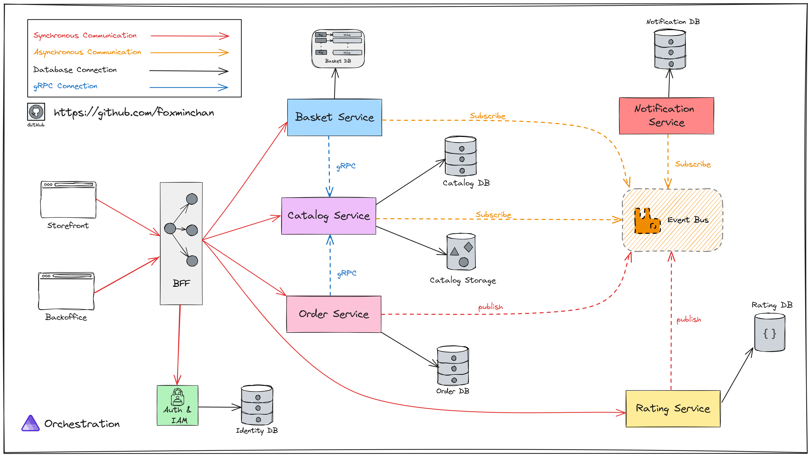

# BookStore: The practical .NET Aspire

## Introduction

<p align="justify">
⭐ This is a pet project to demonstrate the practical use of .NET Aspire. The project is a cloud-native application with applying Domain-Driven Design (DDD) and Vertical Slice Methodology to organize the codebase.
</p>

<div>
  <a href="https://codespaces.new/foxminchan/BookWorm?quickstart=1">
    
  </a>
</div>

## The Goals of the Project

- [x] Building a cloud-native application with .NET Aspire
- [x] Using `Vertical Slice Architecture` to organize the codebase
- [x] Using `Domain-Driven Design` to design the domain model
- [x] Implement the `CQRS` pattern with `MediatR`
- [x] Using `RabbitMQ` on top `MassTransit` for messaging
- [x] Using `gRPC` for inter-service communication
- [x] API versioning
- [x] Health checks
- [x] OpenAPI/Swagger
- [x] AuthN/AuthZ with `Duende IdentityServer`
- [x] Observability with `.NET Aspire`
- [x] Add `MailDev` for local email testing
- [ ] CI/CD with `Azure DevOps`
- [ ] Testing
  - [ ] Service unit tests
  - [ ] Integration tests with `Aspire Testing` & `WireMock`
- [ ] Output Caching, Response Caching and Distributed Caching with Redis
- [ ] Deployment with `Aspirate` on `k3d`
- [ ] EDA document with `EventCatalog`

## Domain Business & Bounded Contexts - Services Boundaries

- **Catalog**: Display books with pagination and search functionality.
- **Shopping Cart**: Add books to the shopping cart and place an order.
- **Order**: Display orders with pagination and search functionality.
- **Identity**: Register, login, and manage user profile.
- **Notification**: Send email notifications.
- **Rating**: Rate products.



## How to run the project

### Prerequisites

- [.NET 8.0 SDK](https://dotnet.microsoft.com/download/dotnet/8.0)
- [Docker](https://www.docker.com/products/docker-desktop)
- [Gitleaks](https://gitleaks.io/)

### Setting up user secrets

1. Open a terminal
2. Run the following command to set the user secrets for the `BookWorm.AppHost` project

```bash
dotnet user-secrets set "Parameters:SqlUser" "postgres"
dotnet user-secrets set "Parameters:SqlPassword" "yourcomplexpassword"
dotnet user-secrets set "ConnectionStrings:openai" "Key=yourapikey"
```

> [!NOTE]
> You need and OpenAI API key to run the project. You can get one [here](https://platform.openai.com/).

### Running the project

1. Clone the repository

```bash
git clone git@github.com:foxminchan/BookWorm.git
```

2. Run the project

```bash
dotnet run --project src/BookWorm.AppHost/BookWorm.AppHost.csproj
```

> [!NOTE]
> Ensure that you have Docker running on your machine.

## Contributing

- Fork the repository
- Create a new branch for your feature
- Make your changes
- Create a pull request

## License

This project is licensed under the MIT License - see the [LICENSE](LICENSE) file for details.
