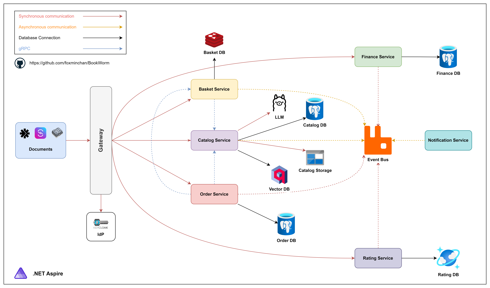

# BookWorm: A Practical .NET Aspire Application

## Introduction

<p align="justify">
⭐ BookWorm demonstrates the practical implementation of .NET Aspire in a cloud-native application. The project employs Domain-Driven Design (DDD) and Vertical Slice Architecture to organize the codebase effectively.
</p>

<div>
  <a href="https://codespaces.new/foxminchan/BookWorm?quickstart=1">
    
  </a>
</div>

## Project Goals

- [x] Build a cloud-native application with `.NET Aspire`
- [x] Implement `Vertical Slice Architecture` for codebase organization
- [x] Apply `Domain-Driven Design` principles
- [x] Implement `CQRS` pattern with `MediatR`
- [x] Utilize `RabbitMQ` with `MassTransit` for messaging
- [x] Implement `gRPC` for service-to-service communication
- [x] Implement `Saga` patterns (Orchestration & Choreography) with `MassTransit`
- [x] Implement `Event Sourcing`
- [x] Implement `Outbox Pattern` and `Inbox Pattern` for messaging
- [x] Support API versioning
- [x] Implement comprehensive health checks
- [x] Provide `OpenAPI/Scalar` documentation
- [x] Enable feature flags to control application behavior
- [x] Implement AuthN/AuthZ with `Keycloak`
- [x] Enable observability with `.NET Aspire`
- [x] Integrate `Mailpit` for local email testing
- [x] Integrate with `DeepSeek R1` & `Nomic Embed Text`
  - [x] Text embedding with `Nomic Embed Text`
  - [x] Support hybrid search with `Qdrant`
  - [x] Chatbot integration with `DeepSeek R1`
- [x] Create EDA documentation with `EventCatalog` and `AsyncAPI`
- [x] Configure CI/CD with `GitHub Actions`
- [x] Deploy with `Aspirate` on `k3d`
- [x] Implement testing strategy
  - [x] Service unit tests
  - [ ] Integration tests
- [ ] Create StoreFront & BackOffice with `Blazor`

## Project Architecture

BookWorm is structured as a microservices-based application with the following services:

- **Catalog**: Book inventory management with search and pagination
- **Basket**: Shopping cart functionality
- **Ordering**: Order processing and fulfillment
- **Identity**: User authentication and profile management
- **Notification**: Email notification services (Worker Service)
- **Rating**: Book review and rating system
- **Finance**: Orchestration service for basket reservation and order processing



## Getting Started

### Prerequisites

- A device with an Nvidia GPU
- [.NET 9.0 SDK](https://dotnet.microsoft.com/download/dotnet/9.0)
- [Gitleaks](https://gitleaks.io/)
- [Docker](https://www.docker.com/get-started) or [Podman](https://podman-desktop.io/)
- [k3d](https://k3d.io/) & [k9s](https://k9scli.io/)

> [!NOTE]
> In this project, we use [DeepSeek R1](https://ollama.com/library/deepseek-r1) & [Nomic Embed Text](https://ollama.com/library/nomic-embed-text). So, you need to have an Nvidia GPU to run the application.
>
> In Production, we use [SendGrid](https://sendgrid.com/) for email services. But, for local development, we use [Mailpit](https://mailpit.io/).

### Configure User Secrets

```bash
dotnet user-secrets set "Parameters:sql-user" "postgres"
dotnet user-secrets set "Parameters:sql-password" "postgres"
```

### Run the Application

1. Clone the repository

   ```bash
   git clone git@github.com:foxminchan/BookWorm.git
   ```

2. Change directory to the repository

   ```bash
   cd BookWorm
   ```

3. Restore the dependencies

   ```bash
   dotnet restore && dotnet tool restore
   ```

4. Start the application
   ```bash
   dotnet run --project src/BookWorm.AppHost/BookWorm.AppHost.csproj
   ```

> [!WARNING]
> Docker must be running on your machine before starting the application.

### Deploy the Application

- Deploy to `AKS`:

  ```bash
  bash ./deploys/scripts/deploy.sh
  ```

- Deploy to `k3d`:

  ```bash
  dotnet aspire apply --non-interactive -p ./src/BookWorm.AppHost
  ```

> [!NOTE]
> Make sure you have created a `k3d` cluster before deploying the application.

## Contributing

1. Fork the repository
2. Create a feature branch
3. Implement your changes
4. Submit a pull request

> [!CAUTION]
> Do not modify namespaces for `Integration Events` as it will disrupt the messaging system.

## License

This project is licensed under the MIT License - see the [LICENSE](LICENSE) file for details.
