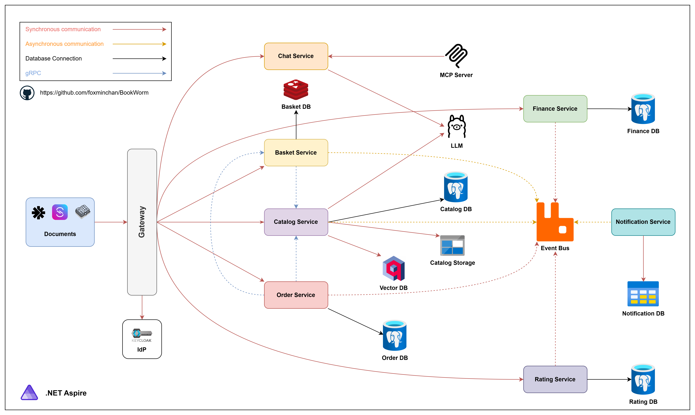

[](https://github.com/foxminchan/BookWorm/actions/workflows/ci.yaml)
[](https://sonarcloud.io/summary/new_code?id=foxminchan_BookWorm)
[](https://sonarcloud.io/summary/new_code?id=foxminchan_BookWorm)

# 📖 BookWorm: A Practical .NET Aspire Application

## Introduction

<p align="justify">
⭐ BookWorm demonstrates the practical implementation of .NET Aspire in a cloud-native application. The project employs Domain-Driven Design (DDD) and Vertical Slice Architecture to organize the codebase effectively.
</p>

<div>
  <a href="https://codespaces.new/foxminchan/BookWorm?quickstart=1">
    
  </a>
</div>

## Project Goals

- [x] Developed a cloud-native application using .NET Aspire
- [x] Implemented Vertical Slice Architecture with Domain-Driven Design & CQRS
- [x] Enabled service-to-service communication with gRPC
- [x] Incorporated various microservices patterns
  - [x] Utilized outbox and inbox patterns to manage commands and events
  - [x] Implemented saga patterns for orchestration and choreography
  - [x] Integrated event sourcing for storing domain events
  - [x] Implemented a microservices chassis for cross-cutting concerns and service infrastructure
- [x] Implemented API versioning and feature flags for flexible application management
- [x] Set up AuthN/AuthZ with Keycloak
- [x] Implemented caching with HybridCache
- [x] Incorporated AI components:
  - [x] Text embedding with Nomic Embed Text
  - [x] Integrated a chatbot using Gemma 3
  - [x] Standardized AI tools with MCP Tools
- [x] Configured CI/CD with GitHub Actions
- [x] Created comprehensive documentation:
  - [x] Used OpenAPI for REST API & AsyncAPI for event-driven endpoints
  - [x] Utilized EventCatalog for centralized architecture documentation
- [x] Established a testing strategy:
  - [x] Conducted service unit tests
  - [x] Established architecture testing strategy
  - [x] Performed load testing with k6 (see [testing suite](./src/Aspire/BookWorm.AppHost/Container/k6/README.md))
  - [ ] Planned integration tests

## Project Architecture



## Getting Started

### Prerequisites

- [.NET 9.0 SDK](https://dotnet.microsoft.com/download/dotnet/9.0)
- [Gitleaks](https://gitleaks.io/)
- [Docker](https://www.docker.com/get-started) or [Podman](https://podman-desktop.io/)

### System Requirements

> [!IMPORTANT]
>
> AI components require an **Nvidia GPU** for local development. Email services use [SendGrid](https://sendgrid.com/) in production and [Mailpit](https://mailpit.axllent.org/) locally.

### Run the Application

1. Clone the repository

   ```bash
   git clone git@github.com:foxminchan/BookWorm.git
   ```

2. Change directory to the repository

   ```bash
   cd BookWorm
   ```

3. Run the application

   ```bash
   make run
   ```

> [!WARNING]
> Docker or Podman must be running on your machine before starting the application.

### Deploy the application

For detailed deployment instructions, please consult the [deployment guide](./deploys/README.md).

### Event-Driven Architecture

Explore our [event catalog](https://bookwormdev.netlify.app/) for messaging patterns and API details.

## Documentation

### Architecture Documentation

BookWorm includes comprehensive architecture documentation using the [arc42 template](https://arc42.org) and [DocFX](https://dotnet.github.io/docfx/).

#### Building Documentation Locally

1. **Prerequisites**: Ensure DocFX is installed globally
   ```bash
   dotnet tool install --global docfx
   ```

2. **Build Documentation**:
   ```bash
   # On Linux/macOS
   cd docs
   ./build.sh
   
   # On Windows
   cd docs
   build.cmd
   ```

3. **Serve Documentation Locally**:
   ```bash
   # On Linux/macOS
   ./serve.sh
   
   # On Windows
   serve.cmd
   ```

4. **View Documentation**: Open http://localhost:8080 in your browser

The architecture documentation includes:
- Introduction and Goals
- Architecture Constraints  
- System Scope and Context
- Solution Strategy
- Building Block View
- Runtime View
- Deployment View
- Cross-cutting Concepts
- Architecture Decisions
- Quality Requirements
- Risks and Technical Debt
- Glossary

## Contributing

Contributions are welcome! Please read the [contribution guidelines](./.github/CONTRIBUTING.md) and [code of conduct](./.github/CODE-OF-CONDUCT.md) to learn how to participate.

## Support

- If you like this project, please give it a ⭐ star.
- If you have any issues or feature requests, please [create an issue](https://github.com/foxminchan/BookWorm/issues/new/choose).

## License

This project is licensed under the MIT License - see the [LICENSE](LICENSE) file for details.
