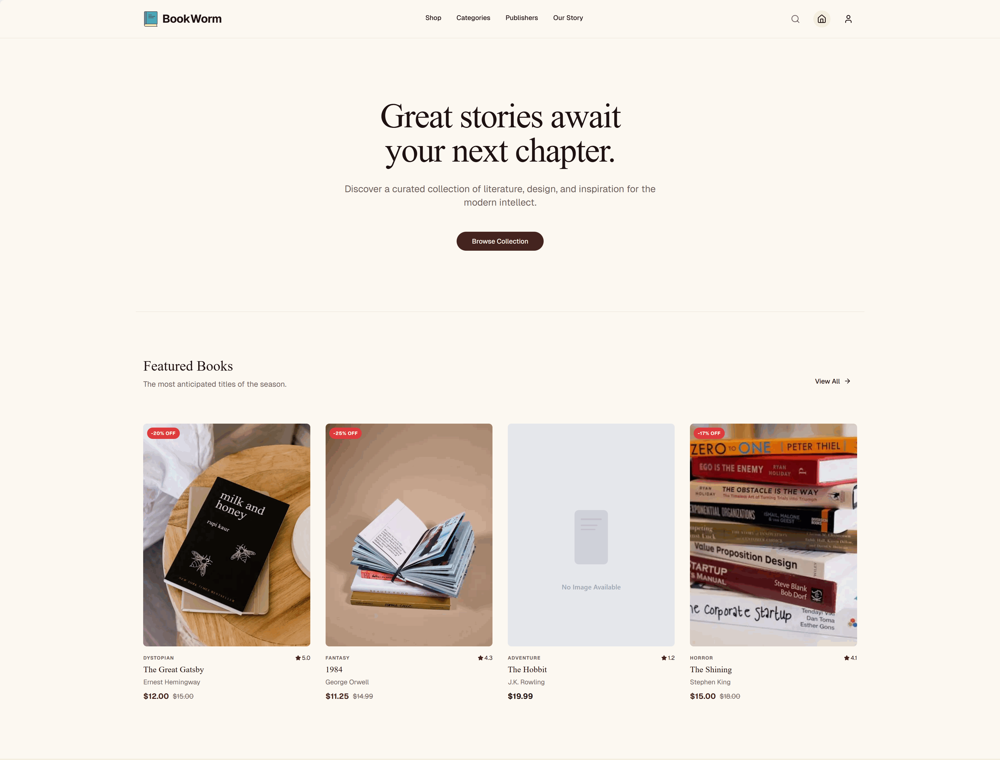
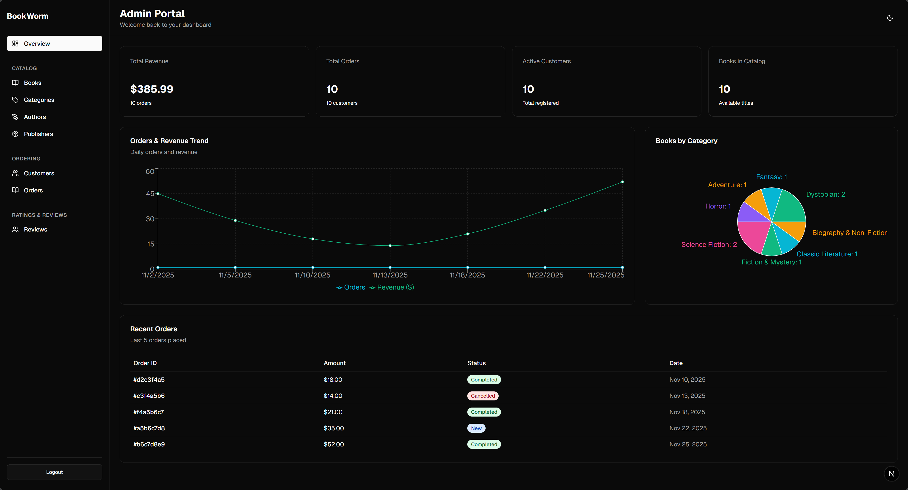
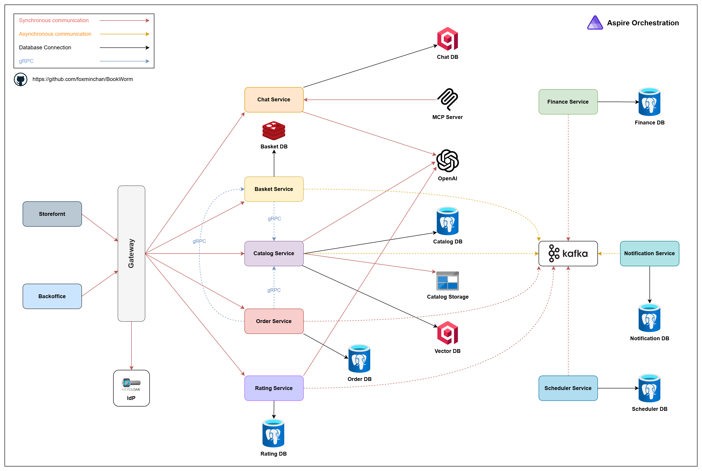

[](https://foxminchan.github.io/BookWorm/)

# BookWorm

[](https://slsa.dev)
[](https://scorecard.dev/viewer/?uri=github.com/foxminchan/BookWorm)

[](https://sonarcloud.io/summary/new_code?id=foxminchan_BookWorm)
[](https://sonarcloud.io/summary/new_code?id=foxminchan_BookWorm)

[](https://github.com/foxminchan/BookWorm/actions/workflows/backend-ci.yml)
[](https://github.com/foxminchan/BookWorm/actions/workflows/frontend-ci.yml)
[](https://github.com/foxminchan/BookWorm/actions/workflows/keycloak-ci.yml)

<div>
  <a href="https://codespaces.new/foxminchan/BookWorm?quickstart=1" target="_blank">
    
  </a>
</div>

> [!WARNING]
> This project is for demo purposes only and is not production-ready.

## Introduction

<p align="justify">
  ⭐ BookWorm showcases Aspire in a cloud-native application with AI integration. Built with DDD and VSA, it features multi-agent orchestration and standardized AI tooling through MCP with A2A & AG-UI Protocol support.
</p>

<details>
<summary>View Screenshots</summary>




</details>

## Project Goals

- [x] Developed a cloud-native application using Aspire
- [x] Implemented Vertical Slice Architecture with Domain-Driven Design & CQRS
- [x] Enabled service-to-service communication with gRPC
- [x] Incorporated various microservices patterns
  - [x] Utilized outbox and inbox patterns to manage commands and events
  - [x] Implemented saga patterns for orchestration and choreography
  - [x] Integrated event sourcing for storing domain events
  - [x] Implemented a microservices chassis for cross-cutting concerns and service infrastructure
- [x] Implemented API versioning and feature flags for flexible application management
- [x] Set up AuthN/AuthZ with Keycloak
  - [x] Used Authorization Code Flow with PKCE for user authentication
  - [x] Enabled Token Exchange for service-to-service authentication
- [x] Implemented caching with FusionCache
- [x] Incorporated AI components:
  - [x] Text embedding with `text-embedding-3-large`
  - [x] Integrated chatbot functionality using `gpt-4o-mini`
  - [x] Orchestrated multi-agent workflows using Agent Framework
  - [x] Standardized AI tooling with Model Context Protocol (MCP)
  - [x] Enabled agent-to-agent communication via A2A Protocol
  - [x] Supported Agent interactions via AG-UI Protocol
  - [x] Evaluate generative AI models and applications
  - [x] Agent governance with policy-based controls and monitoring
  - [x] Enabled AI agents to generate rich, interactive UIs using A2UI
- [x] Configured CI/CD with GitHub Actions
- [x] Created comprehensive documentation:
  - [x] Used OpenAPI for REST API & AsyncAPI for event-driven endpoints
  - [x] Utilized EventCatalog for centralized architecture documentation
- [x] Built modern client applications:
  - [x] Monorepo architecture powered by `Turborepo`
  - [x] Customer-facing storefront and admin backoffice dashboard with `Next.js`
  - [x] Supported WCAG 2.1 AA accessibility standards
- [x] Established a testing strategy:
  - [x] Conducted service unit tests
  - [x] Implemented snapshot tests
  - [x] Established architecture testing strategy
  - [x] Performed load testing with k6
  - [x] Implemented frontend unit tests and component tests
  - [x] Conducted end-to-end testing with BDD
  - [ ] Planned integration tests _(planned)_

## Project Architecture



## Getting Started

### Prerequisites

**Required**

- [mise](https://mise.jdx.dev/) — tool version manager
- [Docker](https://www.docker.com/get-started) — container runtime _(must be running before starting the app)_
- [Aspire CLI](https://aspire.dev/get-started/install-cli/) — app orchestration

**Optional**

- [Buf CLI](https://docs.buf.build/installation) — gRPC schema & codegen
- [Azure CLI](https://learn.microsoft.com/cli/azure/install-azure-cli) — Azure auth & deploy
- [Spec-Kit](https://github.com/github/spec-kit) — spec-driven development
- [GitHub Copilot CLI](https://github.com/github/copilot-cli) — AI-assisted development

> [!NOTE]
>
> - **AI features** require an [OpenAI API key](https://platform.openai.com/api-keys)
> - **Email** uses [SendGrid](https://sendgrid.com/) in production and [Mailpit](https://mailpit.axllent.org/) locally

### Run locally

```sh
# 1. Clone the repository
git clone git@github.com:foxminchan/BookWorm.git

# 2. Navigate to the project directory
cd BookWorm

# 3. Install tools (.NET SDK, Bun, JDK — skip if already installed globally)
mise install

# 4. First-time setup
mise run prepare

# 5. Start the application
mise run run
```

> [!NOTE]
>
> On first run, you'll be prompted to enter the required environment variables.

### Self-Deploy the Azure

1. **Authenticate with Azure**

```sh
az login
```

2. **Deploy**

```sh
aspire deploy
```

3. **Get the app URL**

```sh
az containerapp show --name <app-name> --resource-group <resource-group> \
  --query properties.configuration.ingress.fqdn --output tsv
```

4. **Clean up resources**

```sh
az group delete --name <resource-group> --yes --no-wait
```

4. **Clean up resources**:

To remove all deployed resources and avoid charges:

```sh
az group delete --name <resource-group> --yes --no-wait
```

## Documentation

For full documentation, visit the [GitHub Wiki](https://github.com/foxminchan/BookWorm/wiki).

## Contributing

Contributions are welcome — see [CONTRIBUTING](./.github/CONTRIBUTING.md) and [CODE OF CONDUCT](./.github/CODE-OF-CONDUCT.md) for details. Thanks to all [contributors](https://github.com/foxminchan/BookWorm/graphs/contributors)!

For bugs or feature requests, [open an issue](https://github.com/foxminchan/BookWorm/issues/new/choose).

## License

MIT — see [LICENSE](LICENSE) for details.
