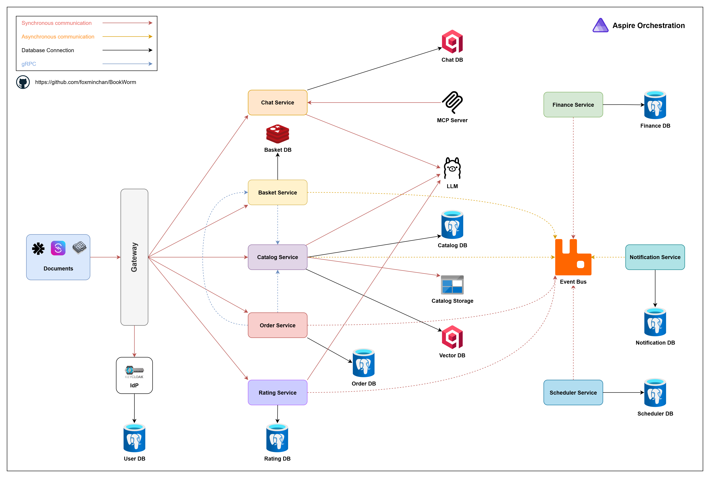

[](https://foxminchan.github.io/BookWorm/)

# BookWorm

[](https://github.com/foxminchan/BookWorm/actions/workflows/dotnet-ci.yml)
[](https://github.com/foxminchan/BookWorm/actions/workflows/keycloak-ci.yml)
[](https://sonarcloud.io/summary/new_code?id=foxminchan_BookWorm)
[](https://sonarcloud.io/summary/new_code?id=foxminchan_BookWorm)

<div>
  <a href="https://codespaces.new/foxminchan/BookWorm?quickstart=1" target="_blank">
    
  </a>
</div>

> [!WARNING]
>
> **Disclaimer**: This example is for demo use only. It’s not production-ready and may omit important features.

## Introduction

<p align="justify">
  ⭐ BookWorm showcases Aspire in a cloud-native application with AI integration. Built with DDD and VSA, it features multi-agent orchestration and standardized AI tooling through MCP with A2A & AG-UI Protocol support.
</p>

<details>
<summary>View Screenshots</summary>


</details>

## Project Goals

- [x] Developed a cloud-native application using Aspire
- [x] Implemented Vertical Slice Architecture with Domain-Driven Design & CQRS
- [x] Enabled service-to-service communication with gRPC
- [x] Incorporated various microservices patterns
  - [x] Utilized outbox and inbox patterns to manage commands and events
  - [x] Implemented saga patterns for orchestration and choreography
  - [x] Integrated event sourcing for storing domain events
  - [x] Implemented a microservices chassis for cross-cutting concerns and service infrastructure
- [x] Implemented API versioning and feature flags for flexible application management
- [x] Set up AuthN/AuthZ with Keycloak
  - [x] Used Authorization Code Flow with PKCE for user authentication
  - [x] Enabled Token Exchange for service-to-service authentication
- [x] Implemented caching with HybridCache
- [x] Incorporated AI components:
  - [x] Text embedding with `text-embedding-3-large`
  - [x] Integrated chatbot functionality using `gpt-4o-mini`
  - [x] Orchestrated multi-agent workflows using Agent Framework
  - [x] Standardized AI tooling with Model Context Protocol (MCP)
  - [x] Enabled agent-to-agent communication via A2A Protocol
  - [x] Supported Agent interactions via AG-UI Protocol
- [x] Configured CI/CD with GitHub Actions
- [x] Created comprehensive documentation:
  - [x] Used OpenAPI for REST API & AsyncAPI for event-driven endpoints
  - [x] Utilized EventCatalog for centralized architecture documentation
- [x] Built modern client applications:
  - [x] Monorepo architecture powered by `Turborepo`
  - [x] Customer-facing storefront and admin backoffice dashboard with `Next.js`
  - [x] Supported WCAG 2.1 AA accessibility standards
- [x] Established a testing strategy:
  - [x] Conducted service unit tests
  - [x] Implemented snapshot tests
  - [x] Established architecture testing strategy
  - [x] Performed load testing with k6
  - [x] Implemented frontend unit tests and component tests
  - [x] Conducted end-to-end testing with BDD
  - [ ] Planned integration tests

## Project Architecture



## Getting Started

### Prerequisites

- [.NET 10.0 SDK](https://dotnet.microsoft.com/download/dotnet/10.0)
- [Node.js](https://nodejs.org/en/download/)
- [Docker](https://www.docker.com/get-started)
- [Gitleaks](https://gitleaks.io/)
- [Bun](https://bun.sh/)
- [Pnpm](https://pnpm.io/installation)
- [Just](https://github.com/casey/just)
- [Buf CLI](https://docs.buf.build/installation)
- [Aspire CLI](https://aspire.dev/get-started/install-cli/)
- [Azure CLI](https://learn.microsoft.com/cli/azure/install-azure-cli)
- Optional: [Spec-Kit](https://github.com/github/spec-kit)
- Optional: [GitHub Copilot CLI](https://github.com/github/copilot-cli)

> [!NOTE]
>
> - 🤖 Ensure you have an [OpenAI API key](https://platform.openai.com/api-keys) to use the AI features
> - 📧 Email services use [SendGrid](https://sendgrid.com/) in production and [Mailpit](https://mailpit.axllent.org/) locally
> - 🐳 Docker Desktop must be running before starting the application

### Run the Application

Follow these steps to get BookWorm running locally:

```sh
# 1. Clone the repository
git clone git@github.com:foxminchan/BookWorm.git

# 2. Navigate to the project directory
cd BookWorm

# 3. First-time setup
just prepare

# 4. Run the application
just run
```

> [!NOTE]
>
> On first run, you'll be prompted to enter necessary environment variables

### Deploy the Application

To deploy BookWorm to Azure Container Apps, follow these steps:

1. **Authenticate with Azure**:

```sh
az login
```

2. **Deploy the application**:

```sh
aspire deploy
```

3. **Verify the deployment**:

After deployment completes, get the application URL:

```sh
az containerapp show --name <app-name> --resource-group <resource-group> --query properties.configuration.ingress.fqdn --output tsv
```

Replace `<app-name>` and `<resource-group>` with the values you specified during deployment.

4. **Clean up resources**:

To remove all deployed resources and avoid charges:

```sh
az group delete --name <resource-group> --yes --no-wait
```

### Documentation

For comprehensive project documentation, visit our [GitHub Wiki](https://github.com/foxminchan/BookWorm/wiki).

## Contribution

Thanks to all [contributors](https://github.com/foxminchan/BookWorm/graphs/contributors), your help is greatly appreciated!

Contributions are welcome! Please read the [contribution guidelines](./.github/CONTRIBUTING.md) and [code of conduct](./.github/CODE-OF-CONDUCT.md) to learn how to participate.

## Support

- If you like this project, please give it a ⭐ star.
- If you have any issues or feature requests, please [create an issue](https://github.com/foxminchan/BookWorm/issues/new/choose).

## License

This project is licensed under the MIT License. See the [LICENSE](LICENSE) file for details.
