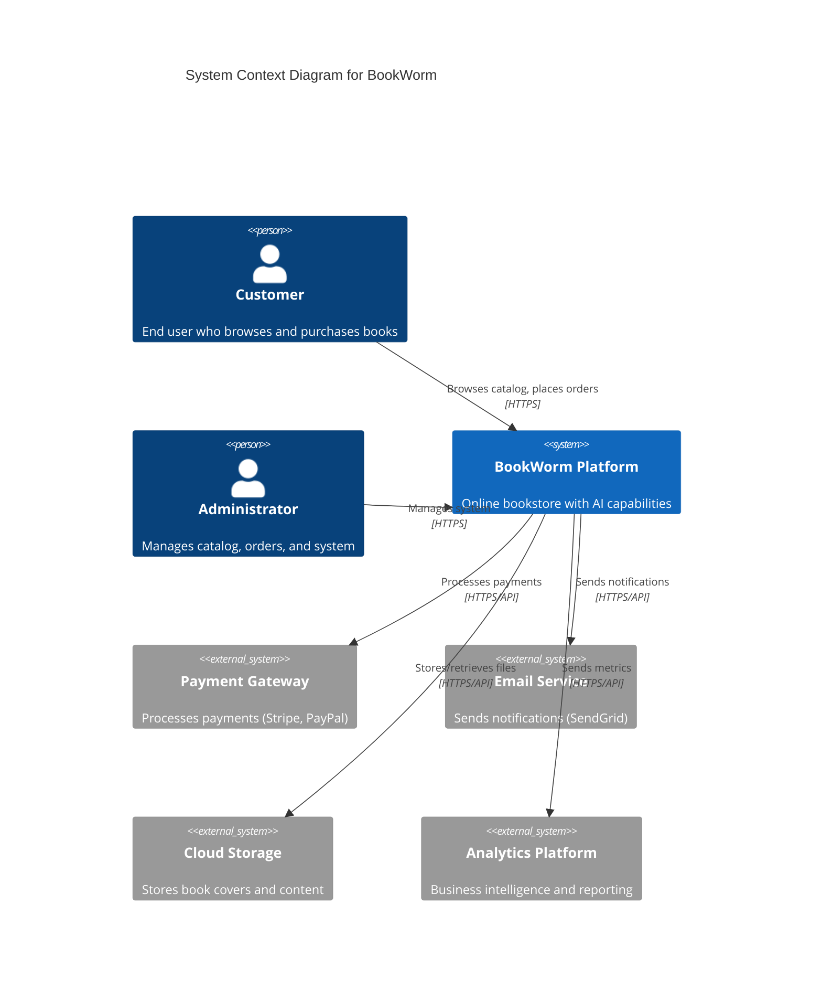
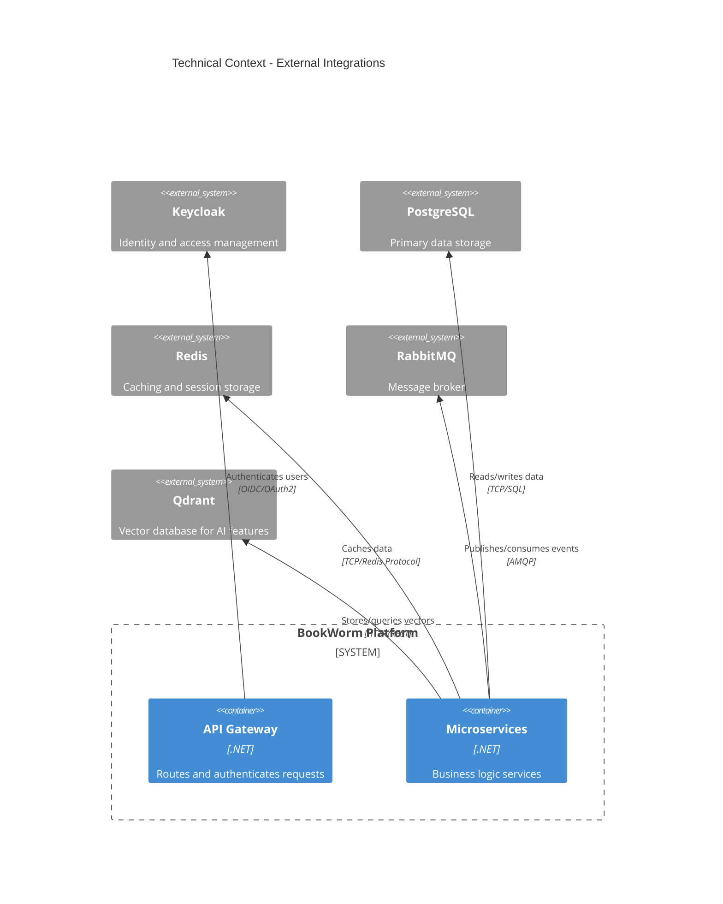

# 3. System Scope and Context

## 3.1 Business Context

BookWorm operates as an online bookstore platform within the broader e-commerce ecosystem, providing book discovery, purchasing, and management capabilities to end users.

### System Environment

### External Actors

| Actor | Description | Interface |
|-------|-------------|-----------|
| **Customer** | End users browsing and purchasing books | Web UI, Mobile App |
| **Administrator** | System admins managing catalog and orders | Admin Dashboard |
| **Payment Gateway** | External payment processing services | REST API |
| **Email Service** | Email notification delivery | REST API |
| **Cloud Storage** | File storage for book covers and content | Object Storage API |
| **Analytics Platform** | Business intelligence and metrics collection | REST API |

## 3.2 Technical Context

### External Systems Integration

### Communication Protocols

| Protocol | Usage | Description |
|----------|-------|-------------|
| **HTTPS/REST** | External APIs | Standard web API communication |
| **gRPC** | Internal service communication | High-performance inter-service calls |
| **AMQP** | Event messaging | Asynchronous event-driven communication |
| **WebSocket** | Real-time features | Live notifications and chat |
| **OIDC/OAuth2** | Authentication | Secure user authentication flow |

### Data Flow Boundaries

#### Input Interfaces
- **Web UI**: Customer interactions through browser
- **Mobile API**: Native mobile application calls
- **Admin Dashboard**: Administrative operations
- **External APIs**: Third-party service integrations

#### Output Interfaces
- **API Responses**: JSON/REST responses to clients
- **Email Notifications**: Automated email communications
- **Event Publications**: Business events to message bus
- **Analytics Data**: Metrics and monitoring data
- **File Storage**: Images and document uploads

## 3.3 External Dependencies

### Critical Dependencies
| Dependency | Impact if Unavailable | Mitigation Strategy |
|------------|----------------------|-------------------|
| **Payment Gateway** | Cannot process orders | Graceful degradation, offline order queuing |
| **Email Service** | No notifications sent | Queue emails, retry mechanism |
| **Identity Provider** | No user authentication | Temporary local auth fallback |
| **Cloud Storage** | No image/file access | CDN caching, local fallback |

### Optional Dependencies
| Dependency | Impact if Unavailable | Mitigation Strategy |
|------------|----------------------|-------------------|
| **Analytics Platform** | No business metrics | Local logging, batch sync when available |
| **AI Services** | Reduced search capability | Fallback to traditional search |
| **CDN** | Slower content delivery | Direct origin serving |

## 3.4 Interface Specifications

### Public APIs
- **Customer API**: RESTful endpoints for customer operations
- **Admin API**: Management endpoints with enhanced permissions
- **Webhook API**: External system integration points

### Data Formats
- **JSON**: Primary data exchange format
- **Protocol Buffers**: gRPC service communication
- **XML**: Legacy system compatibility (if needed)
- **Binary**: File uploads and downloads