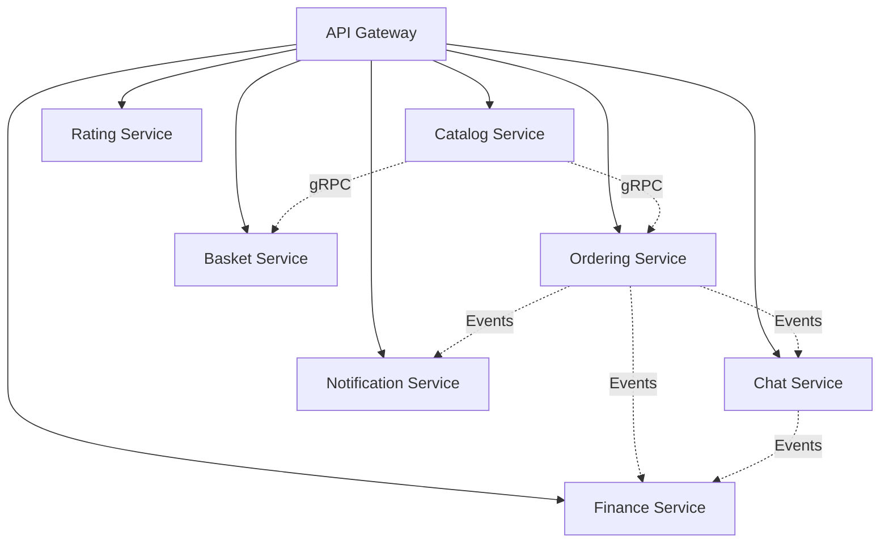

# 4. Solution Strategy

## 4.1 Technology Decisions

### Core Technology Stack
| Technology | Decision Rationale |
|------------|-------------------|
| **.NET Aspire** | Simplifies cloud-native development with built-in observability and service discovery |
| **Microservices Architecture** | Enables independent deployment, scaling, and technology choices per service |
| **Domain-Driven Design** | Aligns software design with business domains for better maintainability |
| **CQRS + Event Sourcing** | Separates read/write concerns and provides audit trail for business events |
| **Vertical Slice Architecture** | Reduces coupling and enables feature-focused development |

### Service Communication Strategy


## 4.2 Architectural Patterns

### Microservices Patterns Implementation
| Pattern | Implementation | Benefit |
|---------|---------------|---------|
| **API Gateway** | YARP Reverse Proxy | Single entry point, cross-cutting concerns |
| **Service Registry** | .NET Aspire Service Discovery | Dynamic service location |
| **Circuit Breaker** | Polly Framework | Fault tolerance and resilience |
| **Outbox Pattern** | Event publishing from aggregates | Transactional consistency |
| **Inbox Pattern** | Duplicate event detection | Idempotent message processing |
| **Saga Pattern** | Order processing coordination | Distributed transaction management |

### Data Management Strategy
- **Database per Service**: Each service owns its data
- **Event Sourcing**: For audit trails and temporal queries
- **CQRS**: Separate read and write models for optimization
- **Distributed Caching**: Redis for cross-service data sharing

## 4.3 Quality Attribute Scenarios

### Scalability Solutions
- **Horizontal Scaling**: Stateless services with load balancing
- **Database Sharding**: Partition strategies for high-volume data
- **Caching Layers**: Multi-level caching for performance
- **Asynchronous Processing**: Event-driven background operations

### Reliability Solutions
- **Health Checks**: Comprehensive service monitoring
- **Graceful Degradation**: Feature flags for partial functionality
- **Retry Mechanisms**: Exponential backoff for transient failures
- **Dead Letter Queues**: Failed message handling

### Security Solutions
- **Zero Trust Architecture**: Verify every request
- **OAuth 2.0/OpenID Connect**: Industry-standard authentication
- **API Rate Limiting**: Prevent abuse and ensure availability
- **Encryption**: Data at rest and in transit protection

## 4.4 Development Strategy

### Team Organization
- **Domain Teams**: Aligned with business capabilities
- **Platform Team**: Shared infrastructure and tooling
- **DevOps Integration**: Continuous delivery pipeline

### Code Organization
```
src/
├── Services/           # Domain services
├── BuildingBlocks/     # Shared libraries
├── Aspire/            # Application host
└── Integrations/      # External integrations
```

### Testing Strategy
- **Unit Tests**: Service-level business logic
- **Integration Tests**: Service boundaries and data access
- **Architecture Tests**: Enforce design constraints
- **Load Tests**: Performance and scalability validation
- **Contract Tests**: API compatibility between services