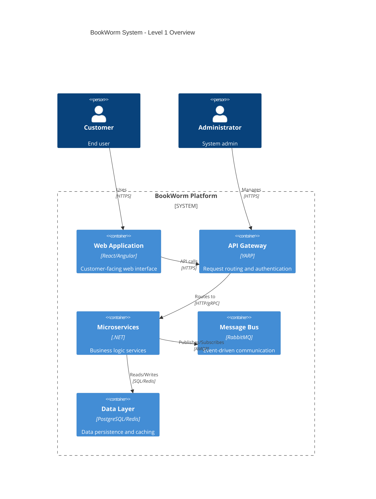
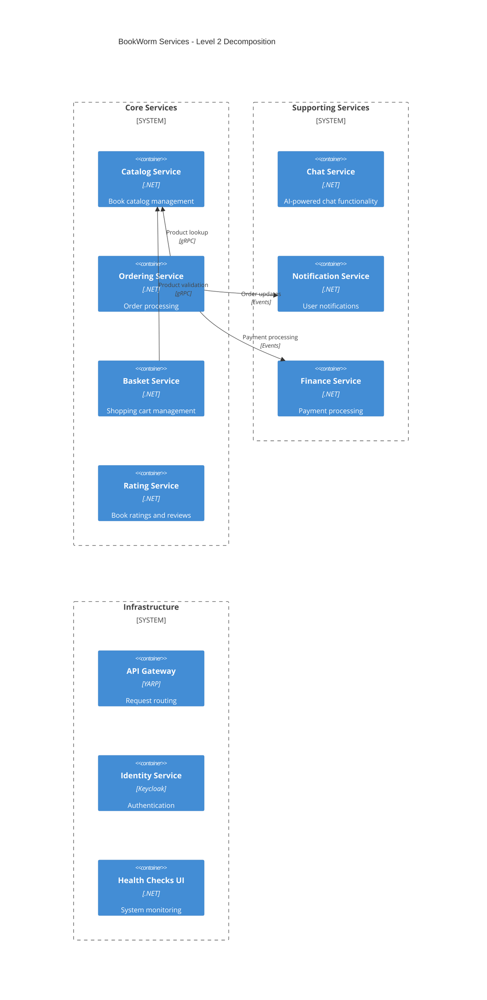
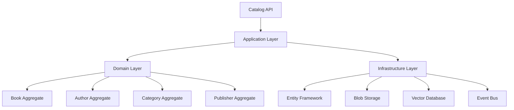

# 5. Building Block View

## 5.1 Level 1: System Overview



### Main Building Blocks

| Component | Responsibility | Interface |
|-----------|---------------|-----------|
| **Web Application** | User interface and experience | HTTP/HTTPS Browser |
| **API Gateway** | Request routing, authentication, rate limiting | REST API |
| **Microservices** | Business logic and domain operations | HTTP/gRPC |
| **Message Bus** | Asynchronous event communication | AMQP |
| **Data Layer** | Data persistence and caching | SQL/NoSQL |

## 5.2 Level 2: Service Decomposition



### Service Responsibilities

#### Core Domain Services
| Service | Primary Responsibility | Key Operations |
|---------|----------------------|----------------|
| **Catalog Service** | Book catalog and inventory management | Search, browse, manage books |
| **Ordering Service** | Order lifecycle management | Create, process, fulfill orders |
| **Basket Service** | Shopping cart operations | Add/remove items, calculate totals |
| **Rating Service** | Reviews and ratings | Submit ratings, aggregate scores |

#### Supporting Services
| Service | Primary Responsibility | Key Operations |
|---------|----------------------|----------------|
| **Chat Service** | AI-powered customer support | Natural language processing, responses |
| **Notification Service** | User communication | Email, SMS, push notifications |
| **Finance Service** | Payment and financial operations | Process payments, handle refunds |

## 5.3 Level 3: Internal Service Structure

### Catalog Service Structure


### Vertical Slice Organization
Each service follows Vertical Slice Architecture with features organized as:

```
/Features
  /Books
    /Create
      - CreateBookCommand.cs
      - CreateBookHandler.cs
      - CreateBookValidator.cs
      - CreateBookEndpoint.cs
    /Update
      - UpdateBookCommand.cs
      - UpdateBookHandler.cs
      - UpdateBookValidator.cs
      - UpdateBookEndpoint.cs
```

## 5.4 Data Architecture

### Database Design Principles
- **Database per Service**: Each service owns its data
- **Shared Nothing Architecture**: No direct database access between services
- **Event-Driven Synchronization**: Data consistency through events
- **CQRS Implementation**: Separate read and write models

### Storage Patterns
| Pattern | Implementation | Usage |
|---------|---------------|-------|
| **Aggregate Storage** | Entity Framework Core | Transactional consistency |
| **Read Models** | Optimized projections | Query performance |
| **Event Store** | Custom implementation | Audit trail and replay |
| **Cache Layer** | Redis | Fast data access |
| **Blob Storage** | Azure Blob/S3 | File and image storage |

## 5.5 Cross-Cutting Concerns

### Shared Building Blocks
Located in `BookWorm.Chassis` and `BookWorm.SharedKernel`:

| Component | Purpose | Implementation |
|-----------|---------|---------------|
| **Activity Scope** | Request tracing | OpenTelemetry integration |
| **Command/Query Handlers** | CQRS implementation | MediatR patterns |
| **Event Bus** | Messaging abstraction | MassTransit wrapper |
| **Repository Pattern** | Data access abstraction | Generic repository |
| **Specification Pattern** | Query composition | LINQ expressions |
| **Validation** | Input validation | FluentValidation |
| **Mapping** | Object transformation | AutoMapper/Mapperly |
| **Versioning** | API versioning | ASP.NET Core versioning |