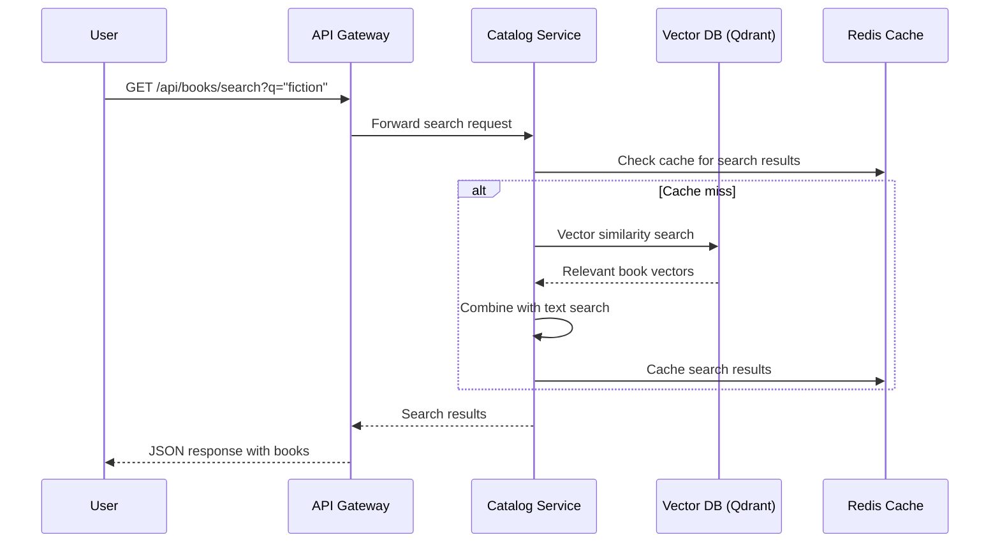
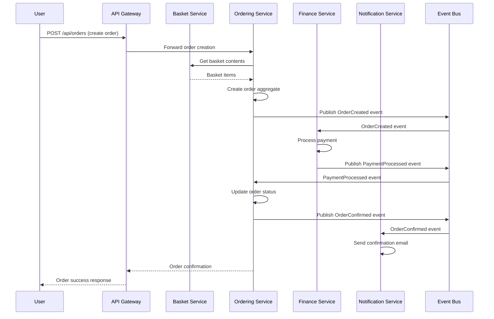
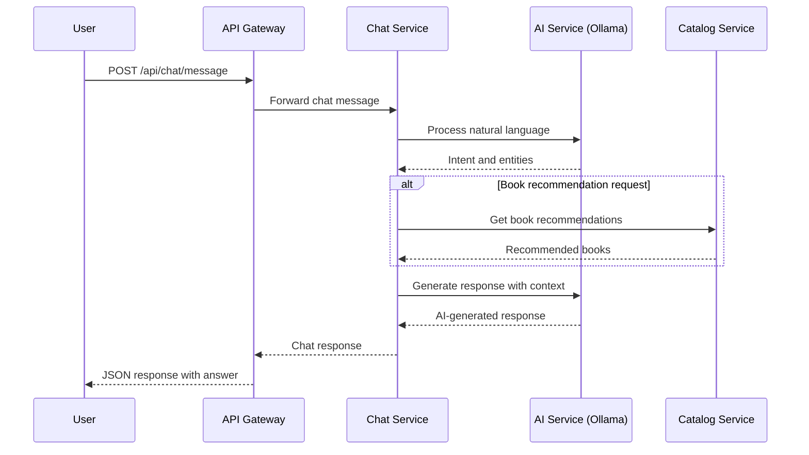
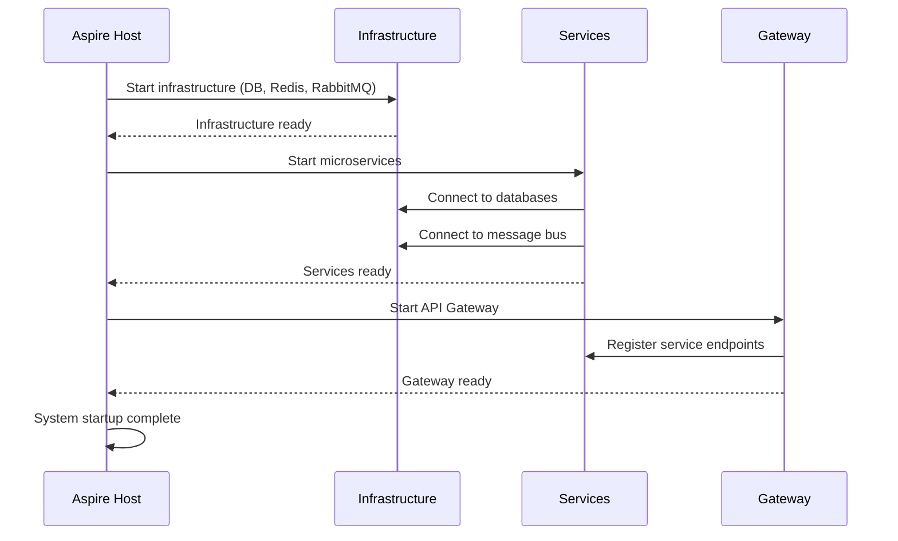
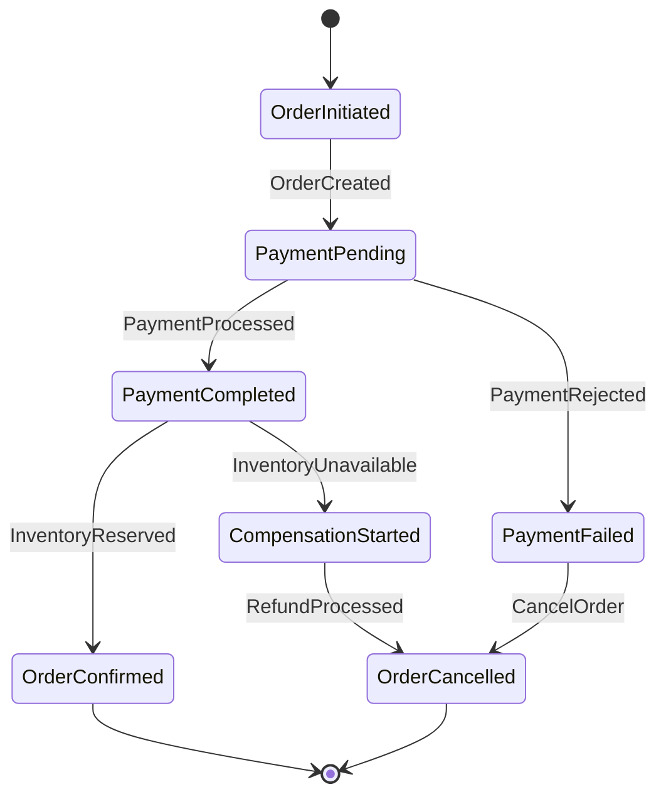
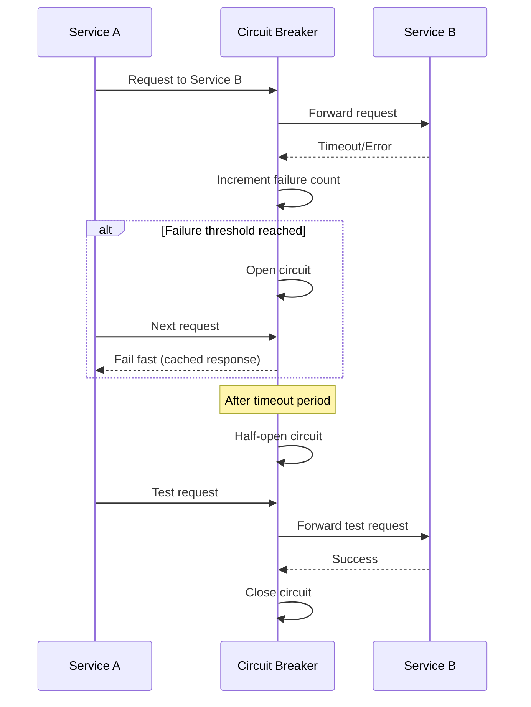
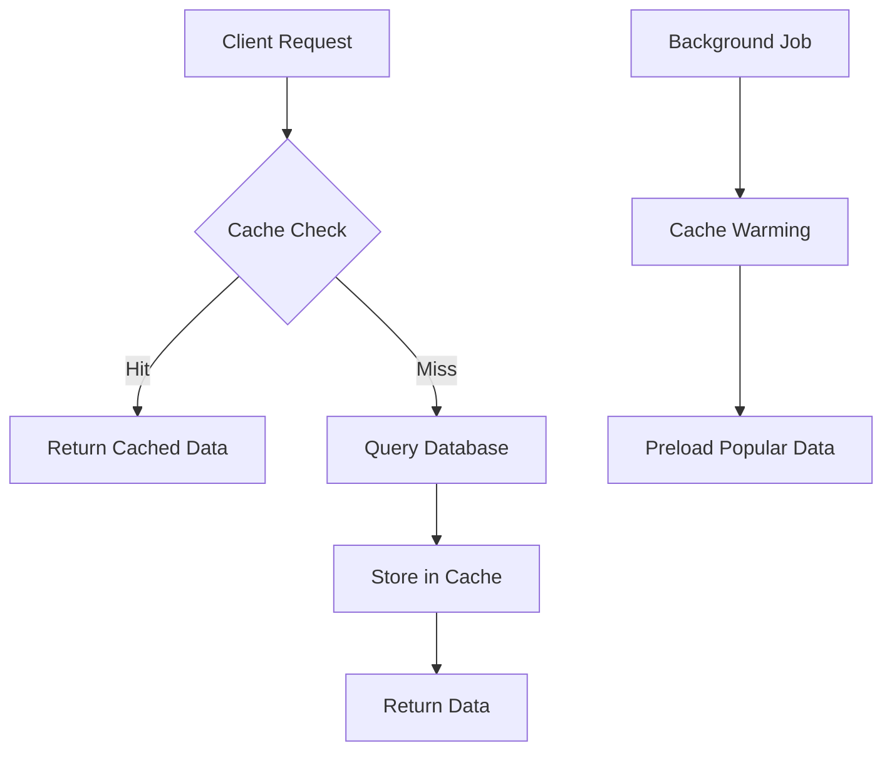
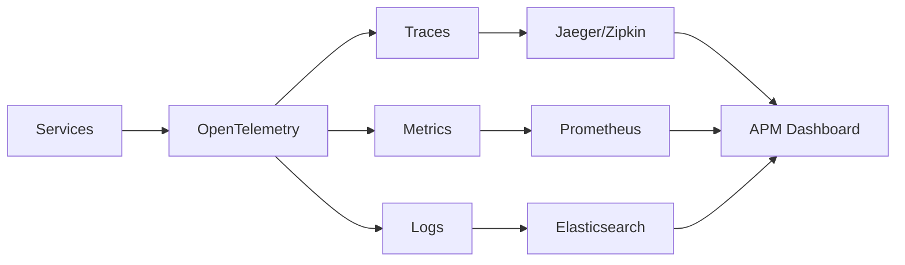

# 6. Runtime View

## 6.1 Key Scenarios

### Scenario 1: Book Search and Browse

### Scenario 2: Order Processing Workflow

### Scenario 3: Chat Service Interaction

## 6.2 System Startup Sequence

## 6.3 Event-Driven Flows

### Order Saga Pattern

### Event Flow Patterns
| Event Type | Publisher | Subscribers | Purpose |
|------------|-----------|-------------|---------|
| **BookCreated** | Catalog Service | Search Index, Analytics | Catalog updates |
| **OrderCreated** | Ordering Service | Finance, Notification | Order processing |
| **PaymentProcessed** | Finance Service | Ordering, Notification | Payment confirmation |
| **OrderConfirmed** | Ordering Service | Inventory, Notification | Order fulfillment |
| **UserRegistered** | Identity Service | Notification, Analytics | User onboarding |

## 6.4 Error Handling Flows

### Circuit Breaker Pattern

### Retry Mechanisms
- **Exponential Backoff**: For transient failures
- **Dead Letter Queues**: For permanently failed messages
- **Compensation Actions**: For distributed transaction rollbacks

## 6.5 Performance Optimization Flows

### Caching Strategy

### Load Balancing
- **Gateway Level**: YARP load balancing across service instances
- **Database Level**: Read replicas for query optimization
- **Cache Level**: Distributed caching with Redis Cluster

## 6.6 Monitoring and Observability

### Telemetry Flow

### Health Check Flow
- **Startup Checks**: Verify external dependencies
- **Readiness Checks**: Service ready to accept traffic
- **Liveness Checks**: Service is functioning correctly
- **Dependency Checks**: External service availability