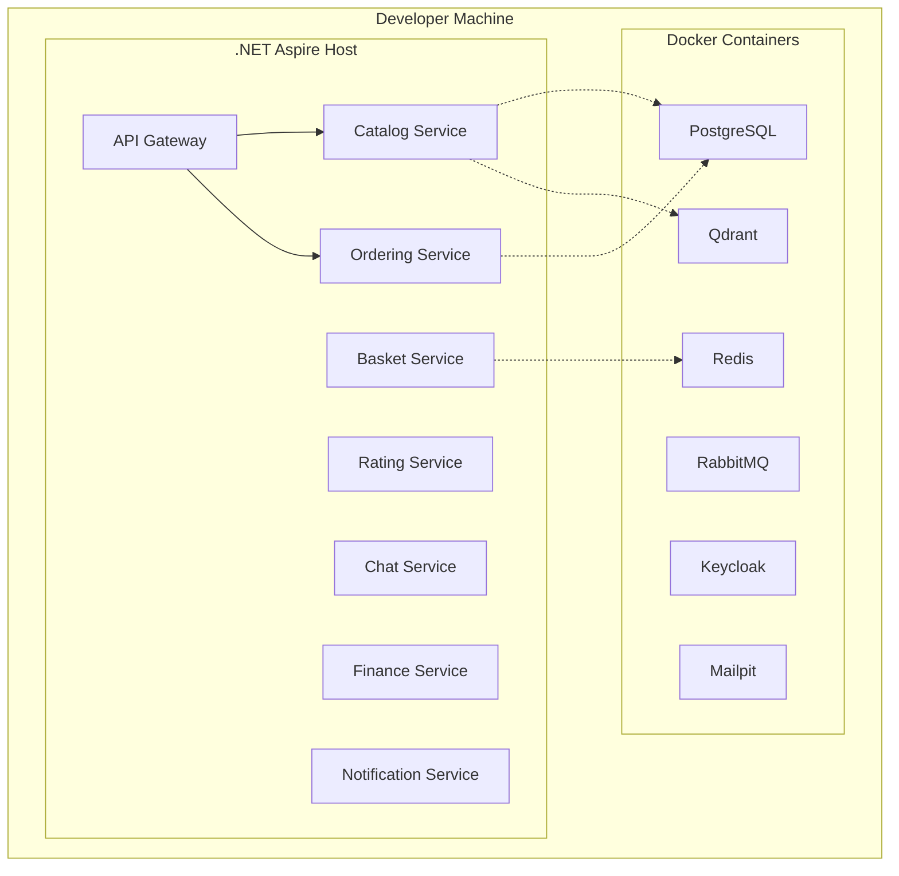
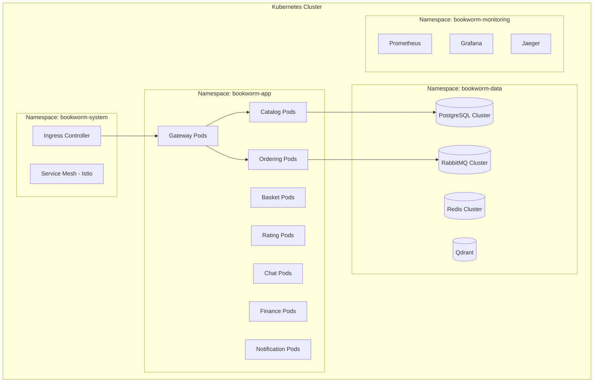
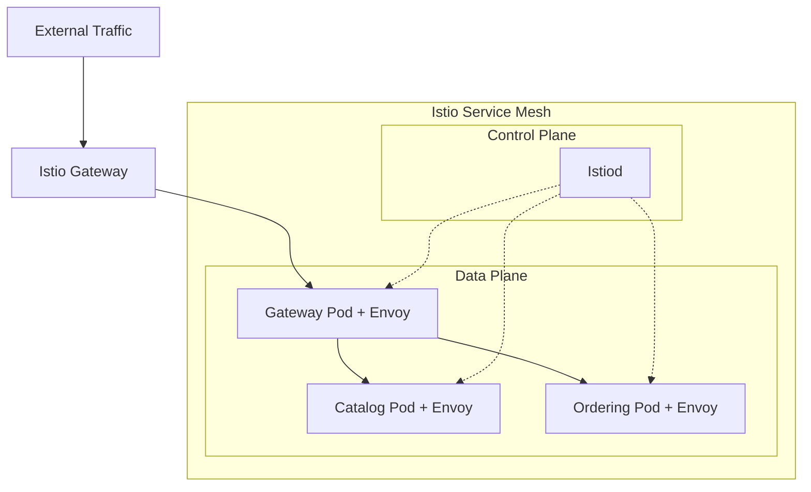
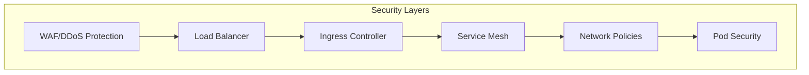
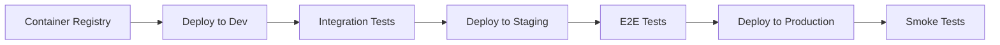

# 7. Deployment View

## 7.1 Deployment Overview

### Local Development Environment


### Container Orchestration (Kubernetes)


## 7.2 Infrastructure Components

### Data Tier
| Component | Technology | Configuration | Scaling Strategy |
|-----------|------------|---------------|------------------|
| **Primary Database** | PostgreSQL 15+ | Master-Replica setup | Horizontal read replicas |
| **Cache Layer** | Redis 7+ | Cluster mode | Memory-based scaling |
| **Message Broker** | RabbitMQ 3.12+ | Clustered deployment | Queue partitioning |
| **Vector Database** | Qdrant | Single/Multi-node | Horizontal scaling |
| **Blob Storage** | Azure Blob/S3 | Geo-redundant | CDN integration |

### Application Tier
| Service | Resource Requirements | Scaling Triggers | Health Checks |
|---------|----------------------|------------------|---------------|
| **Catalog Service** | 256MB RAM, 0.1 CPU | CPU > 70%, Memory > 80% | `/health/ready` |
| **Ordering Service** | 512MB RAM, 0.2 CPU | Queue depth > 100 | `/health/ready` |
| **Basket Service** | 128MB RAM, 0.1 CPU | Active sessions > 1000 | `/health/ready` |
| **API Gateway** | 512MB RAM, 0.2 CPU | Request rate > 1000/min | `/health/ready` |

### Infrastructure Services
| Service | Purpose | Deployment | Configuration |
|---------|---------|------------|---------------|
| **Keycloak** | Identity & Access Management | StatefulSet | External DB, HA mode |
| **YARP Gateway** | API Gateway & Load Balancer | Deployment | Auto-scaling enabled |
| **Health Checks UI** | System monitoring | Deployment | Read-only dashboard |

## 7.3 Environment Configurations

### Development Environment
```yaml
# Aspire configuration for local development
services:
  catalog-service:
    replicas: 1
    resources:
      memory: "256MB"
      cpu: "0.1"
  
  ordering-service:
    replicas: 1
    resources:
      memory: "512MB"
      cpu: "0.2"
```

### Staging Environment
```yaml
# Kubernetes deployment for staging
apiVersion: apps/v1
kind: Deployment
metadata:
  name: catalog-service
spec:
  replicas: 2
  selector:
    matchLabels:
      app: catalog-service
  template:
    spec:
      containers:
      - name: catalog-service
        image: bookworm/catalog:staging
        resources:
          requests:
            memory: "256Mi"
            cpu: "100m"
          limits:
            memory: "512Mi"
            cpu: "500m"
```

### Production Environment
```yaml
# Production configuration with high availability
apiVersion: apps/v1
kind: Deployment
metadata:
  name: catalog-service
spec:
  replicas: 3
  strategy:
    type: RollingUpdate
    rollingUpdate:
      maxSurge: 1
      maxUnavailable: 0
  template:
    spec:
      containers:
      - name: catalog-service
        image: bookworm/catalog:v1.0.0
        resources:
          requests:
            memory: "512Mi"
            cpu: "200m"
          limits:
            memory: "1Gi"
            cpu: "1000m"
```

## 7.4 Network Architecture

### Service Mesh Configuration


### Network Policies
| Policy Type | Configuration | Purpose |
|-------------|---------------|---------|
| **Ingress** | External -> Gateway only | Security boundary |
| **East-West** | Service-to-service mesh | Encrypted communication |
| **Database** | Apps -> Data tier only | Data access control |
| **Monitoring** | Observability tools access | System monitoring |

## 7.5 Security Deployment

### Certificate Management
- **TLS Termination**: At ingress controller level
- **Internal TLS**: Service mesh automatic mTLS
- **Certificate Rotation**: Automated with cert-manager
- **Secret Management**: Kubernetes secrets + external vault

### Network Security


## 7.6 Monitoring and Observability Deployment

### Telemetry Stack
| Component | Purpose | Deployment Model |
|-----------|---------|------------------|
| **OpenTelemetry Collector** | Telemetry aggregation | DaemonSet |
| **Prometheus** | Metrics storage | StatefulSet |
| **Jaeger** | Distributed tracing | Operator deployment |
| **Grafana** | Visualization | Deployment |
| **ELK Stack** | Log aggregation | Operator deployment |

### Backup and Disaster Recovery
- **Database Backups**: Automated daily backups to cloud storage
- **Configuration Backups**: GitOps repository snapshots
- **Application State**: Event sourcing for replay capability
- **Recovery Time Objective**: 4 hours
- **Recovery Point Objective**: 1 hour

## 7.7 CI/CD Pipeline Deployment

### Build Pipeline


### Deployment Pipeline


### Deployment Strategies
- **Development**: Direct deployment on code push
- **Staging**: Automated deployment with approval gates
- **Production**: Blue-green deployment with canary testing
- **Rollback**: Automated rollback on health check failures