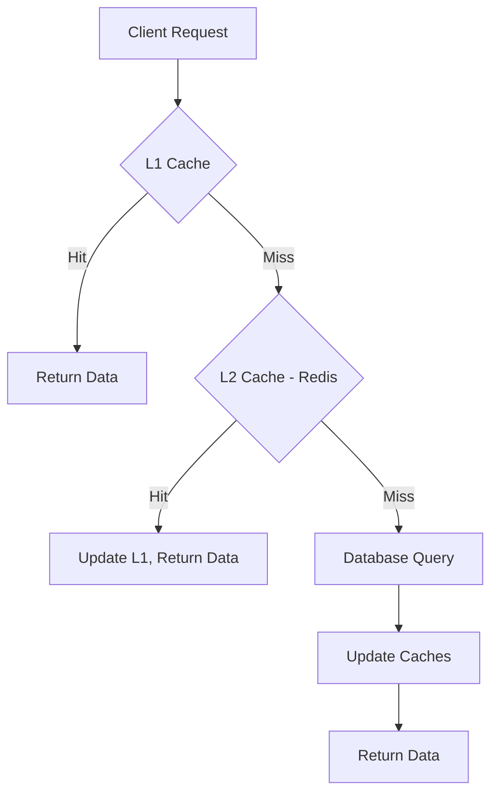
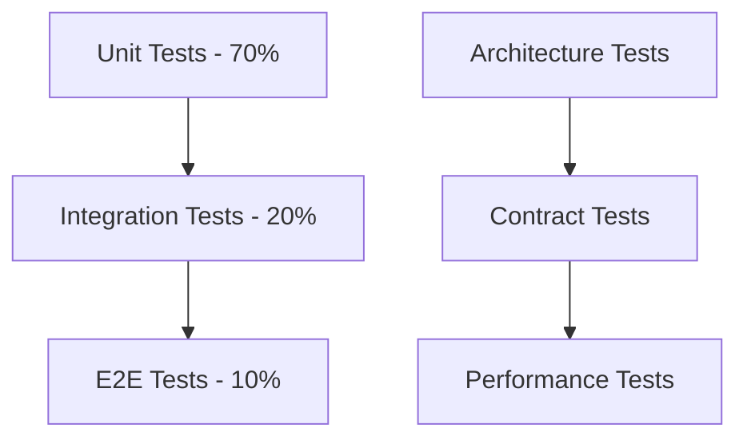
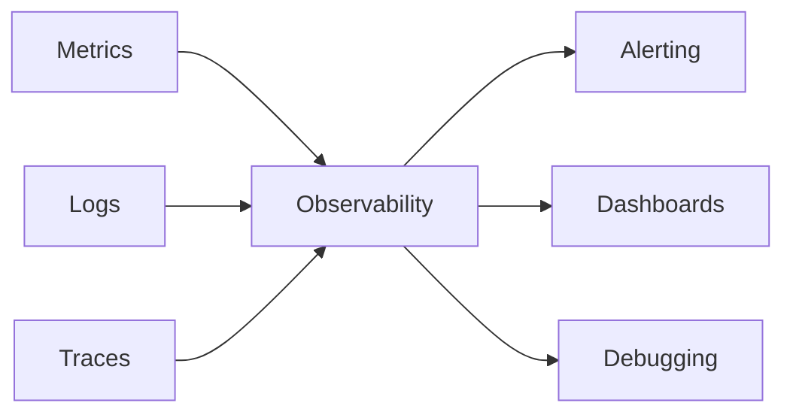

# 8. Cross-cutting Concepts

## 8.1 Security Concepts

### Authentication and Authorization
| Concept | Implementation | Technology |
|---------|---------------|------------|
| **Identity Management** | Centralized authentication with Keycloak | OpenID Connect/OAuth 2.0 |
| **API Security** | Bearer token validation on all endpoints | JWT tokens |
| **Role-Based Access** | Fine-grained permissions per service | Keycloak roles and policies |
| **Service-to-Service** | Mutual TLS for internal communication | Istio service mesh |

### Security Patterns
```csharp
// Example: Security attribute for endpoint protection
[Authorize(Policy = "CustomerPolicy")]
[HttpGet("/api/books/{id}")]
public async Task<BookResponse> GetBook(Guid id)
{
    // Implementation
}
```

### Data Protection
- **Encryption at Rest**: Database and file storage encryption
- **Encryption in Transit**: TLS 1.3 for all communications
- **PII Handling**: GDPR-compliant data processing
- **Secret Management**: Kubernetes secrets and external vaults

## 8.2 Error Handling and Logging

### Standardized Error Responses
```csharp
public class ApiErrorResponse
{
    public string Type { get; set; }
    public string Title { get; set; }
    public int Status { get; set; }
    public string Detail { get; set; }
    public string Instance { get; set; }
    public Dictionary<string, object> Extensions { get; set; }
}
```

### Logging Strategy
| Log Level | Usage | Retention |
|-----------|-------|-----------|
| **Trace** | Detailed execution flow | 1 day |
| **Debug** | Development debugging | 3 days |
| **Information** | General application flow | 7 days |
| **Warning** | Unexpected but recoverable conditions | 30 days |
| **Error** | Error conditions with impact | 90 days |
| **Critical** | Critical failures requiring immediate attention | 1 year |

### Structured Logging
```csharp
logger.LogInformation("Order {OrderId} created for customer {CustomerId} with total {Total:C}",
    order.Id, order.CustomerId, order.Total);
```

## 8.3 Configuration Management

### Configuration Hierarchy
1. **Default Values**: Embedded in application
2. **Environment Variables**: Container/OS level
3. **Configuration Files**: appsettings.json
4. **External Configuration**: Kubernetes ConfigMaps/Secrets
5. **Feature Flags**: Dynamic configuration changes

### Configuration Pattern
```csharp
public class ServiceConfiguration
{
    public DatabaseOptions Database { get; set; }
    public MessagingOptions Messaging { get; set; }
    public CacheOptions Cache { get; set; }
    public SecurityOptions Security { get; set; }
}
```

### Environment-Specific Configuration
| Environment | Configuration Source | Update Mechanism |
|-------------|---------------------|------------------|
| **Development** | Local appsettings.json | Manual/Git |
| **Testing** | Environment variables | CI/CD pipeline |
| **Staging** | Kubernetes ConfigMaps | GitOps |
| **Production** | External configuration service | Controlled deployment |

## 8.4 Data Management

### Data Consistency Patterns
| Pattern | Implementation | Use Case |
|---------|---------------|----------|
| **Strong Consistency** | ACID transactions within aggregates | Financial operations |
| **Eventual Consistency** | Event-driven synchronization | Cross-service data |
| **Optimistic Concurrency** | Version-based conflict detection | Collaborative editing |
| **Compensating Actions** | Saga pattern for distributed transactions | Order processing |

### Data Validation
```csharp
public class CreateBookCommandValidator : AbstractValidator<CreateBookCommand>
{
    public CreateBookCommandValidator()
    {
        RuleFor(x => x.Title).NotEmpty().MaximumLength(200);
        RuleFor(x => x.ISBN).NotEmpty().Matches(@"^[\d-]+$");
        RuleFor(x => x.Price).GreaterThan(0);
    }
}
```

### Caching Strategy


## 8.5 Communication Patterns

### Inter-Service Communication
| Pattern | Technology | Use Case |
|---------|------------|----------|
| **Synchronous** | gRPC | Real-time data retrieval |
| **Asynchronous** | RabbitMQ | Event notifications |
| **Request-Response** | HTTP/REST | Client-server interactions |
| **Publish-Subscribe** | Event Bus | Loose coupling |

### Message Formats
```csharp
// Event message format
public record OrderCreatedEvent(
    Guid OrderId,
    Guid CustomerId,
    decimal Total,
    DateTime CreatedAt
) : IEvent;
```

### Communication Resilience
- **Circuit Breakers**: Prevent cascade failures
- **Retries**: Exponential backoff with jitter
- **Timeouts**: Prevent hanging requests
- **Bulkheads**: Resource isolation

## 8.6 Performance and Scalability

### Performance Monitoring
| Metric | Target | Monitoring Tool |
|--------|--------|----------------|
| **Response Time** | < 200ms (95th percentile) | Application Insights |
| **Throughput** | > 1000 RPS | Prometheus |
| **Error Rate** | < 0.1% | Custom dashboards |
| **Availability** | > 99.9% | Health checks |

### Scalability Patterns
```csharp
// Auto-scaling configuration
[HttpGet]
[ResponseCache(Duration = 300, VaryByQueryKeys = new[] { "page", "size" })]
public async Task<PagedResult<BookSummary>> GetBooks(
    [FromQuery] GetBooksQuery query,
    CancellationToken cancellationToken)
{
    return await mediator.Send(query, cancellationToken);
}
```

### Resource Management
- **Connection Pooling**: Database and HTTP connections
- **Memory Management**: Proper disposal patterns
- **CPU Optimization**: Async/await patterns
- **I/O Optimization**: Streaming for large datasets

## 8.7 Testing Concepts

### Test Strategy Pyramid


### Test Categories
| Test Type | Scope | Tools |
|-----------|-------|-------|
| **Unit Tests** | Service logic | xUnit, NSubstitute |
| **Integration Tests** | Service boundaries | TestContainers |
| **Architecture Tests** | Design constraints | NetArchTest |
| **Contract Tests** | API compatibility | Pact |
| **Performance Tests** | Load and stress | k6 |

## 8.8 Observability

### Three Pillars of Observability


### Telemetry Implementation
```csharp
// OpenTelemetry instrumentation
services.AddOpenTelemetry()
    .WithTracing(builder => builder
        .AddAspNetCoreInstrumentation()
        .AddEntityFrameworkCoreInstrumentation()
        .AddRedisInstrumentation())
    .WithMetrics(builder => builder
        .AddAspNetCoreInstrumentation()
        .AddRuntimeInstrumentation());
```

### Alerting Strategy
| Alert Type | Condition | Response |
|------------|-----------|----------|
| **Critical** | Service down, high error rate | Immediate escalation |
| **Warning** | High latency, resource usage | Team notification |
| **Info** | Deployment events | Slack notification |

## 8.9 Documentation Standards

### API Documentation
- **OpenAPI**: REST API specifications
- **AsyncAPI**: Event-driven API documentation
- **Code Comments**: Inline documentation
- **Architecture Documentation**: This arc42 documentation

### Documentation Generation
```csharp
// Swagger/OpenAPI configuration
services.AddSwaggerGen(c =>
{
    c.SwaggerDoc("v1", new OpenApiInfo
    {
        Title = "BookWorm Catalog API",
        Version = "v1",
        Description = "API for managing book catalog"
    });
    
    c.IncludeXmlComments(xmlFile);
});
```