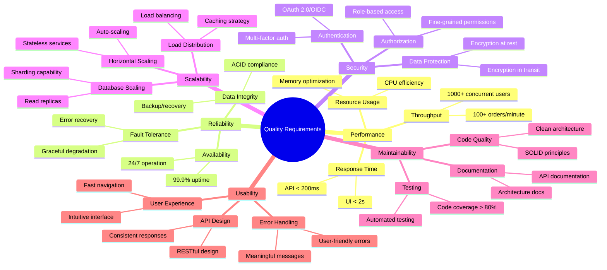

# 10. Quality Requirements

## 10.1 Quality Tree



## 10.2 Performance Requirements

### Response Time Requirements
| Operation Type | Target | Maximum | Measurement |
|----------------|--------|---------|-------------|
| **API Calls** | < 100ms | < 200ms | 95th percentile |
| **Database Queries** | < 50ms | < 100ms | Average |
| **Search Operations** | < 150ms | < 300ms | 95th percentile |
| **Page Load** | < 1s | < 2s | First contentful paint |
| **File Upload** | < 5s | < 10s | 100MB file |

### Throughput Requirements
| Metric | Normal Load | Peak Load | Measurement Period |
|--------|-------------|-----------|-------------------|
| **Concurrent Users** | 500 | 1,000+ | Sustained |
| **API Requests** | 500/sec | 1,000/sec | Peak 15 minutes |
| **Order Processing** | 50/min | 100/min | During sales events |
| **Search Queries** | 200/sec | 500/sec | Peak hours |
| **Database Connections** | 100 | 200 | Connection pool |

### Performance Testing Scenarios
```typescript
// k6 performance test example
export const options = {
  stages: [
    { duration: '2m', target: 100 }, // Ramp up
    { duration: '5m', target: 500 }, // Normal load
    { duration: '2m', target: 1000 }, // Peak load
    { duration: '5m', target: 1000 }, // Sustained peak
    { duration: '2m', target: 0 }, // Ramp down
  ],
  thresholds: {
    http_req_duration: ['p(95)<200'], // 95% < 200ms
    http_req_failed: ['rate<0.1'], // Error rate < 0.1%
  },
};
```

## 10.3 Reliability Requirements

### Availability Targets
| Service Level | Target | Downtime/Month | Measurement |
|---------------|--------|----------------|-------------|
| **Critical Services** | 99.95% | 22 minutes | Catalog, Ordering |
| **Supporting Services** | 99.9% | 43 minutes | Rating, Chat |
| **Administrative** | 99.5% | 3.6 hours | Admin dashboard |
| **Maintenance Windows** | Planned | 4 hours/month | Off-peak hours |

### Fault Tolerance Scenarios
| Scenario | Expected Behavior | Recovery Time |
|----------|------------------|---------------|
| **Database Failure** | Read-only mode with cached data | < 5 minutes |
| **Service Instance Failure** | Traffic routed to healthy instances | < 30 seconds |
| **Network Partition** | Services continue with cached data | Immediate |
| **External API Failure** | Graceful degradation of features | Immediate |
| **Message Broker Failure** | Events queued locally, retry on recovery | < 2 minutes |

### Data Consistency Requirements
| Data Type | Consistency Model | Recovery Point |
|-----------|------------------|----------------|
| **Financial Data** | Strong consistency | Zero data loss |
| **User Orders** | Strong consistency | Zero data loss |
| **Inventory** | Eventual consistency | < 1 minute |
| **User Preferences** | Eventual consistency | < 5 minutes |
| **Analytics Data** | Eventual consistency | < 1 hour |

## 10.4 Security Requirements

### Authentication Requirements
| Requirement | Implementation | Compliance |
|-------------|---------------|------------|
| **Strong Authentication** | Multi-factor authentication for admin | NIST 800-63B |
| **Password Policy** | Min 8 chars, complexity requirements | OWASP guidelines |
| **Session Management** | JWT tokens with expiration | OAuth 2.0/OIDC |
| **Account Lockout** | 5 failed attempts, 15-minute lockout | Security best practices |

### Authorization Requirements
| Resource | Access Control | Granularity |
|----------|---------------|-------------|
| **Customer Data** | Role-based + ownership | Individual records |
| **Administrative Functions** | Role-based | Feature level |
| **API Endpoints** | Scope-based | Endpoint level |
| **Service-to-Service** | Mutual TLS | Service level |

### Data Protection Requirements
| Data Classification | Protection Level | Encryption |
|--------------------|------------------|------------|
| **PII** | High | AES-256 at rest, TLS 1.3 in transit |
| **Financial** | High | AES-256 at rest, TLS 1.3 in transit |
| **Business** | Medium | TLS 1.3 in transit |
| **Public** | Low | TLS 1.3 in transit |

## 10.5 Scalability Requirements

### Horizontal Scaling Targets
| Component | Baseline | Scale Target | Trigger |
|-----------|----------|--------------|---------|
| **API Gateway** | 2 instances | 10 instances | CPU > 70% |
| **Catalog Service** | 2 instances | 5 instances | Memory > 80% |
| **Ordering Service** | 3 instances | 8 instances | Queue depth > 100 |
| **Database** | 1 master + 2 replicas | 1 master + 5 replicas | Connection pool > 80% |

### Load Distribution Requirements
| Load Type | Distribution Strategy | Expected Pattern |
|-----------|----------------------|------------------|
| **Geographic** | CDN + regional deployments | Global distribution |
| **Temporal** | Auto-scaling based on time | Peak hours: 9 AM - 9 PM |
| **Feature-based** | Service-specific scaling | Search-heavy vs order-heavy |
| **User-based** | Session affinity for stateful operations | Consistent user experience |

### Storage Scaling Requirements
| Storage Type | Growth Rate | Scaling Strategy |
|-------------|-------------|------------------|
| **Transactional Data** | 10GB/month | Vertical then horizontal |
| **File Storage** | 50GB/month | Horizontal with CDN |
| **Log Data** | 100GB/month | Time-based partitioning |
| **Analytics Data** | 20GB/month | Compression + archival |

## 10.6 Maintainability Requirements

### Code Quality Metrics
| Metric | Target | Measurement | Tool |
|--------|--------|-------------|------|
| **Code Coverage** | > 80% | Unit + integration tests | Coverlet |
| **Cyclomatic Complexity** | < 10 per method | Static analysis | SonarQube |
| **Duplicate Code** | < 3% | Code analysis | SonarQube |
| **Technical Debt** | < 5% | Code quality rating | SonarQube |
| **Documentation Coverage** | > 90% | API documentation | Swagger/OpenAPI |

### Development Productivity Metrics
| Metric | Target | Measurement |
|--------|--------|-------------|
| **Build Time** | < 5 minutes | CI/CD pipeline |
| **Deployment Time** | < 10 minutes | Automated deployment |
| **Test Execution** | < 2 minutes | Unit test suite |
| **Local Development Setup** | < 30 minutes | Developer onboarding |

### Monitoring and Observability
| Aspect | Requirement | Implementation |
|--------|-------------|---------------|
| **Metrics Collection** | 99.9% data availability | Prometheus + Grafana |
| **Log Aggregation** | Centralized logging | ELK stack |
| **Distributed Tracing** | End-to-end visibility | Jaeger |
| **Alerting** | < 5 minute response | PagerDuty integration |

## 10.7 Usability Requirements

### User Experience Metrics
| Metric | Target | Measurement |
|--------|--------|-------------|
| **Task Completion Rate** | > 95% | User testing |
| **User Error Rate** | < 5% | Analytics tracking |
| **Navigation Efficiency** | < 3 clicks to any feature | Site structure analysis |
| **Mobile Responsiveness** | 100% feature parity | Cross-device testing |

### API Usability Requirements
| Aspect | Requirement | Implementation |
|--------|-------------|---------------|
| **Consistency** | RESTful design patterns | API design guidelines |
| **Documentation** | Interactive API docs | Swagger UI |
| **Error Messages** | Human-readable responses | Standardized error format |
| **Versioning** | Backward compatibility | Semantic versioning |

## 10.8 Quality Scenarios

### Performance Scenario
**Scenario**: During a flash sale event, 2,000 concurrent users browse the catalog and 500 users simultaneously place orders.  
**Expected Response**: System maintains < 200ms API response times and processes all orders successfully without data loss.  
**Measurement**: Load testing with k6, monitoring with Application Insights.

### Reliability Scenario
**Scenario**: Primary database server fails during peak hours.  
**Expected Response**: System automatically fails over to read replica, maintains read-only operations, and recovers full functionality within 5 minutes.  
**Measurement**: Chaos engineering tests, recovery time monitoring.

### Security Scenario
**Scenario**: An attacker attempts to access user data through API manipulation.  
**Expected Response**: All unauthorized requests are blocked, security events are logged, and no sensitive data is exposed.  
**Measurement**: Penetration testing, security audit logs.

### Scalability Scenario
**Scenario**: Traffic increases by 500% during a marketing campaign.  
**Expected Response**: System automatically scales to handle increased load while maintaining performance targets.  
**Measurement**: Auto-scaling metrics, performance monitoring during load spikes.

## 10.9 Quality Assurance Process

### Testing Strategy
| Test Type | Coverage | Automation Level | Frequency |
|-----------|----------|------------------|-----------|
| **Unit Tests** | > 80% code coverage | 100% automated | Every commit |
| **Integration Tests** | Major workflows | 100% automated | Every build |
| **Performance Tests** | Critical paths | 100% automated | Weekly |
| **Security Tests** | OWASP Top 10 | 80% automated | Monthly |
| **Usability Tests** | Key user journeys | Manual | Quarterly |

### Quality Gates
1. **Code Quality**: SonarQube quality gate passes
2. **Security**: No high-severity vulnerabilities
3. **Performance**: Load tests meet requirements
4. **Reliability**: Health checks pass for 24 hours
5. **Documentation**: API documentation is current