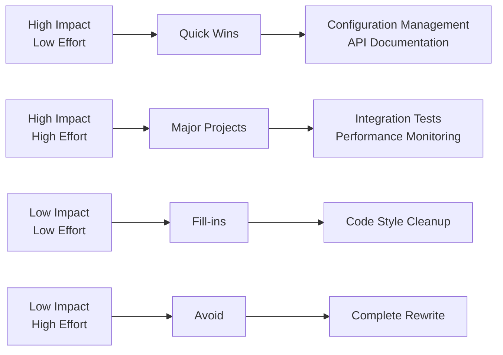

# 11. Risks and Technical Debt

## 11.1 Technical Risks

### High-Risk Items

| Risk | Probability | Impact | Risk Level | Mitigation Strategy |
|------|-------------|--------|------------|-------------------|
| **Service Mesh Complexity** | Medium | High | 🔴 High | Gradual rollout, training, fallback plans |
| **Event Consistency Issues** | High | Medium | 🟡 Medium | Event sourcing, compensation patterns |
| **Third-party Dependencies** | Medium | Medium | 🟡 Medium | Vendor evaluation, backup providers |
| **Data Migration Complexity** | Low | High | 🟡 Medium | Phased migration, extensive testing |
| **Performance Bottlenecks** | Medium | Medium | 🟡 Medium | Continuous monitoring, load testing |

### Detailed Risk Analysis

#### Risk 1: Service Mesh Operational Complexity
**Description**: Istio service mesh adds operational complexity and potential single point of failure.

**Impact**: 
- Increased debugging difficulty
- Additional infrastructure overhead
- Potential network latency
- Learning curve for operations team

**Mitigation Strategies**:
- Start with basic service mesh features
- Comprehensive monitoring and observability
- Team training on Istio operations
- Gradual feature adoption
- Fallback to direct service communication

**Contingency Plan**:
- Service mesh can be disabled if critical issues arise
- Direct service-to-service communication as fallback
- Network policies for basic security

#### Risk 2: Event-Driven Architecture Consistency
**Description**: Eventual consistency in event-driven systems may lead to temporary data inconsistencies.

**Impact**:
- User experience issues during inconsistent states
- Complex debugging of distributed state
- Potential business rule violations
- Customer service complications

**Mitigation Strategies**:
- Event sourcing for audit trails
- Saga patterns for distributed transactions
- Comprehensive monitoring of event flows
- Clear business rules for eventual consistency
- Compensating actions for error handling

**Monitoring Indicators**:
- Event processing lag metrics
- Failed event retry counts
- Saga completion rates
- Data consistency checks

#### Risk 3: Third-Party Service Dependencies
**Description**: Critical dependencies on external services (payment, email, AI) create availability risks.

**Dependencies**:
- Payment gateway integration
- Email service provider
- AI/ML services
- Cloud storage providers
- Identity provider

**Mitigation Strategies**:
- Circuit breaker patterns
- Graceful degradation modes
- Alternative service providers
- Local caching for non-critical features
- SLA monitoring and alerting

## 11.2 Technical Debt

### Current Technical Debt Inventory

| Area | Debt Type | Priority | Effort | Impact |
|------|-----------|----------|--------|--------|
| **Legacy Endpoint Patterns** | Code Quality | Medium | 2 weeks | Medium |
| **Missing Integration Tests** | Testing | High | 3 weeks | High |
| **Configuration Management** | Infrastructure | Medium | 1 week | Low |
| **API Documentation Gaps** | Documentation | Low | 1 week | Medium |
| **Performance Monitoring** | Observability | High | 2 weeks | High |

### Detailed Technical Debt Items

#### TD-001: Legacy Controller-Based Endpoints
**Description**: Some services still use traditional controller-based endpoints instead of minimal APIs.

**Current State**:
- 30% of endpoints use old controller pattern
- Inconsistent endpoint structure
- More boilerplate code required

**Target State**:
- Migrate to minimal APIs for consistency
- Reduce boilerplate code
- Improve maintainability

**Remediation Plan**:
```csharp
// Current: Controller-based
[ApiController]
[Route("api/[controller]")]
public class BooksController : ControllerBase
{
    [HttpGet("{id}")]
    public async Task<ActionResult<BookResponse>> GetBook(Guid id)
    {
        // Implementation
    }
}

// Target: Minimal API
app.MapGet("/api/books/{id}", async (Guid id, IMediator mediator) =>
{
    var query = new GetBookQuery(id);
    var result = await mediator.Send(query);
    return Results.Ok(result);
});
```

**Effort Estimate**: 2 weeks  
**Business Impact**: Low - Internal code quality improvement

#### TD-002: Missing Integration Tests
**Description**: Lack of comprehensive integration tests for service boundaries.

**Current Coverage**:
- Unit tests: 85%
- Integration tests: 45%
- End-to-end tests: 20%

**Target Coverage**:
- Unit tests: 90%
- Integration tests: 80%
- End-to-end tests: 60%

**Remediation Strategy**:
```csharp
// Example integration test pattern
[Collection("Database")]
public class CatalogServiceIntegrationTests : IClassFixture<WebApplicationFactory<Program>>
{
    [Fact]
    public async Task CreateBook_ShouldPersistToDatabase()
    {
        // Arrange
        var client = _factory.CreateClient();
        var command = new CreateBookCommand("Test Book", "123456789");
        
        // Act
        var response = await client.PostAsJsonAsync("/api/books", command);
        
        // Assert
        response.StatusCode.Should().Be(HttpStatusCode.Created);
        // Verify database state
    }
}
```

#### TD-003: Configuration Management Inconsistencies
**Description**: Inconsistent configuration patterns across services.

**Current Issues**:
- Mixed configuration sources
- Hard-coded values in some places
- No standardized configuration validation

**Remediation Plan**:
```csharp
// Standardized configuration pattern
public class ServiceConfiguration
{
    public const string SectionName = "ServiceName";
    
    [Required]
    public string DatabaseConnectionString { get; set; }
    
    [Required]
    [Range(1, 300)]
    public int CacheExpirationSeconds { get; set; }
    
    public void Validate()
    {
        var context = new ValidationContext(this);
        var results = new List<ValidationResult>();
        if (!Validator.TryValidateObject(this, context, results, true))
        {
            throw new ValidationException(string.Join(", ", results.Select(r => r.ErrorMessage)));
        }
    }
}
```

### Technical Debt Prioritization

#### Priority Matrix


#### Debt Repayment Schedule
| Sprint | Focus Area | Debt Items | Estimated Effort |
|--------|------------|------------|------------------|
| **Sprint 1** | Testing | Integration test coverage | 3 weeks |
| **Sprint 2** | Monitoring | Performance observability | 2 weeks |
| **Sprint 3** | Code Quality | Minimal API migration | 2 weeks |
| **Sprint 4** | Configuration | Standardized config patterns | 1 week |

## 11.3 Operational Risks

### Infrastructure Risks
| Risk | Description | Probability | Mitigation |
|------|-------------|-------------|------------|
| **Cloud Provider Outage** | Azure region unavailable | Low | Multi-region deployment |
| **Database Performance** | PostgreSQL performance degradation | Medium | Read replicas, monitoring |
| **Network Partitions** | Service communication failures | Medium | Circuit breakers, retries |
| **Storage Limits** | Blob storage quota exceeded | Low | Monitoring, alerts, archival |

### Security Risks
| Risk | Description | Impact | Mitigation |
|------|-------------|--------|------------|
| **Dependency Vulnerabilities** | Third-party package vulnerabilities | High | Automated scanning, updates |
| **API Abuse** | Rate limiting bypass attempts | Medium | Enhanced rate limiting, monitoring |
| **Data Breaches** | Unauthorized data access | High | Encryption, access controls, auditing |
| **Insider Threats** | Malicious internal access | Medium | Role-based access, audit logs |

## 11.4 Business Risks

### Market Risks
| Risk | Impact | Probability | Response Strategy |
|------|--------|-------------|------------------|
| **Technology Obsolescence** | Framework becomes outdated | Low | Regular technology reviews |
| **Competitive Pressure** | Feature parity requirements | High | Agile development practices |
| **Regulatory Changes** | GDPR/PCI compliance updates | Medium | Compliance monitoring, legal review |
| **Economic Downturn** | Reduced development budget | Medium | Cost optimization, priority focus |

### Project Risks
| Risk | Impact | Mitigation |
|------|--------|------------|
| **Key Personnel Loss** | Knowledge transfer gaps | Documentation, cross-training |
| **Scope Creep** | Delayed deliveries | Clear requirements, change control |
| **Integration Complexity** | Extended timeline | Proof of concepts, phased approach |
| **Performance Issues** | User satisfaction impact | Early performance testing |

## 11.5 Risk Monitoring and Management

### Risk Indicators
| Category | Key Metrics | Thresholds | Actions |
|----------|-------------|------------|---------|
| **Performance** | Response time, error rate | > 200ms, > 1% | Performance investigation |
| **Security** | Failed auth attempts, vulnerabilities | > 100/hour, any critical | Security review |
| **Operational** | Service availability, deployment success | < 99.9%, < 95% | Incident response |
| **Business** | User satisfaction, feature adoption | < 4.0/5.0, < 50% | Product review |

### Risk Review Process
1. **Weekly**: Technical risk assessment in team meetings
2. **Monthly**: Comprehensive risk review with stakeholders
3. **Quarterly**: Strategic risk evaluation and planning
4. **Ad-hoc**: Risk assessment for major changes

### Debt Management Process
1. **Continuous**: Identify and log technical debt
2. **Sprint Planning**: Allocate 20% capacity to debt reduction
3. **Monthly**: Review and prioritize debt backlog
4. **Quarterly**: Major debt reduction initiatives

## 11.6 Contingency Planning

### Service Degradation Scenarios
| Scenario | Response | Recovery |
|----------|----------|----------|
| **Database Unavailable** | Switch to read-only mode | Restore from backup |
| **Payment Service Down** | Queue orders for later processing | Retry when service returns |
| **Search Service Failure** | Fallback to basic text search | Restart vector database |
| **AI Service Unavailable** | Disable AI features gracefully | Manual customer service |

### Data Recovery Procedures
- **Backup Frequency**: Every 6 hours for critical data
- **Recovery Time Objective**: 4 hours maximum
- **Recovery Point Objective**: 30 minutes maximum data loss
- **Testing**: Monthly recovery drills

### Communication Plans
- **Internal**: Slack alerts, email notifications
- **External**: Status page updates, customer communications
- **Escalation**: On-call rotation, management notification
- **Documentation**: Incident reports, lessons learned