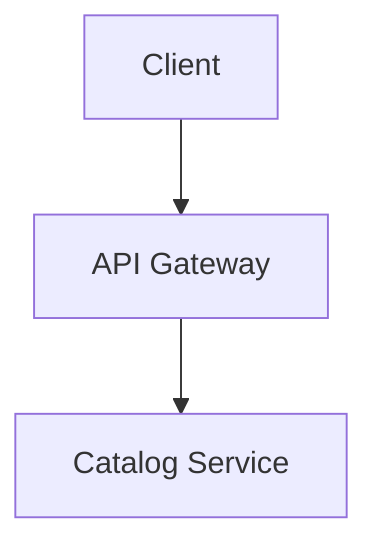

[](https://github.com/foxminchan/BookWorm/actions/workflows/docs.yaml)

# BookWorm Docusaurus

Comprehensive arc42 architecture documentation, Architecture Decision Records (ADRs), and a
technical blog for [BookWorm](https://github.com/foxminchan/BookWorm) — a modern e-commerce platform
built with .NET 10 microservices, Azure OpenAI, and Next.js 16.

The site is published to GitHub Pages at **<https://foxminchan.github.io/BookWorm>** and is
automatically rebuilt on every push to `main` via the CI workflow.

## Tech Stack

| Tool                                          | Version | Purpose                         |
| --------------------------------------------- | ------- | ------------------------------- |
| [Docusaurus](https://docusaurus.io/)          | 3.9.2   | Static site generator           |
| [React](https://react.dev/)                   | 19      | UI rendering                    |
| [TypeScript](https://www.typescriptlang.org/) | ~5.9    | Type-safe configuration         |
| [Mermaid](https://mermaid.js.org/)            | —       | Architecture diagrams           |
| [Bun](https://bun.sh/)                        | latest  | Package manager & script runner |

## Prerequisites

- [Node.js](https://nodejs.org/en/download/) >= 25.0.0
- [Bun](https://bun.sh/) >= 1.0 (used as the package manager and script runner)

## Getting Started

```bash
# Install dependencies
bun install

# Start the local development server (hot-reload enabled)
bun run start
```

The dev server opens at <http://localhost:3000/BookWorm> by default.

## Available Scripts

| Script                 | Description                                     |
| ---------------------- | ----------------------------------------------- |
| `bun run start`        | Start the development server with live reload   |
| `bun run build`        | Build the production static site into `build/`  |
| `bun run serve`        | Serve the production build locally              |
| `bun run clear`        | Clear the generated cache and build directories |
| `bun run format`       | Format all source files with Prettier           |
| `bun run format:check` | Check formatting without writing changes        |
| `bun run lint`         | Lint and auto-fix with ESLint                   |
| `bun run lint:check`   | Lint without auto-fixing                        |
| `bun run typecheck`    | Run TypeScript type checking                    |

## Project Structure

```
docs/docusaurus/
├── docs/                          # Documentation pages (arc42 sections)
│   ├── 01-introduction-and-goals/
│   ├── 02-architecture-constraints.mdx
│   ├── 03-context-and-scope/
│   ├── 04-solution-strategy.mdx
│   ├── 05-building-block-view/
│   ├── 06-runtime-view/
│   ├── 07-deployment-view/
│   ├── 08-cross-cutting-concepts/
│   ├── 09-architecture-decisions/  # ADRs
│   ├── 10-quality-requirements/
│   ├── 11-risks-and-technical-debts.mdx
│   ├── 12-glossary.mdx
│   └── intro.mdx
├── blog/                          # Technical blog posts
├── src/
│   ├── components/                # Custom React components
│   ├── css/custom.css             # Theme overrides
│   └── pages/                     # Standalone pages
├── static/                        # Static assets (images, icons)
├── docusaurus.config.ts           # Site configuration
└── sidebars.ts                    # Sidebar navigation
```

## Writing Documentation

### Adding a New Architecture Page

1. Create an `.md` or `.mdx` file inside the appropriate `docs/` subfolder.
2. Add front matter with `id`, `title`, and optionally `sidebar_position`.
3. The sidebar is auto-generated; adjust `sidebars.ts` only when a custom order is needed.

### Adding a Blog Post

1. Create a file under `blog/` following the `YYYY-MM-DD-slug.md` naming convention.
2. Include front matter: `title`, `authors`, `tags`, and `description`.

### Using Mermaid Diagrams

Wrap diagrams in a fenced code block tagged `mermaid`:

````markdown

````

### Editing an Existing Page

Every published page has an **Edit this page** link at the bottom that opens the source file
directly on GitHub.

## Deployment

The site is deployed automatically to [GitHub Pages](https://foxminchan.github.io/BookWorm) by the
`docs.yaml` workflow whenever changes are pushed to `main` inside the `docs/docusaurus/` directory.

To deploy manually:

```bash
bun run build
bun run deploy   # requires GH_TOKEN or SSH access
```

## Related Resources

- 📖 [Live Documentation](https://foxminchan.github.io/BookWorm)
- 🗂 [EventCatalog](https://bookwormdev.netlify.app/) — event-driven architecture catalog
- 🐙 [GitHub Repository](https://github.com/foxminchan/BookWorm)
