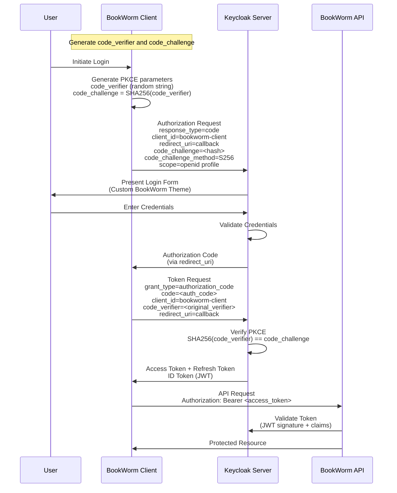

import Image from '@theme/IdealImage';

# Keycloak Identity and Access Management

<p style={{ textAlign: "justify" }}>
  This blog post explores how BookWorm leverages Keycloak for secure identity
  and access management, detailing its integration, OAuth2 PKCE flow, and the
  creation of a custom authentication theme using Keycloakify. You'll learn
  about the architecture, security benefits, and development workflow for
  customizing the user authentication experience in a modern e-commerce
  platform.
</p>

{/* truncate */}

## What is Keycloak?

[Keycloak](https://www.keycloak.org/) is an open-source Identity and Access Management (IAM) solution developed by Red Hat. It provides enterprise-grade security features including single sign-on (SSO), identity brokering, social login, user federation, and comprehensive admin capabilities.

### Key Features

- **Protocol Support**: OAuth 2.0, OpenID Connect, SAML 2.0
- **Identity Providers**: Integration with LDAP, Active Directory, social providers
- **Multi-tenancy**: Support for multiple realms and organizations
- **Extensibility**: Custom themes, plugins, and identity providers
- **Admin Console**: Web-based administration interface
- **Clustering**: High availability and scalability support

## Why Keycloak for BookWorm?

We chose Keycloak over alternatives like Auth0, Firebase Auth, or AWS Cognito for several compelling reasons:

### Business Benefits

- **Cost-Effective**: Open-source solution reduces licensing costs
- **Data Sovereignty**: Full control over user data and infrastructure
- **Compliance**: GDPR, CCPA compliance with data residency control
- **No Vendor Lock-in**: Standard protocols ensure portability

### Technical Advantages

- **Microservices Ready**: Perfect for distributed architectures
- **Customization**: Complete control over authentication flows and UI
- **Integration**: Seamless integration with existing systems
- **Standards-Based**: OAuth2, OpenID Connect, JWT standards compliance

### BookWorm-Specific Requirements

- **Multi-Client Support**: Web app, mobile app, and API clients
- **Custom Branding**: Branded authentication experience
- **Role-Based Access**: Customer, admin, and service-to-service roles
- **Social Login**: Integration with Google, Facebook, GitHub
- **Self-Hosting**: Deployed within our infrastructure for security

## Prerequisites

Before diving into the implementation details, you should have:

### Knowledge Requirements

- **OAuth2 & JWT**: Understanding of OAuth2 flows and JWT token structure
- **React & TypeScript**: Familiarity with modern React development
- **Docker**: Basic Docker knowledge for containerized deployment
- **Authentication Concepts**: Understanding of SSO, RBAC, and identity providers

### Development Environment

- **Node.js 18+**: For Keycloakify theme development
- **Maven**: Required for building Keycloak themes
- **Docker Compose**: For running the complete BookWorm stack
- **Modern IDE**: VS Code with TypeScript support recommended

## BookWorm Architecture Overview

## BookWorm Architecture Overview

Keycloak is an open-source Identity and Access Management (IAM) solution that provides authentication and authorization
services for the BookWorm application. It serves as the central identity provider, handling user authentication, token
management, and access control across all BookWorm microservices.

### Purpose in BookWorm Application

In the BookWorm e-commerce platform, Keycloak serves several critical functions:

- **Centralized Authentication**: Single sign-on (SSO) across all BookWorm services
- **User Management**: Registration, login, profile management, and password policies
- **API Protection**: Securing REST APIs with JWT tokens and OAuth2 flows
- **Role-Based Access Control**: Managing permissions for different user types (customers, admins, etc.)
- **Client Management**: Supporting multiple client applications (web app, mobile app, APIs)
- **Custom Branding**: Providing a branded login experience with the BookWorm theme

## Authorization Code + PKCE Flow

The BookWorm application implements the OAuth2 Authorization Code flow with PKCE (Proof Key for Code Exchange) for
secure authentication. This flow is particularly important for public clients like SPAs and mobile applications.



### PKCE Security Benefits

- **Prevents Authorization Code Interception**: Even if the authorization code is intercepted, it cannot be exchanged
  for tokens without the original `code_verifier`
- **No Client Secret Required**: Perfect for public clients that cannot securely store secrets
- **Dynamic Challenge**: Each authentication flow uses a unique code challenge/verifier pair

## Custom Theme with Keycloakify

The BookWorm application includes a custom Keycloak theme built with [Keycloakify](https://www.keycloakify.dev/), a modern React-based framework for creating Keycloak themes. This provides a branded authentication experience that matches the application's design language.

<Image img={require("./img/keycloak-theme.jpg")} />

### Keycloakify Project Structure

The theme is developed as a separate TypeScript/React project located in the `keycloakify/` directory:

```
keycloakify/
├── src/
│   ├── login/           # Login page components
│   ├── email/           # Email template components
│   ├── kc.gen.tsx       # Generated Keycloak context
│   └── main.tsx         # Theme entry point
├── package.json         # Dependencies and build scripts
├── vite.config.ts       # Vite configuration with Keycloakify plugin
├── tailwind.config.js   # Tailwind CSS configuration
└── tsconfig.json        # TypeScript configuration
```

💡 **Repository Location**: The complete Keycloak conf
 suite is available at [BookWorm/src/Aspire/BookWorm.AppHost/Container/keycloak](https://github.com/foxminchan/BookWorm/tree/main/src/Aspire/BookWorm.AppHost/Container/keycloak)

### Theme Features

- **Modern React Development**: Built with React, TypeScript, and Tailwind CSS
- **Component-Based Architecture**: Modular and maintainable theme components
- **Hot Reloading**: Fast development experience with Vite
- **Custom UI**: Tailored login and registration forms
- **Responsive Design**: Mobile-friendly login forms with Tailwind CSS
- **Consistent UX**: Matches the main application's look and feel
- **Professional Appearance**: Enhanced user trust and brand recognition
- **Email Templates**: Custom branded email notifications

### Theme Configuration

The Keycloakify theme is configured in `vite.config.ts`:

```typescript
keycloakify({
  themeName: "bookworm",
  themeVersion: "1.0.0",
  groupId: "com.foxminchan.bookworm.keycloak",
  artifactId: "keycloak-theme-bookworm",
  accountThemeImplementation: "none",
  keycloakifyBuildDirPath: "../themes",
});
```

The theme is applied to the realm in the realm configuration:

```json
{
  "loginTheme": "bookworm",
  "accountTheme": "bookworm",
  "adminConsoleTheme": "keycloak"
}
```

### Theme Development & Deployment

#### Development Workflow

1. **Setup**: Navigate to the `keycloakify/` directory and install dependencies

   ```bash
   cd keycloakify
   bun install
   ```

2. **Development**: Start the development server with hot reloading

   ```bash
   bun run dev
   ```

3. **Storybook**: Use Storybook for component development and testing

   ```bash
   bun run storybook
   ```

4. **Build Theme**: Generate the Keycloak theme artifacts
   ```bash
   bun run build-keycloak-theme
   ```

:::warning

Maven is required to build the Keycloak theme. Please ensure you have Maven installed and configured.

:::

#### Deployment Process

1. **Theme Build**: The Keycloakify build process generates theme files in the `../themes/` directory
2. **Delete Old Theme**: Remove any existing theme files to avoid conflicts
3. **Rename Build Files**: Ensure the theme files are named `BookWormThemes.jar` to match the Keycloak theme configuration
4. **Container Integration**: Theme files are automatically available to the Keycloak container
5. **Realm Configuration**: The theme is applied through realm settings
6. **Hot Deployment**: Changes are reflected when Keycloak restarts or reloads

#### Technology Stack

- **Keycloakify**: React-based Keycloak theme framework
- **React**: UI component library
- **TypeScript**: Type-safe development
- **Tailwind CSS**: Utility-first CSS framework
- **Vite**: Fast build tool and dev server
- **Storybook**: Component development environment

### Customization Areas

The BookWorm Keycloakify theme customizes several Keycloak pages through React components:

- **Login Page**: Modern React-based authentication form (`src/login/`)
- **Registration**: User signup form with custom validation
- **Password Reset**: Forgot password flow with branded styling
- **Error Pages**: Branded error messaging components
- **Email Templates**: React-based email components (`src/email/`)

### Development Notes

- **Component-Based**: Each Keycloak page is implemented as a React component
- **TypeScript Support**: Full type safety with Keycloak context types
- **Tailwind Styling**: Utility-first CSS for rapid UI development
- **Hot Reloading**: Instant feedback during development
- **Storybook Integration**: Isolated component development and testing
- **Build Automation**: Vite handles bundling and optimization
- **Theme Generation**: Keycloakify automatically generates compatible Keycloak theme files
