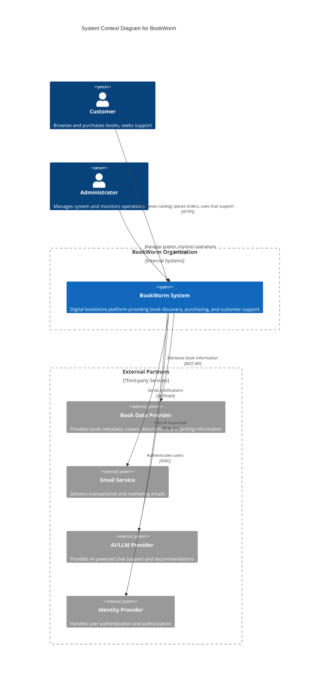

## Business Context Diagram

The business context shows BookWorm's interactions with its business environment, focusing on the
domain-specific inputs and outputs exchanged with external entities.

## External Domain Interfaces

### Customer Interactions

| Interface Type       | Purpose                         | Data Exchanged                                           | Business Rules                                   |
| -------------------- | ------------------------------- | -------------------------------------------------------- | ------------------------------------------------ |
| **Book Discovery**   | Product browsing and search     | Search queries, book metadata, user preferences          | Books must be available and properly categorized |
| **Order Management** | Purchase process                | Order details, delivery preferences                      | Orders require valid delivery information        |
| **Customer Support** | Issue resolution and assistance | Support requests, chat conversations, feedback           | Support must be available during business hours  |
| **User Profile**     | Account management              | Personal information, reading preferences, order history | User data must be protected and GDPR compliant   |

### Business Partner Interfaces

| Partner                     | Business Function            | Data Exchange                                             | Business Value                                    |
| --------------------------- | ---------------------------- | --------------------------------------------------------- | ------------------------------------------------- |
| **Book Data Providers**     | Content sourcing             | ISBN, metadata, pricing, availability                     | Comprehensive catalog with up-to-date information |
| **Email Service Providers** | Customer communication       | Order confirmations, newsletters, support updates         | Timely and reliable customer notifications        |
| **AI/LLM Providers**        | Enhanced customer experience | Chat queries, product recommendations, search enhancement | Improved customer support and personalization     |
| **Identity Providers**      | User authentication          | User credentials, profile data, access tokens             | Secure and seamless user experience               |

### Regulatory and Compliance Interfaces

| Requirement              | Domain Impact          | Data Protection                                  | Implementation                           |
| ------------------------ | ---------------------- | ------------------------------------------------ | ---------------------------------------- |
| **GDPR Compliance**      | Customer data handling | Personal data encryption, consent management     | Right to be forgotten, data portability  |
| **Accessibility (WCAG)** | User interface         | Screen reader compatibility, keyboard navigation | Inclusive design principles              |
| **Consumer Protection**  | Order fulfillment      | Return policies, dispute resolution              | Clear terms of service, refund processes |

## Business Data Flows

### Core Customer Journey

1. **Discovery Phase**
   - Customer searches for books using keywords, filters, or AI recommendations
   - System retrieves book metadata from external providers
   - Personalized recommendations based on browsing history and preferences

2. **Evaluation Phase**
   - Customer views detailed book information, reviews, and ratings
   - AI chat support assists with questions and recommendations
   - Social proof through community reviews and ratings

3. **Purchase Phase**
   - Customer adds items to cart and proceeds to checkout
   - System validates inventory and pricing with external providers
   - Order confirmation sent via email service

4. **Fulfillment Phase**
   - Order details transmitted to fulfillment systems
   - Customer receives shipment tracking information
   - Post-purchase follow-up for reviews and satisfaction

### Business Intelligence and Analytics

- **Sales Performance**: Revenue tracking, bestseller analysis, seasonal trends
- **Customer Behavior**: Page views, search patterns, conversion funnels
- **Inventory Optimization**: Stock levels, demand forecasting, supplier performance
- **Support Effectiveness**: Chat resolution times, customer satisfaction scores

## Business Constraints and Rules

### Commercial Constraints

- **Pricing Models**: Dynamic pricing based on supplier agreements and market conditions
- **Inventory Management**: Real-time stock validation to prevent overselling
- **Geographic Restrictions**: Content licensing limitations by region

### Operational Constraints

- **Business Hours**: Customer support availability windows
- **Service Levels**: Response time commitments for different service tiers
- **Capacity Planning**: Peak period handling (holidays, promotional events)
- **Data Retention**: Legal requirements for transaction and customer data storage

### Quality Requirements

- **Customer Experience**: Sub-2-second page load times, 99.9% uptime
- **Data Accuracy**: Real-time inventory synchronization, accurate pricing
- **Security**: End-to-end encryption, fraud detection, secure authentication
- **Compliance**: Automated compliance checking, audit trail maintenance
