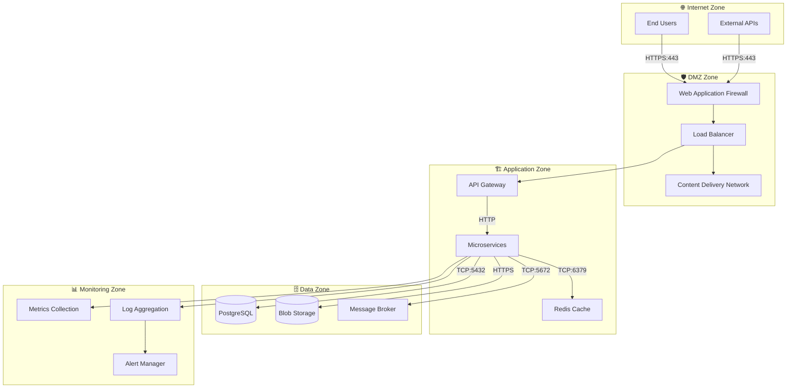

# Technical Context

## Technical Interfaces

### Input/Output Channels

| Channel               | Technology     | Protocol | Port | Authentication | Data Format | Purpose                     |
| --------------------- | -------------- | -------- | ---- | -------------- | ----------- | --------------------------- |
| **Storefront App**    | Next.js 16     | HTTPS    | 443  | OIDC/JWT       | HTML/CSS/JS | Customer-facing ecommerce   |
| **Backoffice App**    | Next.js 16     | HTTPS    | 443  | OIDC/JWT       | HTML/CSS/JS | Admin dashboard             |
| **API Gateway Proxy** | Custom ASP.NET | HTTPS    | 443  | JWT Bearer     | JSON        | Backend service aggregation |
| **Service APIs**      | REST           | HTTP     | 80   | JWT Bearer     | JSON        | Microservice endpoints      |
| **Real-time Chat**    | WebSocket      | WSS      | 443  | JWT Bearer     | JSON        | Live communication          |
| **AI Agent Dev UI**   | HTTP           | HTTP     | 80   | None           | HTML/JSON   | AI agent debugging          |
| **Health Checks**     | HTTP           | HTTP     | 80   | None           | JSON        | Service monitoring          |
| **Metrics Export**    | HTTP           | HTTP     | 9090 | Basic Auth     | Prometheus  | Performance monitoring      |

### External System Integration

#### Frontend Applications

##### Storefront (Customer-facing)

- **Framework**: Next.js 16 with React 19 and Server Components
- **Build System**: Turbo monorepo with pnpm workspace
- **UI Stack**: TanStack Query (data fetching), TanStack Table (data grids), TanStack Form (forms),
  Radix UI (components), Tailwind CSS v4 (styling)
- **Authentication**: Better Auth with Keycloak OIDC integration
- **API Integration**: Consumes API Gateway via `NEXT_PUBLIC_GATEWAY_HTTPS`/`HTTP` environment
  variables
- **Features**: Product catalog, shopping cart, order management, user reviews, AI-powered
  recommendations
- **Deployment**: Aspire-managed Turbo app with OpenTelemetry, health checks, external HTTP
  endpoints

##### Backoffice (Admin Dashboard)

- **Framework**: Next.js 16 with React 19 and Server Components
- **Build System**: Turbo monorepo with pnpm workspace
- **UI Stack**: Radix UI components, Tailwind CSS v4, data tables with TanStack Table
- **Authentication**: Better Auth with Keycloak OIDC and RBAC
- **API Integration**: Consumes API Gateway via `NEXT_PUBLIC_GATEWAY_HTTPS`/`HTTP` environment
  variables
- **Features**: Inventory management, order processing, user management, analytics dashboards
- **Deployment**: Aspire-managed Turbo app with OpenTelemetry, health checks, external HTTP
  endpoints

##### Shared Packages (9 packages)

- **api-client**: Typed API clients for backend services
- **api-hooks**: React hooks for data fetching with TanStack Query
- **ui**: Shared UI component library (Radix UI-based)
- **types**: TypeScript type definitions shared across apps
- **utils**: Common utility functions
- **validations**: Zod schemas for form and API validation
- **mocks**: Testing mocks for development and testing
- **eslint-config**: Shared ESLint configuration
- **typescript-config**: Shared TypeScript configuration

#### API Gateway Proxy

- **Implementation**: Custom ASP.NET Core proxy with YARP (Yet Another Reverse Proxy)
- **Purpose**: Aggregates and routes requests from frontend to backend microservices
- **Routing**: Routes to 5 services: Chat, Rating, Ordering, Basket, Catalog
- **Authentication**: Keycloak token introspection middleware validates JWT tokens
- **Features**:
  - Service discovery integration with Aspire
  - Request/response transformation
  - Health check aggregation
  - CORS policy management for frontend origins
- **Environment Variables Injection**: Gateway endpoints injected into frontend apps as
  `NEXT_PUBLIC_GATEWAY_HTTPS` and `NEXT_PUBLIC_GATEWAY_HTTP`

#### Authentication & Identity (Keycloak)

- **Protocol**: OpenID Connect (OIDC) / OAuth 2.0
- **Transport**: HTTPS with TLS 1.3
- **Authentication**: Client credentials and user authentication flows
- **Data Exchange**: JWT tokens, user profiles, group memberships

#### Book Data Providers

- **Protocol**: REST over HTTPS
- **Authentication**: API keys with rate limiting
- **Data Format**: JSON with OpenAPI 3.0 specifications
- **Caching Strategy**: Redis cache with TTL-based invalidation

#### Email Services

- **Protocol**: SMTP (port 587) and REST API
- **Authentication**: API keys and SMTP credentials
- **Data Format**: MIME for emails, JSON for API
- **Templates**: Dynamic templates with personalization

#### AI/ML Services (Azure OpenAI)

- **Provider**: Azure OpenAI Service (enterprise-grade managed service)
- **Models**:
  - **GPT-4o-mini**: Cost-effective chat completion for AI-powered features (Chat service, Rating
    service)
  - **text-embedding-3-large**: High-quality embeddings for semantic search and RAG patterns
- **Integration Framework**: Microsoft Semantic Kernel for .NET
- **Protocol**: REST over HTTPS with Azure authentication
- **Authentication**: Azure AD service principal with managed identity
- **Data Format**: JSON with streaming support for chat completions
- **Rate Limiting**: Azure-managed quota with automatic throttling
- **Health Checks**: Model availability health checks integrated with Aspire
- **Agent Framework**: Microsoft Agents AI Framework with A2A Protocol for agent-to-agent
  communication
- **Dev UI**: AI agent debugging interface available at `/dev/agent` endpoints (Chat, Rating
  services)
- **Use Cases**:
  - Book content enrichment and categorization (Catalog service)
  - Personalized recommendations (Rating service)
  - Customer support chat (Chat service)
  - Semantic search across book catalog

### Infrastructure Interfaces

#### Azure Container Apps

- **Container Runtime**: Docker containers
- **Networking**: Virtual network with private endpoints
- **Scaling**: HTTP-based autoscaling with custom metrics
- **Load Balancing**: Built-in load balancer with health checks
- **Logging**: Container logs to Azure Log Analytics

#### Data Storage

- **PostgreSQL**: TCP connections on port 5432
- **Redis**: TCP connections on port 6379 with AUTH
- **Blob Storage**: HTTPS REST API with SAS tokens
- **Vector Database**: HTTP API with embeddings storage

#### Message Broker (RabbitMQ)

- **Protocol**: AMQP 0.9.1 on port 5672
- **Authentication**: Username/password with virtual hosts
- **Queues**: Durable queues with dead letter exchanges
- **Patterns**: Publish/subscribe and request/reply

## Network Architecture

### Network Zones

### Security Boundaries

| Boundary               | Protection            | Access Control              | Monitoring             |
| ---------------------- | --------------------- | --------------------------- | ---------------------- |
| **Internet → DMZ**     | WAF, DDoS protection  | IP filtering, rate limiting | Security event logging |
| **DMZ → Application**  | Network ACLs          | Certificate-based auth      | Traffic analysis       |
| **Application → Data** | Private endpoints     | Service identity            | Query monitoring       |
| **Cross-zone**         | Encryption in transit | Mutual TLS                  | Audit logging          |

## Technology Mapping

### Programming Frameworks

- **Backend Services**: .NET 10 with ASP.NET Core Minimal APIs
- **Frontend Applications**: Next.js 16 with React 19 (Server Components + Client Components)
- **Frontend Build System**: Turbo monorepo with pnpm workspaces
- **API Gateway**: Custom ASP.NET Core proxy with YARP (Yet Another Reverse Proxy)
- **Message Handling**: MassTransit with RabbitMQ (outbox/inbox patterns)
- **AI Integration**: Microsoft Semantic Kernel + Microsoft Agents AI Framework

### Data Technologies

- **Primary Database**: PostgreSQL with connection pooling
- **Caching**: Azure Redis with clustering
- **File Storage**: Azure Blob Storage with CDN
- **Search**: Vector database for semantic search

### DevOps & Deployment

- **Containerization**: Docker with multi-stage builds
- **Orchestration**: Azure Container Apps with Dapr
- **CI/CD**: GitHub Actions with automated testing
- **Monitoring**: Azure Application Insights + Prometheus

### Security Stack

- **Authentication**: Keycloak with OIDC/OAuth2
- **Authorization**: Policy-based with RBAC
- **Secrets**: Azure Key Vault integration
- **Encryption**: TLS 1.3, AES-256 at rest

## Performance and Scalability

### Performance Characteristics

- **Response Time**: 95th percentile under 500ms
- **Throughput**: 1000+ requests per second
- **Concurrency**: 10,000+ concurrent users
- **Availability**: 99.9% uptime target

### Scalability Patterns

- **Horizontal Scaling**: Container autoscaling
- **Database Scaling**: Read replicas and sharding
- **Caching**: Multi-level cache hierarchy
- **CDN**: Global content distribution

### Monitoring and Observability

- **Metrics**: Custom business and technical metrics
- **Logging**: Structured logging with correlation IDs
- **Tracing**: Distributed tracing across services
- **Alerting**: Proactive alerts on SLA violations
