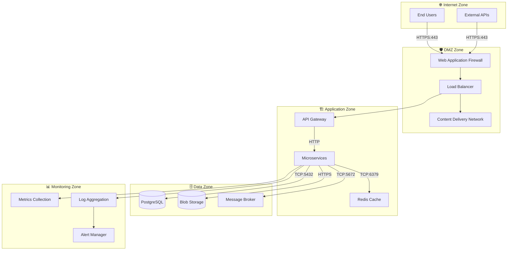

# Technical Context

## Technical Interfaces

### Input/Output Channels

| Channel            | Technology | Protocol | Port | Authentication | Data Format | Purpose                |
| ------------------ | ---------- | -------- | ---- | -------------- | ----------- | ---------------------- |
| **Web Interface**  | HTTP/HTTPS | HTTPS    | 443  | OIDC/JWT       | HTML/CSS/JS | User interface         |
| **API Gateway**    | REST       | HTTPS    | 443  | JWT Bearer     | JSON        | Programmatic access    |
| **Real-time Chat** | WebSocket  | WSS      | 443  | JWT Bearer     | JSON        | Live communication     |
| **Health Checks**  | HTTP       | HTTP     | 8080 | None           | JSON        | Service monitoring     |
| **Metrics Export** | HTTP       | HTTP     | 9090 | Basic Auth     | Prometheus  | Performance monitoring |

### External System Integration

#### Authentication & Identity (Keycloak)

- **Protocol**: OpenID Connect (OIDC) / OAuth 2.0
- **Transport**: HTTPS with TLS 1.3
- **Authentication**: Client credentials and user authentication flows
- **Data Exchange**: JWT tokens, user profiles, group memberships

#### Book Data Providers

- **Protocol**: REST over HTTPS
- **Authentication**: API keys with rate limiting
- **Data Format**: JSON with OpenAPI 3.0 specifications
- **Caching Strategy**: Redis cache with TTL-based invalidation

#### Email Services

- **Protocol**: SMTP (port 587) and REST API
- **Authentication**: API keys and SMTP credentials
- **Data Format**: MIME for emails, JSON for API
- **Templates**: Dynamic templates with personalization

#### AI/ML Services

- **Protocol**: REST over HTTPS
- **Authentication**: API keys or OAuth 2.0
- **Data Format**: JSON with base64 encoded content
- **Rate Limiting**: Request throttling and quota management

### Infrastructure Interfaces

#### Azure Container Apps

- **Container Runtime**: Docker containers
- **Networking**: Virtual network with private endpoints
- **Scaling**: HTTP-based autoscaling with custom metrics
- **Load Balancing**: Built-in load balancer with health checks
- **Logging**: Container logs to Azure Log Analytics

#### Data Storage

- **PostgreSQL**: TCP connections on port 5432
- **Redis**: TCP connections on port 6379 with AUTH
- **Blob Storage**: HTTPS REST API with SAS tokens
- **Vector Database**: HTTP API with embeddings storage

#### Message Broker (RabbitMQ)

- **Protocol**: AMQP 0.9.1 on port 5672
- **Authentication**: Username/password with virtual hosts
- **Queues**: Durable queues with dead letter exchanges
- **Patterns**: Publish/subscribe and request/reply

## Network Architecture

### Network Zones

### Security Boundaries

| Boundary               | Protection            | Access Control              | Monitoring             |
| ---------------------- | --------------------- | --------------------------- | ---------------------- |
| **Internet → DMZ**     | WAF, DDoS protection  | IP filtering, rate limiting | Security event logging |
| **DMZ → Application**  | Network ACLs          | Certificate-based auth      | Traffic analysis       |
| **Application → Data** | Private endpoints     | Service identity            | Query monitoring       |
| **Cross-zone**         | Encryption in transit | Mutual TLS                  | Audit logging          |

## Technology Mapping

### Programming Frameworks

- **Backend Services**: .NET with ASP.NET Core
- **Frontend**: Blazor Server/WASM and React
- **API Gateway**: YARP (Yet Another Reverse Proxy)
- **Message Handling**: MassTransit with RabbitMQ

### Data Technologies

- **Primary Database**: PostgreSQL with connection pooling
- **Caching**: Azure Redis with clustering
- **File Storage**: Azure Blob Storage with CDN
- **Search**: Vector database for semantic search

### DevOps & Deployment

- **Containerization**: Docker with multi-stage builds
- **Orchestration**: Azure Container Apps with Dapr
- **CI/CD**: GitHub Actions with automated testing
- **Monitoring**: Azure Application Insights + Prometheus

### Security Stack

- **Authentication**: Keycloak with OIDC/OAuth2
- **Authorization**: Policy-based with RBAC
- **Secrets**: Azure Key Vault integration
- **Encryption**: TLS 1.3, AES-256 at rest

## Performance and Scalability

### Performance Characteristics

- **Response Time**: 95th percentile under 500ms
- **Throughput**: 1000+ requests per second
- **Concurrency**: 10,000+ concurrent users
- **Availability**: 99.9% uptime target

### Scalability Patterns

- **Horizontal Scaling**: Container autoscaling
- **Database Scaling**: Read replicas and sharding
- **Caching**: Multi-level cache hierarchy
- **CDN**: Global content distribution

### Monitoring and Observability

- **Metrics**: Custom business and technical metrics
- **Logging**: Structured logging with correlation IDs
- **Tracing**: Distributed tracing across services
- **Alerting**: Proactive alerts on SLA violations
