# Solution Strategy

This section summarizes the fundamental decisions and solution strategies that shape BookWorm's architecture. These cornerstone decisions provide the foundation for detailed implementation decisions and serve as guiding principles for the system's evolution.

---

## Technology Decisions

### Core Technology Stack

The foundation of BookWorm is built on carefully selected technologies that align with modern cloud-native development practices:

| Technology       | Decision Rationale                                                                       | Impact                                                                           | Trade-offs                                                                 |
| ---------------- | ---------------------------------------------------------------------------------------- | -------------------------------------------------------------------------------- | -------------------------------------------------------------------------- |
| **ASP.NET Core** | Cross-platform, high-performance web framework with excellent cloud integration          | Scalable APIs, dependency injection, middleware pipeline                         | Requires deeper knowledge of middleware and async programming              |
| **.NET Aspire**  | Cloud-native development framework with built-in observability and service orchestration | Simplified local development, integrated telemetry, streamlined Azure deployment | Still evolving, ecosystem not as mature as other orchestrators              |
| **Docker**       | Industry standard for containerization and orchestration                                 | Consistent deployments, scaling, and isolation                                   | Adds operational complexity and requires DevOps expertise                  |

---

### Data Storage Strategy

| Technology                 | Use Case                              | Rationale                                                                     |
| -------------------------- | ------------------------------------- | ----------------------------------------------------------------------------- |
| **PostgreSQL**             | Primary database for most services    | ACID compliance, JSON support, excellent .NET integration, proven scalability |
| **Redis**                  | Caching and session storage           | High-performance in-memory storage, pub/sub capabilities, distributed caching |
| **Azure Blob Storage**     | File storage and static assets        | Scalable object storage, CDN integration, cost-effective for large files      |
| **Qdrant Vector Database** | AI-powered search and recommendations | Specialized vector storage for embeddings, semantic search capabilities       |

---

### Communication Patterns

| Pattern          | Technology                | Rationale                                                                    |
| ---------------- | ------------------------- | ---------------------------------------------------------------------------- |
| **Synchronous**  | HTTP/REST APIs            | Simple integration, excellent tooling, wide ecosystem support                |
| **Asynchronous** | RabbitMQ with MassTransit | Reliable message delivery, event-driven architecture, decoupling             |
| **Real-time**    | SignalR                   | Bi-directional communication, automatic transport fallback, .NET integration |

---

### CI/CD Strategy

- **GitHub Actions** for CI with unit/integration tests
- **Infrastructure as Code** using Bicep for reproducible environments
- **Trade-offs**: Increased pipeline complexity but ensures reliability, repeatability, and security in deployments

---

### Observability & Monitoring

- **.NET Aspire** telemetry (logs, metrics, traces) with OpenTelemetry integration
- **Dashboards** in Azure Monitor/Grafana for real-time visibility
- **Distributed tracing** with correlation IDs across services
- **Trade-offs**: Higher storage costs for telemetry data, requires governance to avoid noise

---

### Security Strategy

- **Authentication & Authorization**: Identity Provider (OIDC/OAuth2 with Keycloak)
- **Secrets Management**: Azure Key Vault integration
- **Data Protection**: Encryption at rest (PostgreSQL TDE, Blob Storage SSE) and in transit (TLS)
- **Trade-offs**: Stronger security may add latency and operational complexity

---

## Architectural Patterns

### Microservices Architecture

**Decision**: Adopt domain-driven microservices architecture with clear service boundaries.

**Rationale**:

- **Scalability**: Independent scaling of services based on different load characteristics
- **Technology Diversity**: Enables showcasing various .NET technologies and patterns
- **Team Autonomy**: Supports autonomous development teams with clear ownership boundaries
- **Fault Isolation**: Failures in one service don't cascade to the entire system
- **Security & Compliance**: Enables domain-level isolation for sensitive data

**Service Boundaries**:

### Event-Driven Architecture with CQRS

**Decision**: Adopt event-driven architecture combined with Command Query Responsibility Segregation (CQRS) across microservices to decouple domains, improve scalability, and enable reliable integration.

---

#### Rationale

- **Loose Coupling**: Services communicate through events without direct dependencies, enabling independent evolution and deployment.
- **Scalability**: Read and write operations can be scaled and optimized independently.
- **Eventual Consistency**: Acceptable for business scenarios, though requires careful user experience design to handle temporary inconsistencies.
- **Audit Trail**: Events provide natural audit logging, replay capabilities, and temporal queries.
- **Integration**: Events enable easy integration with external systems, analytics, and third-party consumers.
- **Evolvability**: Supports long-term system maintainability and adaptability.

---

#### Implementation Patterns

- **Command Processing**:
  - *In-process*: MediatR for local command handling.
  - *Cross-service*: Message bus (e.g., Kafka, RabbitMQ, Azure Service Bus) for distributed commands.

- **Event Publishing**:
  - Use the **Transactional Outbox pattern** to ensure reliable event delivery as part of the database transaction.

- **Event Consumption**:
  - Apply the **Idempotent Inbox pattern** to prevent duplicate event handling and support reliable retries.

- **Saga Orchestration**:
  - Manage long-running or multi-service workflows using orchestration engines (e.g., MassTransit, NServiceBus, Dapr Workflows).

---

#### Saga Patterns

**Orchestration Saga**
Centralized control for complex business processes:
- Order processing workflow
- Compensation handling for failed transactions

**When to use**: Strong coordination is required, with well-defined compensating actions.

---

**Choreography Saga**
Loosely coupled domain interactions where services react to published events:
- Catalog updates triggering search index refresh
- User actions generating analytics events
- Cross-domain notifications

**When to use**: Suitable for independent services, but may lead to “event spaghetti” if overused.

---

#### Event Patterns

| Pattern              | Implementation                          | Use Case                                 | Trade-offs / Risks                                   |
| -------------------- | --------------------------------------- | ---------------------------------------- | --------------------------------------------------- |
| **Outbox Pattern**   | Database transaction + event publishing | Ensuring reliable event publishing       | Adds DB complexity, requires cleanup & monitoring   |
| **Inbox Pattern**    | Idempotent event processing             | Preventing duplicate event handling      | Needs idempotency logic and deduplication storage   |
| **Event Sourcing**   | Domain events as source of truth        | Audit trail and temporal queries         | Higher learning curve, large event stores to manage |
| **CQRS**             | Separate read/write models              | Optimized queries and command processing | Increases complexity, requires sync strategies      |

---

#### Additional Considerations

- **Error Handling & Monitoring**:
  Poison message queues, retries with backoff, dead-letter queues.

- **Schema Evolution**:
  Version events carefully (e.g., schema registry, backward-compatible contracts).

- **Performance & Scalability**:
  Use partitioning, sharding, or stream-based architectures for high-throughput systems.

- **Observability**:
  Correlation IDs and tracing are essential for debugging distributed event flows.

---

### AI Services Architecture

- **Text Embedding**: Nomic Embed Text for semantic search capabilities
- **Conversational AI**: LLM for intelligent chatbot interactions
- **Search Enhancement**: AI-powered search with natural language understanding

---

## Quality Goals Achievement

### Testing Strategy

```mermaid
mindmap
    root((Testing Strategy))
        Unit Tests
            Fast execution
            Isolated testing
            Comprehensive coverage
            ✅ Most Coverage
        Integration Tests
            Service boundaries
            API contracts
            Database interactions
            📈 More Coverage
        Architecture Tests
            Design compliance
            Dependency rules
            Vertical Slice Architecture
            📝 Medium Coverage
        Contract Tests
            API compatibility
            Event schemas
            Consumer-driven
            📝 Medium Coverage
        E2E Tests
            Critical user journeys
            Full system validation
            ⚠️ Few, Slow, Expensive
        Load Tests
            Performance validation
            Scalability testing
            Stress testing
            ⚠️ Resource Intensive
```

---

### Performance Strategy

| Goal                     | Strategy                                    | Implementation                                                 |
| ------------------------ | ------------------------------------------- | -------------------------------------------------------------- |
| **Sub-2s Response Time** | Multi-level caching, efficient queries, CDN | Redis caching, Entity Framework optimization, Azure Front Door |
| **High Throughput**      | Horizontal scaling, async processing        | Container autoscaling, background job processing               |
| **Low Latency**          | Regional deployment, connection pooling     | Azure regions, database connection management                  |

---

### Scalability Strategy

| Aspect                 | Approach                         | Technology                              |
| ---------------------- | -------------------------------- | --------------------------------------- |
| **Horizontal Scaling** | Stateless services, auto-scaling | Azure Container Apps, load balancers    |
| **Data Scaling**       | Database sharding, read replicas | PostgreSQL clustering, Redis clustering |
| **Caching Strategy**   | Multi-tier caching               | In-memory, Redis, CDN                   |

---

## Organizational Decisions

### Development Process

**Decision**: Adopt agile development with DevOps practices.

**Implementation**:

- **Sprint Planning**: 2-week iterations with clear goals
- **Code Quality**: Peer reviews, automated testing, SonarQube analysis
- **Continuous Integration**: GitHub Actions with automated builds and tests
- **Continuous Deployment**: Automated deployment to staging and production environments

---

### Team Structure

**Decision**: Full-stack teams with service ownership.

**Rationale**:

- **End-to-End Responsibility**: Teams own services from development to production
- **Reduced Handoffs**: Faster delivery with fewer coordination points
- **Skill Development**: Cross-functional skills across the technology stack
- **Business Alignment**: Teams aligned with business domains rather than technical layers

---

### Third-Party Integration Strategy

| Service Type           | Approach                     | Rationale                                           |
| ---------------------- | ---------------------------- | --------------------------------------------------- |
| **Authentication**     | External provider (Keycloak) | Specialized security expertise, reduced maintenance |
| **Email Services**     | Cloud provider (SendGrid)    | Deliverability expertise, compliance handling       |
| **AI/ML Services**     | External APIs                | Rapid innovation, specialized infrastructure        |
| **Payment Processing** | External provider            | PCI compliance, fraud protection                    |

---

## Key Constraints Impact

### Technical Constraints

| Constraint             | Impact                                   | Mitigation Strategy                                                 |
| ---------------------- | ---------------------------------------- | ------------------------------------------------------------------- |
| **.NET Ecosystem**     | Technology choices limited to .NET stack | Leverage extensive .NET ecosystem, use best-of-breed .NET libraries |
| **Azure Platform**     | Cloud provider lock-in                   | Use standard protocols, containerization for portability            |
| **Budget Limitations** | Infrastructure cost optimization         | Auto-scaling, reserved instances, cost monitoring                   |

---

### Organizational Constraints

| Constraint           | Impact                                   | Strategy                                                     |
| -------------------- | ---------------------------------------- | ------------------------------------------------------------ |
| **Team Size**        | Limited parallel development             | Clear service boundaries, minimal inter-service dependencies |
| **Skill Level**      | Learning curve for cloud-native patterns | Comprehensive documentation, training, pair programming      |
| **Time Constraints** | MVP prioritization                       | Iterative development, technical debt management             |

---

## Future Evolution Strategy

### Extensibility Points

- **Service Addition**: Well-defined service templates and patterns
- **Integration Patterns**: Standardized event schemas and API contracts
- **Technology Updates**: Containerized deployment enables technology evolution
- **Scale Requirements**: Horizontal scaling patterns and monitoring

---

### Monitoring and Adaptation

- **Performance Metrics**: Continuous monitoring of quality goals achievement
- **Architecture Fitness**: Regular architecture reviews and fitness functions
- **Technology Evolution**: Planned migration paths for technology updates
- **Business Evolution**: Flexible patterns to accommodate changing business requirements
