## Overview Diagram

The container diagram above shows the high-level decomposition of the BookWorm Store system into its
main building blocks and their relationships.

```mermaid
C4Container
    title Container Diagram for BookWorm Store System

    Enterprise_Boundary(bookworm, "BookWorm Store") {
      Person(customer, "Customer", "A user who wants to browse and purchase books")
      Person(admin, "Admin", "A user who manages the store")

      System_Ext(email, "Email Service", "Handles email notifications")
      System_Ext(identity, "Keycloak", "Handles user authentication (OIDC)")
      System_Ext(azureai, "Azure OpenAI", "AI models (GPT-4o-mini, text-embedding-3-large)")

      System_Boundary(frontend, "Frontend Applications") {
        Container(storefront, "Storefront", "Next.js 16, React 19", "Customer-facing ecommerce app")
        Container(backoffice, "Backoffice", "Next.js 16, React 19", "Admin dashboard")
      }

      System_Boundary(application, "Application") {
        Container(gateway, "API Gateway Proxy", "ASP.NET Core, YARP", "Routes requests to backend services")

        System_Boundary(catalog, "Catalog Domain") {
          Container(catalogSvc, "Catalog Service", ".NET 10", "Manages product catalog and inventory")
          Container(ratingSvc, "Rating Service", ".NET 10", "Manages product ratings and reviews with AI")
          Container(chatSvc, "Chat Service", ".NET 10", "AI-powered chat and support")
        }

        System_Boundary(order, "Order Domain") {
          Container(notificationSvc, "Notification Service", ".NET 10", "Sends notifications to users")
          Container(orderSvc, "Order Service", ".NET 10", "Handles order processing")
          Container(basketSvc, "Basket Service", ".NET 10", "Manages shopping cart")
          Container(financeSvc, "Finance Service", ".NET 10", "Handles payment processing with saga")
        }

        Container(mcpSvc, "MCP Server", ".NET 10", "Model Context Protocol tool server")
        Container(scheduler, "Scheduler Service", ".NET 10", "Background job processing")
      }

      System_Boundary(infrastructure, "Infrastructure") {
        SystemQueue(eventBus, "Event Bus", "RabbitMQ with MassTransit")
        ContainerDb(redis, "Redis Cache", "Azure Managed Redis", "Hybrid caching and sessions")

        System_Boundary(database, "Database") {
          ContainerDb(notificationDb, "Notification DB", "PostgreSQL", "Stores notification records")
          ContainerDb(catalogDb, "Catalog DB", "PostgreSQL", "Stores product information")
          ContainerDb(vectorDb, "Qdrant", "Vector Database", "Stores embeddings for semantic search")
          ContainerDb(orderDb, "Order DB", "PostgreSQL", "Stores order information")
          ContainerDb(financeDb, "Finance DB", "PostgreSQL", "Stores payment records")
          ContainerDb(ratingDb, "Rating DB", "PostgreSQL", "Stores ratings and reviews")
          ContainerDb(blobStorage, "Blob Storage", "Azure Storage", "Stores files and assets")
        }
      }
    }

    BiRel(customer, storefront, "Browses and shops", "HTTPS")
    BiRel(admin, backoffice, "Manages store", "HTTPS")

    Rel(storefront, gateway, "API requests", "HTTPS/JWT")
    Rel(backoffice, gateway, "API requests", "HTTPS/JWT")

    Rel(gateway, catalogSvc, "Routes requests", "HTTP")
    Rel(gateway, orderSvc, "Routes requests", "HTTP")
    Rel(gateway, basketSvc, "Routes requests", "HTTP")
    Rel(gateway, ratingSvc, "Routes requests", "HTTP")
    Rel(gateway, chatSvc, "Routes requests", "HTTP")
    Rel(gateway, identity, "Token introspection", "HTTPS")

    Rel(catalogSvc, catalogDb, "Reads/Writes", "TCP")
    Rel(catalogSvc, blobStorage, "Stores files", "HTTPS")
    Rel(catalogSvc, vectorDb, "Embeddings", "HTTP")
    Rel(catalogSvc, redis, "Hybrid cache", "TCP")
    Rel(catalogSvc, azureai, "AI models", "HTTPS")

    Rel(orderSvc, orderDb, "Reads/Writes", "TCP")
    Rel(basketSvc, redis, "Session storage", "TCP")
    Rel(financeSvc, financeDb, "Reads/Writes", "TCP")
    Rel(ratingSvc, ratingDb, "Reads/Writes", "TCP")
    Rel(ratingSvc, azureai, "AI models", "HTTPS")
    Rel(chatSvc, azureai, "AI models", "HTTPS")
    Rel(chatSvc, mcpSvc, "Tool calls", "HTTP")
    Rel(ratingSvc, mcpSvc, "Tool calls", "HTTP")
    Rel(notificationSvc, notificationDb, "Reads/Writes", "TCP")
    Rel(notificationSvc, email, "Sends emails", "SMTP")

    BiRel(catalogSvc, eventBus, "Publishes/Subscribes", "AMQP")
    BiRel(orderSvc, eventBus, "Publishes/Subscribes", "AMQP")
    BiRel(basketSvc, eventBus, "Publishes/Subscribes", "AMQP")
    BiRel(financeSvc, eventBus, "Publishes/Subscribes", "AMQP")
    BiRel(ratingSvc, eventBus, "Publishes/Subscribes", "AMQP")
    Rel(eventBus, notificationSvc, "Subscribes", "AMQP")
    Rel(eventBus, scheduler, "Subscribes", "AMQP")

    Rel(basketSvc, catalogSvc, "Retrieves products", "HTTP")
    Rel(orderSvc, catalogSvc, "Retrieves products", "HTTP")

    Rel(chatSvc, ratingSvc, "A2A Protocol", "HTTP")

    Rel(email, customer, "Delivers to", "SMTP")
    Rel(storefront, identity, "OAuth/OIDC", "HTTPS")
    Rel(backoffice, identity, "OAuth/OIDC", "HTTPS")

    UpdateLayoutConfig($c4ShapeInRow="3", $c4BoundaryInRow="2")
```

## Contained Building Blocks

| **Name**                 | **Responsibility**                                                  |
| ------------------------ | ------------------------------------------------------------------- |
| **Application Layer**    | Contains all business services and API gateway                      |
| **Infrastructure Layer** | Provides cross-cutting concerns like messaging and data persistence |
| **External Systems**     | Third-party services for authentication and email                   |

## Important Interfaces

| **Interface**        | **Protocol** | **Description**                                        |
| -------------------- | ------------ | ------------------------------------------------------ |
| HTTP REST APIs       | HTTPS        | Synchronous communication between gateway and services |
| gRPC                 | gRPC/HTTP2   | High-performance inter-service communication           |
| Event Bus            | AMQP         | Asynchronous messaging for domain events               |
| Database Connections | TCP          | Data persistence layer connections                     |

## Building Block Descriptions

### Application Layer

**Purpose/Responsibility** The application layer contains all business services and the API gateway
that orchestrates requests. It implements the core business logic of the BookWorm store system.

**Interface(s)**

- HTTP REST APIs for external client communication
- gRPC for internal service-to-service communication
- Event publishing/subscribing via AMQP

**Quality/Performance Characteristics**

- High availability through service redundancy
- Horizontal scalability for individual services
- Fault tolerance with circuit breaker patterns
- Performance optimization through caching and async processing

**Directory/File Location**

- `src/Services/` - Contains all microservices
- `src/Aspire/BookWorm.AppHost/` - Application orchestration
- `src/BuildingBlocks/` - Shared components

### API Gateway Proxy

**Purpose/Responsibility** Custom ASP.NET Core proxy using YARP (Yet Another Reverse Proxy) that
serves as the single entry point for frontend applications. Routes requests to appropriate
microservices (Chat, Rating, Ordering, Basket, Catalog) and handles Keycloak authentication.

**Interface(s)**

- HTTPS REST API endpoints for frontend clients (Storefront and Backoffice)
- Keycloak token introspection middleware for JWT validation
- Internal HTTP calls to downstream services
- Service discovery integration with Aspire

**Quality/Performance Characteristics**

- High throughput with async request processing
- Load balancing to backend services
- CORS policy management for frontend origins
- Circuit breaker for service resilience
- Health check aggregation

### Catalog Service

**Purpose/Responsibility** Manages the product catalog with advanced AI capabilities including
vector search, file storage, and AI-powered recommendations. Integrates with Azure Blob Storage,
Qdrant vector database, and Azure OpenAI for semantic search and content enrichment.

**Interface(s)**

- REST API for catalog management
- Azure OpenAI integration (GPT-4o-mini for content, text-embedding-3-large for embeddings)
- Vector embedding services for semantic search via Qdrant
- Azure Blob Storage integration for file management
- Microsoft.Extensions.Caching.Hybrid for L1/L2 caching
- Event publishing for catalog changes

**Directory/File Location** `src/Services/Catalog/`

**Quality/Performance Characteristics**

- AI-powered semantic search with Azure OpenAI embeddings
- Azure Blob Storage for scalable file management
- Hybrid caching (in-memory + Redis) for performance
- Real-time vector index updates
- Event-driven architecture with RabbitMQ

### Order Service

**Purpose/Responsibility** Handles complete order lifecycle management with event-driven
architecture. Manages order entities, buyer information, and publishes domain events for order state
changes.

**Interface(s)**

- REST API for order and buyer management
- Event publishing for order lifecycle events
- gRPC integration for external service calls
- Real-time order streaming capabilities

**Directory/File Location** `src/Services/Ordering/`

**Quality/Performance Characteristics**

- Event sourcing for complete audit trail
- CQRS pattern implementation
- PostgreSQL for order persistence
- Real-time notifications via events

### Basket Service

**Purpose/Responsibility** Manages shopping cart functionality with Redis-based storage. Handles
basket lifecycle from creation to checkout with event publishing.

**Interface(s)**

- REST API for basket operations
- gRPC integration for product validation
- Event publishing for basket state changes
- Redis Protocol for data persistence

**Directory/File Location** `src/Services/Basket/`

**Quality/Performance Characteristics**

- Redis-based session storage with TTL
- Real-time cart synchronization
- Event-driven basket state management

### Finance Service

**Purpose/Responsibility** Implements saga orchestration pattern for distributed transaction
coordination. Manages order processing workflow with state machine implementation.

**Interface(s)**

- Saga orchestration for distributed transactions
- State machine queries and status endpoints
- Event-driven coordination with other services
- PostgreSQL for financial records and transaction state

**Directory/File Location** `src/Services/Finance/`

**Quality/Performance Characteristics**

- Saga pattern for distributed transaction management
- State machine for order workflow coordination
- Compensation logic for transaction rollbacks
- Event-driven architecture for service coordination

### Rating Service

**Purpose/Responsibility** Manages product ratings and reviews with event-driven architecture.
Handles feedback collection, storage, and aggregation.

**Interface(s)**

- REST API for rating operations
- Event publishing for rating changes
- PostgreSQL for rating data persistence

**Directory/File Location** `src/Services/Rating/`

**Quality/Performance Characteristics**

- Event-driven rating updates
- PostgreSQL for reliable data storage
- Real-time feedback processing

### Chat Service

**Purpose/Responsibility** Provides AI-powered conversational capabilities using Azure OpenAI
(GPT-4o-mini) with Microsoft Agents AI Framework integration. Supports Model Context Protocol (MCP)
for tool exposure and A2A Protocol for agent-to-agent communication.

**Interface(s)**

- REST API for chat operations
- Azure OpenAI integration with GPT-4o-mini model
- Microsoft Semantic Kernel for AI orchestration
- Model Context Protocol (MCP) server integration for tool calls
- A2A Protocol for agent-to-agent communication with Rating service
- Real-time chat capabilities
- Dev UI available at `/dev/agent` endpoint for agent debugging

**Directory/File Location** `src/Services/Chat/`

**Quality/Performance Characteristics**

- AI-powered conversations with Azure OpenAI GPT-4o-mini
- Microsoft Agents AI Framework for agent orchestration
- MCP integration for standardized tool usage
- A2A Protocol for multi-agent workflows
- Real-time chat processing
- PostgreSQL for chat session persistence

### Notification Service

**Purpose/Responsibility** Handles email notifications with template engine and multiple provider
support. Processes events from other services to send transactional emails.

**Interface(s)**

- Event subscription for notification triggers
- SMTP/API integration with SendGrid
- Template engine for email composition
- Azure Table Storage for notification records

**Directory/File Location** `src/Services/Notification/`

**Quality/Performance Characteristics**

- Reliable email delivery with SendGrid integration
- Template-based email composition
- Event-driven notification processing
- Azure Table Storage for audit trails

### Scheduler Service

**Purpose/Responsibility** Manages scheduled tasks and background jobs across the system. Handles
recurring operations like data cleanup and report generation.

**Interface(s)**

- Internal APIs for job scheduling
- Background job processing
- Health monitoring for scheduled tasks

**Directory/File Location** `src/Services/Scheduler/`

### Infrastructure Layer

**Purpose/Responsibility** Provides foundational services including messaging, data persistence, and
cross-cutting concerns that support the application layer.

**Interface(s)**

- Event Bus (AMQP) for asynchronous messaging
- Database connections (TCP) for data persistence
- Monitoring and logging endpoints

**Quality/Performance Characteristics**

- High availability data storage
- Message durability and ordering
- Distributed caching capabilities
- Comprehensive monitoring and alerting
