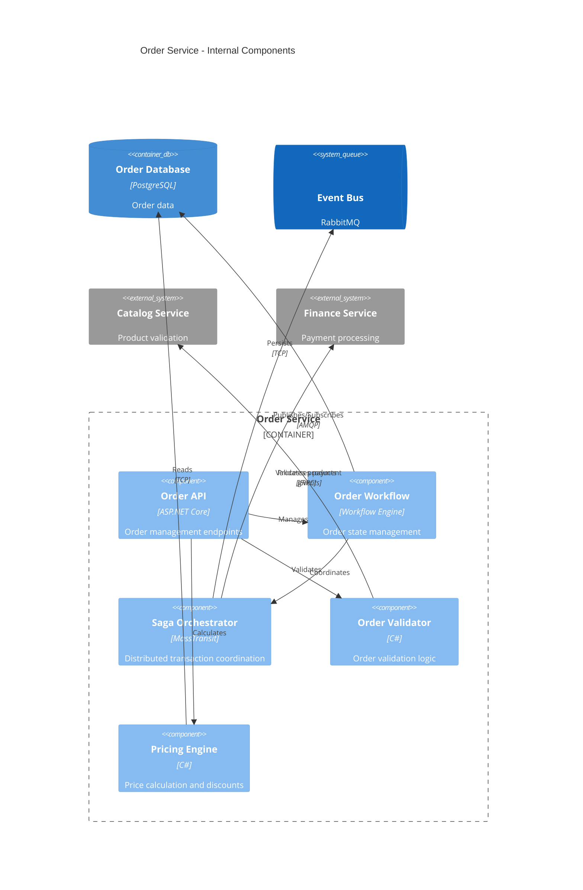
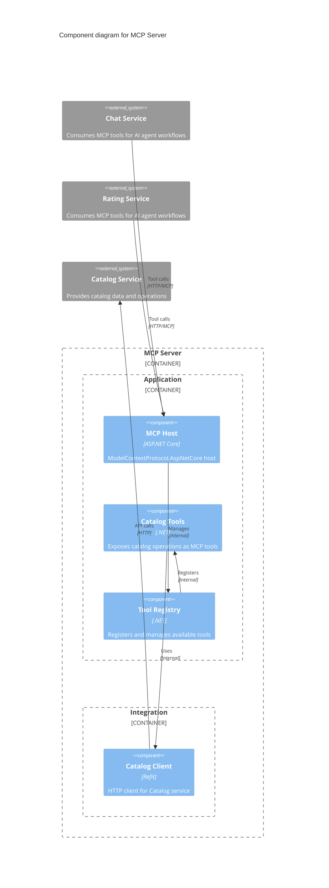

# Level 2 - Detailed Service Decomposition

Here we zoom into the most important building blocks from Level 1, showing their internal structure
and components based on the actual implementation. We focus on the core business services that
represent the most complexity and business value.

## Catalog Service - Internal Structure

The Catalog Service manages product catalog, AI-powered search, and file storage with sophisticated
AI integration.

```mermaid
C4Component
    title Component diagram for Catalog Service

    Container_Boundary(catalog, "Catalog Service") {
        Container_Boundary(application, "Application") {
            Component(catalogEndpoint, "Catalog Endpoints", ".NET", "Manages book catalog operations")
            Component(catalogFacade, "Catalog Facade", ".NET", "Core business logic for catalog management")
            Component(vectorService, "Vector Service", ".NET", "Manages vector embeddings for semantic search")
            Component(storageService, "Storage Service", ".NET", "Manages book files and metadata")
            Component(llmService, "LLM Service", ".NET", "Handles AI-powered recommendations")
            Component(eventHandler, "Event Handler", ".NET", "Handles event publishing/subscribing")
        }

        Container_Boundary(infrastructure, "Infrastructure") {
            ComponentDb(storageSystem, "Storage System", "Azure Blob Storage", "Stores book files and resources")
            ComponentQueue(eventBus, "Event Bus", "RabbitMQ", "Handles async communication")
            ComponentDb(cacheSystem, "Cache System", "Redis", "Hybrid caching (L1: memory, L2: Redis)")

            Container_Boundary(ai, "AI Infrastructure") {
                Component(azureOpenAI, "Azure OpenAI", "Managed AI Service", "Provides AI models")

                Container_Boundary(model, "AI Models") {
                    Component(chatModel, "GPT-4o-mini", "Chat Model", "Content generation and enrichment")
                    Component(embeddingModel, "text-embedding-3-large", "Embedding Model", "Semantic embeddings (3072 dimensions)")
                }
            }

            Container_Boundary(database, "Database") {
                ComponentDb(catalogDb, "Catalog DB", "PostgreSQL", "Stores book metadata and catalog information")
                ComponentDb(vectorDb, "Vector DB", "Qdrant", "Stores vector embeddings")
            }
        }
    }

    Rel(catalogEndpoint, catalogFacade, "Uses", "Internal")
    Rel(catalogFacade, storageService, "Uses", "Internal")
    Rel(catalogFacade, vectorService, "Uses", "Internal")
    Rel(catalogFacade, llmService, "Uses", "Internal")
    Rel(catalogFacade, cacheSystem, "Reads/Writes", "Hybrid Cache")

    Rel(azureOpenAI, chatModel, "Provides", "Internal")
    Rel(azureOpenAI, embeddingModel, "Provides", "Internal")

    Rel(catalogFacade, catalogDb, "Reads/Writes", "SQL")
    Rel(vectorService, vectorDb, "Reads/Writes", "API")
    Rel(llmService, vectorDb, "Reads/Writes", "API")
    Rel(llmService, azureOpenAI, "Uses", "HTTPS")
    Rel(vectorService, azureOpenAI, "Uses", "HTTPS")
    Rel(storageService, storageSystem, "Reads/Writes", "HTTPS")

    BiRel(eventHandler, eventBus, "Publishes/Subscribes", "Async")
    BiRel(catalogFacade, eventHandler, "Uses", "Internal")
    UpdateLayoutConfig($c4ShapeInRow="3", $c4BoundaryInRow="1")
```

### Catalog Endpoints

**Purpose/Responsibility** Exposes HTTP REST endpoints for catalog operations including book
management, search, and metadata operations.

**Interface(s)**

- REST API for book CRUD operations
- Search and filtering endpoints
- File upload/download endpoints

### Catalog Facade

**Purpose/Responsibility** Core business logic coordinator that orchestrates operations across
storage, vector, and LLM services.

**Interface(s)**

- Business operation coordination
- Transaction management
- Domain rule enforcement

### Vector Service

**Purpose/Responsibility** Manages vector embeddings for semantic search capabilities using AI
models.

**Interface(s)**

- Vector embedding generation
- Similarity search operations
- Index management

### Storage Service

**Purpose/Responsibility** Manages book files and metadata storage in Azure Blob Storage.

**Interface(s)**

- File upload/download operations
- Metadata management
- Storage optimization

### LLM Service

**Purpose/Responsibility** Provides AI-powered recommendations and content enrichment using Azure
OpenAI (GPT-4o-mini).

**Interface(s)**

- AI recommendation generation via Azure OpenAI
- Content enrichment and categorization
- Semantic Kernel orchestration
- Vector database queries for RAG patterns

**Quality/Performance Characteristics**

- Azure OpenAI integration with managed scaling
- Hybrid caching for AI responses
- Streaming support for long-running operations

## Order Service - Internal Structure

The Order Service handles order lifecycle management with event-driven architecture.

### Order Endpoints

**Purpose/Responsibility** REST API endpoints for order management including creation, updates,
queries, and buyer management.

**Interface(s)**

- Order CRUD operations
- Buyer management endpoints
- Order status tracking
- Real-time order streaming

### Order Facade

**Purpose/Responsibility** Core business logic for order processing, state management, and business
rule enforcement.

**Interface(s)**

- Order lifecycle management
- Business rule validation
- Integration with external services

### Event Publisher

**Purpose/Responsibility** Publishes domain events for order state changes to notify other services.

**Interface(s)**

- Event publishing to message bus
- Event subscription handling
- Message routing and delivery

## Finance Service - Internal Structure

The Finance Service implements saga orchestration for distributed transaction management.

### Finance Endpoints

**Purpose/Responsibility** Provides API endpoints for retrieving state machine information and
financial operation status.

**Interface(s)**

- State machine query endpoints
- Transaction status queries
- Financial reporting APIs

### Saga Orchestrator

**Purpose/Responsibility** Coordinates distributed transactions across multiple services using the
Saga pattern for order processing.

**Interface(s)**

- Saga workflow coordination
- Distributed transaction management
- Compensation action handling
- State persistence and recovery

## Chat Service - Internal Structure

The Chat Service provides AI-powered conversational capabilities with advanced model integration.

### Chat Endpoints

**Purpose/Responsibility** REST API endpoints for chat session management and real-time conversation
handling.

**Interface(s)**

- Chat session CRUD operations
- Real-time chat streaming
- Chat history retrieval

### Chat Facade

**Purpose/Responsibility** Core business logic for chat management, session handling, and
conversation flow control.

**Interface(s)**

- Chat session orchestration
- Business rule enforcement
- Integration coordination

### LLM Service

**Purpose/Responsibility** Handles AI-powered conversations using large language models with tool
integration capabilities.

**Interface(s)**

- AI conversation processing
- Model Context Protocol (MCP) integration
- Chat model interaction
- Context management and persistence

## Supporting Services

### Basket Service

### Rating Service

### Notification Service

### API Layer

**Purpose/Responsibility** Exposes HTTP REST endpoints for catalog operations including product
browsing, search, and catalog management.

**Interface(s)**

- HTTP REST API for external clients
- OpenAPI/Swagger documentation
- JWT authentication integration

**Quality/Performance Characteristics**

- Response caching for read operations
- Rate limiting and throttling
- Input validation and sanitization

### gRPC Service

**Purpose/Responsibility** Provides high-performance internal API for other services to retrieve
product information.

**Interface(s)**

- gRPC protocol buffers interface
- Service discovery integration
- Load balancing support

**Quality/Performance Characteristics**

- Low-latency communication
- Binary serialization
- Connection pooling

### Search Engine

**Purpose/Responsibility** Implements AI-powered semantic search using vector embeddings for
intelligent product discovery.

**Interface(s)**

- Vector similarity search
- Text search with ranking
- Filter and faceting capabilities

**Quality/Performance Characteristics**

- Sub-second search response times
- Relevance scoring and ranking
- Real-time index updates

### Inventory Manager

**Purpose/Responsibility** Manages product stock levels, availability, and inventory operations.

**Interface(s)**

- Stock level queries
- Inventory reservation and release
- Stock movement tracking

**Quality/Performance Characteristics**

- ACID transactions for stock operations
- Optimistic concurrency control
- Real-time stock updates

## Order Service - Internal Structure

The Order Service orchestrates the complex order fulfillment process across multiple services.

### Order API

**Purpose/Responsibility** Provides RESTful endpoints for order creation, modification, tracking,
and management.

**Interface(s)**

- CRUD operations for orders
- Order status tracking
- Order history and reporting

**Quality/Performance Characteristics**

- Idempotent operations
- Request validation
- Audit logging

### Order Workflow

**Purpose/Responsibility** Manages the order state machine and lifecycle from creation to
completion.

**Interface(s)**

- State transition management
- Business rule enforcement
- Workflow persistence

**Quality/Performance Characteristics**

- Reliable state transitions
- Compensation actions
- Recovery from failures

### Saga Orchestrator

**Purpose/Responsibility** Coordinates distributed transactions across multiple services using the
Saga pattern.

**Interface(s)**

- Saga definition and execution
- Compensation transaction handling
- Cross-service coordination

**Quality/Performance Characteristics**

- Eventually consistent transactions
- Failure isolation
- Automatic retry and compensation

---

## MCP Server (BookWorm.McpTools) - Internal Structure

The MCP (Model Context Protocol) Server exposes catalog and service capabilities as standardized AI
agent tools, enabling AI agents to interact with BookWorm services.

### MCP Host

**Purpose/Responsibility** ASP.NET Core host that implements the Model Context Protocol
specification, enabling AI agents to discover and invoke tools.

**Interface(s)**

- MCP Protocol endpoints for tool discovery
- Tool invocation endpoints
- OpenAPI specification generation

**Quality/Performance Characteristics**

- Standardized protocol compliance
- Async tool execution
- Error handling and retry logic

### Catalog Tools

**Purpose/Responsibility** Exposes catalog service operations as MCP tools that AI agents can
discover and use.

**Interface(s)**

- Book search tools
- Catalog query tools
- Product information retrieval tools

**Quality/Performance Characteristics**

- Tool schema definitions
- Input validation
- Result transformation

### Tool Registry

**Purpose/Responsibility** Manages the registration, discovery, and metadata for available MCP
tools.

**Interface(s)**

- Tool registration and discovery
- Schema management
- Capability advertisement

**Quality/Performance Characteristics**

- Dynamic tool registration
- Schema validation
- Performance monitoring

**Integration with Microsoft Agents AI Framework**:

- Used by Chat and Rating services for agent tooling
- Supports A2A Protocol for agent-to-agent communication
- Enables standardized AI agent integration across services
