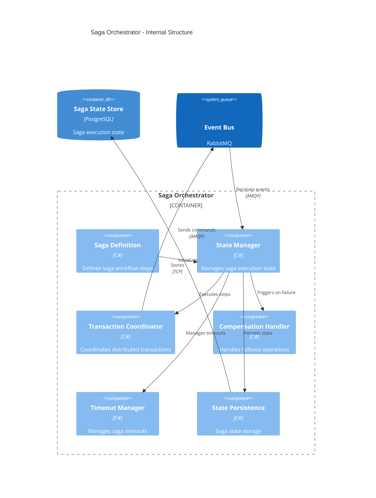
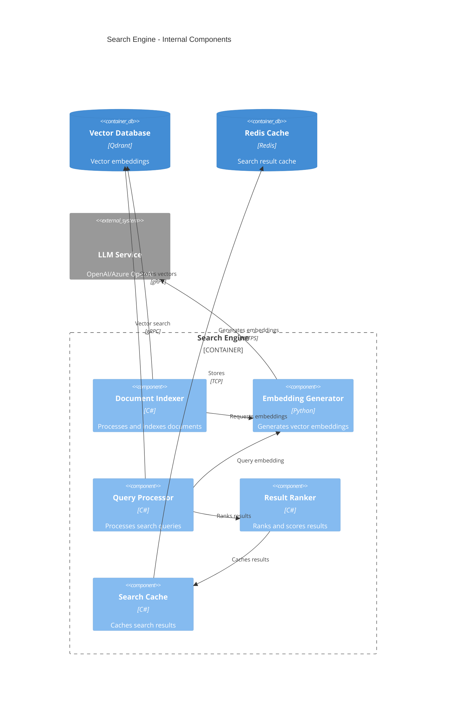

# Level 3

Here we dive deeper into the most complex and critical components from Level 2, showing their internal implementation details and patterns.

## Saga Orchestrator - Internal Implementation

The Saga Orchestrator is a critical component that manages distributed transactions across multiple services. It implements the Saga pattern to ensure data consistency in a microservices environment.



### Saga Definition

**Purpose/Responsibility**
Defines the workflow steps, compensation actions, and business rules for distributed transactions.

**Implementation Details**

- Fluent API for saga definition
- Step dependencies and ordering
- Compensation action mapping
- Timeout configuration

**Code Structure**

```
src/Services/Ordering/
├── Sagas/
│   ├── OrderProcessingSaga.cs
│   ├── PaymentProcessingSaga.cs
│   └── InventoryReservationSaga.cs
├── SagaDefinitions/
│   ├── OrderSagaDefinition.cs
│   └── PaymentSagaDefinition.cs
```

### State Manager

**Purpose/Responsibility**
Tracks saga execution progress, manages state transitions, and ensures consistency.

**Implementation Details**

- State machine implementation
- Event sourcing for state changes
- Optimistic concurrency control
- State snapshot capabilities

### Transaction Coordinator

**Purpose/Responsibility**
Orchestrates the execution of saga steps across multiple services.

**Implementation Details**

- Command dispatching
- Response correlation
- Parallel step execution
- Dependency resolution

### Compensation Handler

**Purpose/Responsibility**
Executes compensation actions when saga steps fail, ensuring system consistency.

**Implementation Details**

- Reverse operation execution
- Compensation ordering
- Partial failure handling
- Idempotent compensation

## Search Engine - Vector Search Implementation

The Search Engine implements sophisticated AI-powered search using vector embeddings and semantic similarity.



### Document Indexer

**Purpose/Responsibility**
Processes product documents and creates searchable index entries with vector embeddings.

**Implementation Details**

- Document parsing and normalization
- Metadata extraction
- Batch processing capabilities
- Index update strategies

**Processing Pipeline**

1. Document preprocessing
2. Text extraction and cleaning
3. Embedding generation
4. Vector storage
5. Index optimization

### Embedding Generator

**Purpose/Responsibility**
Converts text content into high-dimensional vector representations using machine learning models.

**Implementation Details**

- Integration with OpenAI/Azure OpenAI
- Batch embedding generation
- Caching of embeddings
- Model version management

**Quality Characteristics**

- Sub-second embedding generation
- High-dimensional vector space (1536 dimensions)
- Semantic similarity preservation
- Model consistency across updates

### Query Processor

**Purpose/Responsibility**
Processes user search queries and converts them into vector search operations.

**Implementation Details**

- Query parsing and normalization
- Intent recognition
- Filter application
- Hybrid search (vector + keyword)

**Search Features**

- Semantic similarity search
- Faceted search with filters
- Auto-completion suggestions
- Search result personalization
