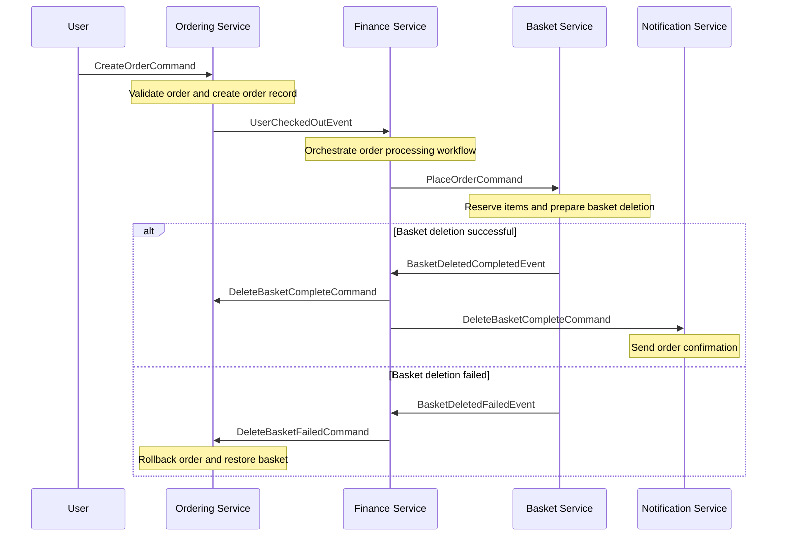
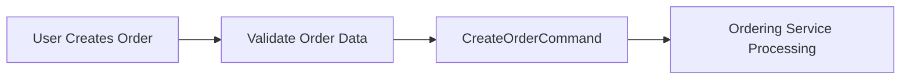
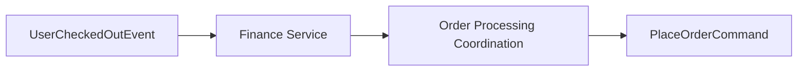
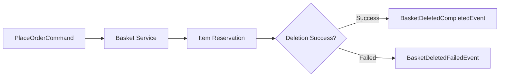
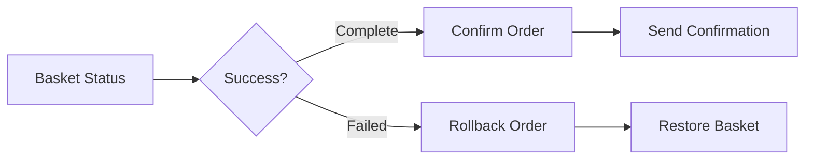

# Create Order Scenario

The Create Order scenario represents the core business process of BookWorm, handling the complete journey from customer checkout to order fulfillment. This flow implements the **Saga pattern** to ensure data consistency across distributed services.

## Overview

This end-to-end flow orchestrates multiple microservices to process customer orders, focusing on proper inventory management, basket cleanup, and customer communication throughout the order lifecycle.

## 🎯 Business Context

### Objectives

1. **Seamless Checkout**: Minimize friction in the purchase process
2. **Inventory Accuracy**: Prevent overselling through proper reservation
3. **Data Consistency**: Ensure proper basket cleanup after order creation
4. **Customer Communication**: Keep customers informed throughout

### Success Criteria

- ✅ Order creation within 5 seconds
- ✅ 99.9% success rate for valid orders
- ✅ Proper basket cleanup after order completion
- ✅ Confirmation notification within 1 minute

## 🔄 Order Processing Flow

The following sequence diagram illustrates the complete order creation and processing flow:

## 📋 Detailed Process Steps

### 1. Order Initiation

**Actions:**

- User submits order with selected items
- System validates order data and business rules
- CreateOrderCommand is generated and sent to Ordering Service

### 2. Order Orchestration

**Actions:**

- Finance Service receives checkout event
- Coordinates the order processing workflow
- PlaceOrderCommand is sent to Basket Service

### 3. Basket Management

**Actions:**

- Basket Service reserves ordered items
- Attempts to delete user's basket after order confirmation
- Publishes appropriate event based on outcome

### 4. Order Completion & Compensation

**Actions:**

- **Success Path**: Order confirmed, notification sent
- **Failure Path**: Order rolled back, basket restored

## 📋 Business Rules

### Order Validation Rules

| Rule                    | Description                   | Action on Violation        |
| ----------------------- | ----------------------------- | -------------------------- |
| **Minimum Order Value** | Orders must be >= $10         | Reject with error message  |
| **Maximum Items**       | Max 50 unique items per order | Split into multiple orders |
| **Stock Availability**  | All items must be in stock    | Suggest alternatives       |
| **Shipping Address**    | Must be deliverable region    | Show supported regions     |

### Compensation Rules

When failures occur, the system automatically compensates:

1. **Basket Clear Failed**:
   - Cancel order record
   - Restore basket contents
   - Alert support team for investigation

2. **Notification Failed**:
   - Retry with exponential backoff
   - Log for manual follow-up
   - Order processing still completes successfully

## 🏗️ Architecture Patterns

### Saga Pattern Implementation

The order flow implements the **Choreography-based Saga** pattern:

- **Event-Driven**: Services communicate through domain events
- **Autonomous**: Each service manages its own compensation logic
- **Resilient**: Automatic retry and rollback mechanisms
- **Observable**: Complete audit trail of all events

## 📈 SLA Requirements

### Service Level Agreement

| Component                | Availability | Response Time | Error Rate |
| ------------------------ | ------------ | ------------- | ---------- |
| **API Gateway**          | 99.99%       | < 50ms        | < 0.01%    |
| **Ordering Service**     | 99.9%        | < 200ms       | < 0.1%     |
| **Finance Service**      | 99.9%        | < 200ms       | < 0.1%     |
| **Basket Service**       | 99.9%        | < 100ms       | < 0.1%     |
| **Notification Service** | 99.5%        | < 1000ms      | < 0.5%     |
| **Overall Flow**         | 99.9%        | < 5s          | < 0.1%     |

## 🛡️ Security Considerations

### Data Protection

- **Encryption at Rest**: Order data encrypted in database
- **Access Control**: Role-based access to order information
- **Data Retention**: Compliance with data retention policies
- **GDPR Compliance**: Customer data protection rights

## 🔍 Monitoring & Observability

### Key Metrics

- **Order Success Rate**: Percentage of successfully completed orders
- **Average Processing Time**: Time from checkout to confirmation
- **Basket Cleanup Rate**: Success rate of basket deletion after orders
- **Compensation Events**: Frequency of rollback scenarios
- **Customer Satisfaction**: Order fulfillment ratings

### Alerting Thresholds

- **Order Success Rate < 99%**: Critical alert
- **Processing Time > 10s**: Warning alert
- **Basket Cleanup Failures > 1%**: Investigation required
- **Multiple Compensations**: Potential system issue
