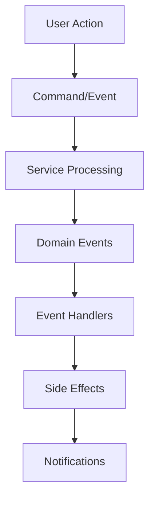
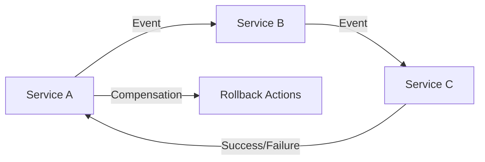
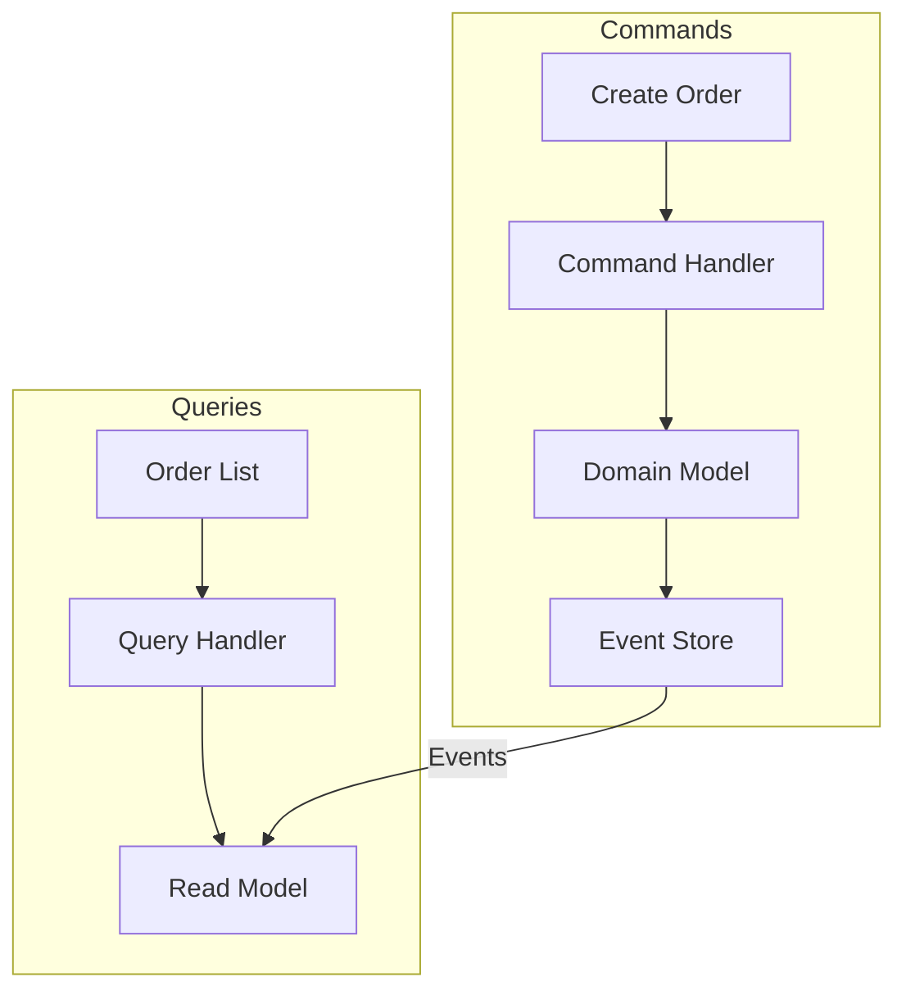
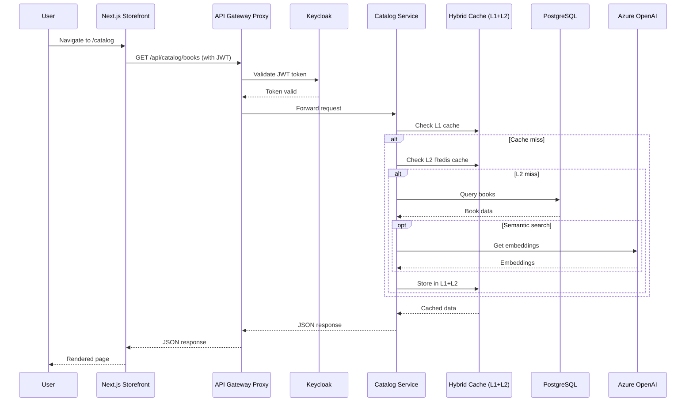

# Runtime View Overview

The Runtime View describes the behavior of BookWorm's architecture during execution, focusing on the
most important scenarios that demonstrate how the system components interact to fulfill business
requirements.

## Purpose

This section illustrates how the static building blocks described in the
[Building Block View](../05-building-block-view/overview.mdx) work together at runtime to deliver
the BookWorm e-commerce functionality. Each scenario shows the dynamic aspects of the system,
including:

- **Service Interactions**: How microservices communicate through events and commands
- **Data Flow**: How information flows through the system during key operations
- **Error Handling**: How the system handles failures and maintains consistency
- **Performance Characteristics**: Timing and scalability considerations

## Architecture Patterns in Action

BookWorm implements several key architectural patterns that are demonstrated across the runtime
scenarios:

### Event-Driven Architecture

- **Asynchronous Communication**: Services communicate through domain events
- **Loose Coupling**: Services are decoupled through event-driven interactions
- **Scalability**: Event-driven design enables horizontal scaling
- **Resilience**: Event sourcing provides audit trails and replay capabilities

### Saga Pattern

BookWorm uses the **Choreography-based Saga** pattern for managing distributed transactions:

- **Data Consistency**: Ensures eventual consistency across microservices
- **Compensation Logic**: Automatic rollback mechanisms for failed operations
- **Autonomous Services**: Each service manages its own state and compensations
- **Observable Workflows**: Complete audit trail of all saga steps

### CQRS (Command Query Responsibility Segregation)

- **Separation of Concerns**: Commands and queries use different models
- **Performance Optimization**: Optimized read models for queries
- **Scalability**: Independent scaling of read and write operations

## Core Runtime Scenarios

BookWorm's runtime behavior is demonstrated through key business scenarios:

### 1. Frontend-to-Service Communication

**Scenario**: User browses products in Storefront application

- **Trigger**: User navigates to catalog page
- **Components**: Next.js Storefront, API Gateway Proxy (YARP), Catalog Service, Azure OpenAI
- **Pattern**: RESTful API calls through gateway with authentication
- **Data Flow**:
  1. Next.js Server Component fetches data via API client
  2. Request routed through API Gateway Proxy with Keycloak token validation
  3. Catalog Service queries PostgreSQL with hybrid caching (L1 memory + L2 Redis)
  4. Azure OpenAI embeddings for semantic search (if applicable)
  5. Response cached and returned through gateway
- **Outcome**: Fast page load with server-side rendering and cached data

### 2. User Authentication Flow

**Scenario**: User signs into the BookWorm application

- **Trigger**: User initiates login process
- **Components**: Keycloak IAM, BookWorm Client, API Gateway
- **Pattern**: OAuth2 + PKCE authentication flow
- **Outcome**: Secure authenticated session with JWT tokens

[👉 View Sign In Scenario](./signin-scenario.mdx)

### 3. Order Creation Flow

**Scenario**: User creates an order and processes checkout

- **Trigger**: User submits order for processing
- **Components**: Ordering, Finance, Basket, and Notification services
- **Pattern**: Choreography-based Saga with event sourcing
- **Outcome**: Order processed with proper basket cleanup and notifications

[👉 View Create Order Scenario](./create-order-scenario.mdx)
