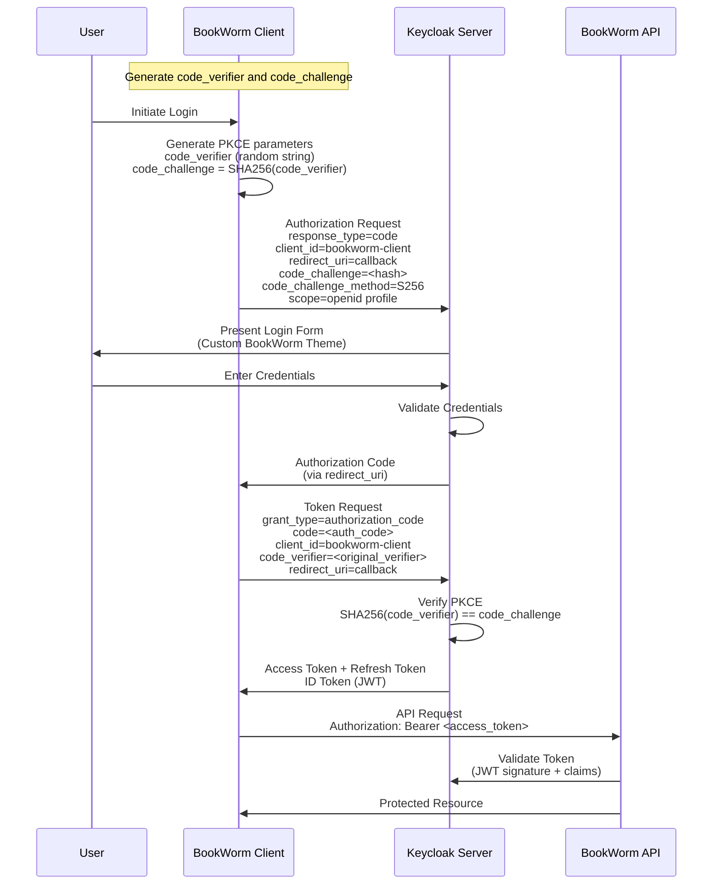

# Sign In Scenario

The Sign In scenario demonstrates how BookWorm implements secure user authentication using Keycloak Identity and Access Management (IAM) with OAuth2 Authorization Code + PKCE flow.

## Overview

BookWorm leverages Keycloak for centralized authentication, providing a secure and seamless sign-in experience across all services. The implementation uses the OAuth2 Authorization Code flow with PKCE (Proof Key for Code Exchange) for enhanced security, particularly important for public clients like SPAs and mobile applications.

## 🎯 Business Context

### Objectives

1. **Secure Authentication**: Implement industry-standard OAuth2 + PKCE flow
2. **Seamless Experience**: Single sign-on (SSO) across all BookWorm services
3. **Custom Branding**: Branded login experience using Keycloakify theme
4. **Multi-Client Support**: Support web app, mobile app, and API clients

### Success Criteria

- ✅ Authentication within 3 seconds
- ✅ 99.9% authentication success rate
- ✅ Zero security vulnerabilities in auth flow
- ✅ Consistent branded experience

## 🔄 Authentication Flow

The following sequence diagram illustrates the OAuth2 Authorization Code + PKCE flow:

## 📋 Security Features

### PKCE Security Benefits

| Feature                 | Description                    | Security Benefit                         |
| ----------------------- | ------------------------------ | ---------------------------------------- |
| **Code Challenge**      | SHA256 hash of random verifier | Prevents authorization code interception |
| **Dynamic Verifier**    | Unique per authentication flow | Eliminates replay attacks                |
| **No Client Secret**    | Perfect for public clients     | Secure for SPAs and mobile apps          |
| **Standard Compliance** | OAuth2.1 recommended flow      | Industry best practices                  |

### Token Management

- **Access Tokens**: Short-lived (15 minutes) for API access
- **Refresh Tokens**: Longer-lived (30 days) for token renewal
- **ID Tokens**: JWT with user identity information
- **Token Rotation**: Automatic refresh token rotation on use

## 🎨 Custom Authentication Experience

BookWorm uses **Keycloakify** to provide a branded authentication experience:

### Features

- **Custom Theme**: Built with React, TypeScript, and Tailwind CSS
- **Responsive Design**: Mobile-friendly login forms
- **Brand Consistency**: Matches BookWorm's design language
- **Component-Based**: Modular and maintainable React components

### Supported Authentication Methods

1. **Email/Password**: Traditional username and password authentication
2. **Social Login**: Integration with Google, Facebook, GitHub
3. **Multi-Factor Authentication**: TOTP and SMS-based 2FA
4. **Remember Me**: Persistent session management

## 📈 Performance Requirements

### Service Level Agreement

| Component               | Availability | Response Time | Error Rate |
| ----------------------- | ------------ | ------------- | ---------- |
| **Keycloak Server**     | 99.95%       | < 100ms       | < 0.01%    |
| **Authentication Flow** | 99.9%        | < 3s          | < 0.1%     |
| **Token Validation**    | 99.99%       | < 10ms        | < 0.001%   |
| **Session Management**  | 99.9%        | < 50ms        | < 0.1%     |

## 🛡️ Security Considerations

### Implementation Details

- **HTTPS Only**: All authentication flows use TLS encryption
- **CSRF Protection**: State parameter prevents cross-site request forgery
- **XSS Prevention**: Secure token storage and handling
- **Session Security**: HttpOnly and Secure cookie flags
- **Audit Logging**: Comprehensive authentication event logging

### Compliance

- **GDPR Compliant**: Data sovereignty and privacy controls
- **OAuth2.1 Standard**: Latest security recommendations
- **OpenID Connect**: Standardized identity layer
- **PKCE Extension**: RFC 7636 implementation
