# Infrastructure Level 1 - Application Architecture

This level shows the high-level deployment architecture of the BookWorm application, focusing on the major infrastructure components and their relationships.

## Architecture Diagram

```mermaid
C4Context
    title Deployment Diagram for BookWorm Application

    Enterprise_Boundary(b0, "BookWorm System") {
        Person(customer, "Customer", "End user accessing the bookstore")
        Person(admin, "Administrator", "System administrator")

        System_Boundary(dev_env, "Development Environment") {
            System(dev_docker, "Docker Desktop", "Local container orchestration platform")

            Deployment_Node(dev_host, "Development Machine", "Windows/macOS/Linux") {
                Deployment_Node(docker_engine, "Docker Engine", "Container Runtime") {
                    Container(gateway_dev, "API Gateway", "YARP", "Single instance gateway")
                    Container(keycloak_dev, "Keycloak", "Identity Provider", "Local authentication server")
                    Container(catalog_dev, "Catalog Service", ".NET", "Product management service")
                    Container(chat_dev, "Chat Service", ".NET", "Real-time messaging service")
                    Container(basket_dev, "Basket Service", ".NET", "Shopping cart service")
                    Container(ordering_dev, "Ordering Service", ".NET", "Order processing service")
                    Container(rating_dev, "Rating Service", ".NET", "Review management service")
                    Container(finance_dev, "Finance Service", ".NET", "Payment processing service")
                    Container(notification_dev, "Notification Service", ".NET", "Notification service")
                    Container(scheduler_dev, "Scheduler Service", ".NET", "Background job service")

                    ContainerDb(postgres_dev, "PostgreSQL", "Container", "Multi-tenant database")
                    ContainerDb(redis_dev, "Redis", "Container", "Cache and session store")
                    ContainerDb(qdrant_dev, "Qdrant", "Container", "Vector database for AI")
                    Container(rabbitmq_dev, "RabbitMQ", "Container", "Message broker")
                    Container(azurite_dev, "Azurite", "Container", "Local blob storage emulator")
                    Container(signalr_dev, "SignalR Emulator", "Container", "Real-time communication")
                    Container(ollama_dev, "Ollama", "Container", "LLM server (Gemma 3 1B)")
                }
            }
        }

        System_Boundary(prod_env, "Production Environment") {
            System(azure_cloud, "Microsoft Azure", "Cloud platform for production deployment")

            Deployment_Node(azure_region, "Azure Region", "East US 2") {
                Deployment_Node(aca_env, "Container Apps Environment", "Serverless container platform") {
                    Container(gateway_prod, "API Gateway", "YARP", "Load balancer with auto-scaling")
                    Container(keycloak_prod, "Keycloak", "Identity Provider", "Multi-tenant auth server")

                    Deployment_Node(microservices, "Microservices", "Auto-scaling container apps") {
                        Container(catalog_prod, "Catalog Service", ".NET", "2+ replicas with auto-scaling")
                        Container(chat_prod, "Chat Service", ".NET", "2+ replicas with auto-scaling")
                        Container(basket_prod, "Basket Service", ".NET", "2+ replicas with auto-scaling")
                        Container(ordering_prod, "Ordering Service", ".NET", "2+ replicas with auto-scaling")
                        Container(rating_prod, "Rating Service", ".NET", "2+ replicas with auto-scaling")
                        Container(finance_prod, "Finance Service", ".NET", "2+ replicas with auto-scaling")
                        Container(notification_prod, "Notification Service", ".NET", "Single replica")
                        Container(scheduler_prod, "Scheduler Service", ".NET", "Single replica")
                    }

                    Container(rabbitmq_prod, "RabbitMQ", "Container App", "Persistent message broker")
                    ContainerDb(qdrant_prod, "Qdrant", "Container App", "Vector database cluster")
                    Container(ollama_prod, "Ollama", "Container App", "GPU-enabled LLM server (Gemma 3 4B)")

                    Container(health_prod, "Health Checks UI", "Container App", "Service monitoring dashboard")
                }

                Deployment_Node(azure_services, "Azure Managed Services", "PaaS offerings") {
                    ContainerDb(postgres_prod, "Azure PostgreSQL", "Flexible Server", "Multi-database managed service")
                    ContainerDb(redis_prod, "Azure Cache for Redis", "Premium", "Managed cache service")
                    Container(storage_prod, "Azure Blob Storage", "Storage Account", "Hot tier blob storage")
                    Container(signalr_prod, "Azure SignalR Service", "Standard", "Managed real-time service")
                    Container(insights_prod, "Application Insights", "Azure Monitor", "APM and logging service")
                    Container(keyvault_prod, "Azure Key Vault", "Secret Management", "Secrets and certificates")
                }
            }
        }
    }

    BiRel(customer, gateway_dev, "Uses (Dev)", "HTTPS")
    BiRel(customer, gateway_prod, "Uses (Prod)", "HTTPS")
    BiRel(admin, health_prod, "Monitors", "HTTPS")

    Rel(gateway_dev, catalog_dev, "Routes to")
    Rel(gateway_dev, chat_dev, "Routes to")
    Rel(gateway_dev, basket_dev, "Routes to")
    Rel(gateway_dev, ordering_dev, "Routes to")

    Rel(catalog_dev, postgres_dev, "Reads/Writes")
    Rel(catalog_dev, redis_dev, "Caches")
    Rel(catalog_dev, qdrant_dev, "Vector ops")
    Rel(catalog_dev, rabbitmq_dev, "Publishes")
    Rel(catalog_dev, azurite_dev, "Stores files")

    Rel(chat_dev, postgres_dev, "Reads/Writes")
    Rel(chat_dev, signalr_dev, "Real-time")
    Rel(chat_dev, ollama_dev, "AI requests")

    Rel(gateway_prod, catalog_prod, "Routes to")
    Rel(gateway_prod, chat_prod, "Routes to")
    Rel(gateway_prod, basket_prod, "Routes to")
    Rel(gateway_prod, ordering_prod, "Routes to")

    Rel(catalog_prod, postgres_prod, "Reads/Writes")
    Rel(catalog_prod, redis_prod, "Caches")
    Rel(catalog_prod, qdrant_prod, "Vector ops")
    Rel(catalog_prod, rabbitmq_prod, "Publishes")
    Rel(catalog_prod, storage_prod, "Stores files")

    Rel(chat_prod, postgres_prod, "Reads/Writes")
    Rel(chat_prod, signalr_prod, "Real-time")
    Rel(chat_prod, ollama_prod, "AI requests")

    Rel(ordering_prod, postgres_prod, "Reads/Writes")
    Rel(ordering_prod, rabbitmq_prod, "Publishes")
    Rel(ordering_prod, signalr_prod, "Updates")

    Rel(catalog_prod, insights_prod, "Telemetry")
    Rel(chat_prod, insights_prod, "Telemetry")
    Rel(ordering_prod, insights_prod, "Telemetry")

    Rel(keycloak_prod, keyvault_prod, "Secrets")
    Rel(catalog_prod, keyvault_prod, "Secrets")
```

## Component Overview

### API Gateway

- **Technology**: YARP (Yet Another Reverse Proxy)
- **Purpose**: Single entry point for all client requests
- **Features**: Request routing, load balancing, SSL termination
- **Services**: Routes to Catalog, Chat, Basket, Ordering, Rating APIs

### Identity Provider

- **Technology**: Keycloak
- **Purpose**: Centralized authentication and authorization
- **Features**: JWT token issuance, custom theming, realm management
- **Database**: External PostgreSQL database for user data

### Microservices Layer

Eight independent services handling specific business domains:

| Service          | Purpose             | Database   | Key Dependencies           |
| ---------------- | ------------------- | ---------- | -------------------------- |
| **Catalog**      | Product management  | PostgreSQL | Qdrant, Redis, Azure Blob  |
| **Chat**         | Real-time messaging | PostgreSQL | SignalR, MCP Tools, Ollama |
| **Basket**       | Shopping cart       | Redis      | Catalog API                |
| **Ordering**     | Order processing    | PostgreSQL | Basket, Catalog, SignalR   |
| **Rating**       | Reviews & ratings   | PostgreSQL | Chat API                   |
| **Finance**      | Payment processing  | PostgreSQL | RabbitMQ                   |
| **Notification** | Email/SMS           | PostgreSQL | MailPit, RabbitMQ          |
| **Scheduler**    | Background jobs     | PostgreSQL | TickerQ dashboard          |

### Data Layer

- **PostgreSQL**: Primary relational database (9 databases)
- **Redis**: Caching and session storage
- **Qdrant**: Vector database for AI-powered search
- **RabbitMQ**: Message queue for async communication
- **Azure Blob**: File and media storage
- **Azure SignalR**: Real-time communication

### AI Services

- **Ollama**: Model management and serving
- **Gemma 3**: Chat interactions (1B dev, 4B prod)
- **Nomic Embed Text**: Text embedding generation

### Monitoring & Tools

- **Health Checks UI**: Service health monitoring
- **Scalar**: Interactive API documentation
- **K6**: Performance testing (development only)
- **MCP Tools**: Model Context Protocol integration

## Deployment Characteristics

### Scalability

- **Horizontal**: Services can be scaled independently
- **Vertical**: Resource allocation per service
- **Auto-scaling**: Azure Container Apps automatic scaling

### Reliability

- **Service Dependencies**: Managed through wait conditions
- **Health Checks**: All services expose health endpoints
- **Circuit Breakers**: Resilience patterns implemented
- **Data Persistence**: Volume mounts for stateful services

### Security

- **Authentication**: Keycloak JWT tokens
- **Authorization**: Role-based access control
- **Secrets**: Azure Key Vault integration
- **Network**: Service-to-service communication secured
