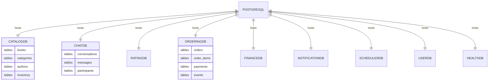
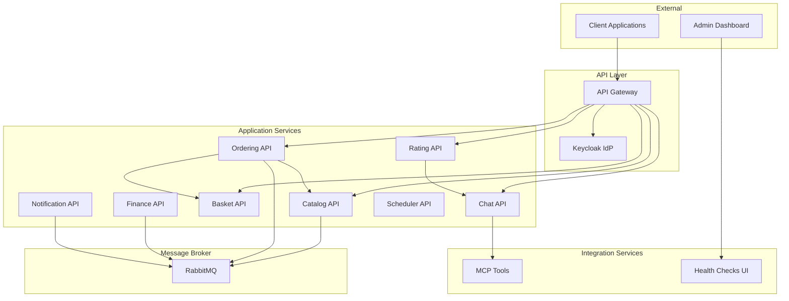

# Infrastructure Level 2 - Container and Service Details

This level provides detailed information about individual services, their container configurations, and deployment specifications.

## Service Configuration Matrix

### Microservices Deployment Specifications

| Service          | Replicas (Dev/Prod) | CPU/Memory | Ports      | Volume Mounts |
| ---------------- | ------------------- | ---------- | ---------- | ------------- |
| **Catalog**      | 1/2                 | 0.5/1GB    | 8080, 8443 | None          |
| **Chat**         | 1/2                 | 0.5/1GB    | 8080, 8443 | None          |
| **Basket**       | 1/2                 | 0.25/512MB | 8080, 8443 | None          |
| **Ordering**     | 1/2                 | 0.5/1GB    | 8080, 8443 | None          |
| **Rating**       | 1/2                 | 0.25/512MB | 8080, 8443 | None          |
| **Finance**      | 1/2                 | 0.5/1GB    | 8080, 8443 | None          |
| **Notification** | 1/1                 | 0.25/512MB | 8080, 8443 | None          |
| **Scheduler**    | 1/1                 | 0.5/1GB    | 8080, 8443 | None          |

### Infrastructure Components

| Component      | Image             | Version    | Persistence | Configuration  |
| -------------- | ----------------- | ---------- | ----------- | -------------- |
| **PostgreSQL** | postgres          | latest     | Data volume | Multi-database |
| **Redis**      | redis             | latest     | None        | Memory cache   |
| **RabbitMQ**   | rabbitmq          | management | Data volume | Management UI  |
| **Qdrant**     | qdrant/qdrant     | v1.15.1    | Data volume | Vector storage |
| **Keycloak**   | keycloak/keycloak | latest     | Data volume | Custom theme   |
| **Ollama**     | ollama/ollama     | latest     | Model cache | GPU optional   |

## Container Configuration Details

### Database Schema Distribution

### Environment-Specific Configurations

#### Development Environment

- **Container Runtime**: Docker Desktop
- **Service Mesh**: Not required
- **Monitoring**: Local health checks only
- **Scaling**: Single replica per service
- **Storage**: Local volumes
- **AI Models**: Lightweight (Gemma 3 1B)

#### Production Environment

- **Container Runtime**: Azure Container Apps
- **Service Mesh**: Built-in service discovery
- **Monitoring**: Azure Monitor integration
- **Scaling**: Auto-scaling enabled
- **Storage**: Azure managed services
- **AI Models**: Full capability (Gemma 3 4B)

## Network Architecture

### Service Communication Patterns

### Port Allocation Strategy

| Service Type     | HTTP | HTTPS | Admin | Debug |
| ---------------- | ---- | ----- | ----- | ----- |
| **API Services** | 8080 | 8443  | -     | 5000+ |
| **PostgreSQL**   | -    | -     | -     | 5432  |
| **Redis**        | -    | -     | -     | 6379  |
| **RabbitMQ**     | 5672 | -     | 15672 | -     |
| **Qdrant**       | 6333 | -     | 6334  | -     |
| **Keycloak**     | 8080 | 8443  | 9990  | -     |

## Security Configuration

### Authentication Flow

1. **Client** → API Gateway (with JWT)
2. **API Gateway** → Keycloak (token validation)
3. **Keycloak** → PostgreSQL (user lookup)
4. **Service** → Downstream services (with validated context)

### Authorization Matrix

| Service      | Public Endpoints        | Authenticated     | Admin Only       |
| ------------ | ----------------------- | ----------------- | ---------------- |
| **Catalog**  | GET /books, /categories | POST, PUT, DELETE | Import, Export   |
| **Chat**     | None                    | All endpoints     | User management  |
| **Basket**   | None                    | All endpoints     | View all baskets |
| **Ordering** | None                    | User orders       | All orders       |
| **Rating**   | GET /ratings            | POST ratings      | Moderation       |

## Monitoring and Observability

### Health Check Endpoints

- **Service Health**: `/health` - Overall service status
- **Readiness**: `/ready` - Ready to accept traffic
- **Liveness**: `/alive` - Service is running

### Telemetry Data

- **Metrics**: Performance counters, custom business metrics
- **Logs**: Structured logging with correlation IDs
- **Traces**: Distributed tracing across service boundaries
- **Dependencies**: External service health and latency

### Development Tools

- **Scalar**: Interactive API documentation and testing
- **K6**: Load testing and performance benchmarking
- **Health UI**: Centralized health monitoring dashboard
