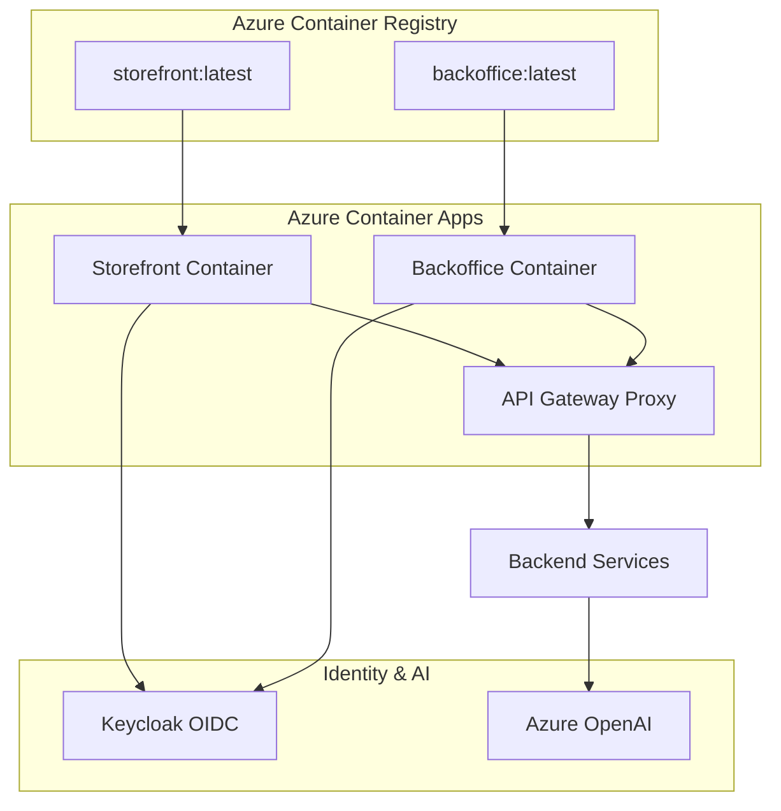

# Deployment View Overview

The BookWorm application is built using Aspire, a cloud-native application framework that
orchestrates containerized services. The deployment architecture supports both local development and
cloud production environments with Azure Container Apps.

## Application Host

The `BookWorm.AppHost` project serves as the orchestration layer, defining the entire application
topology including:

- **8 Microservices**: Catalog, Chat, Basket, Notification, Ordering, Rating, Finance, and Scheduler
- **2 Frontend Applications**: Storefront (customer-facing) and Backoffice (admin dashboard) via
  Turbo monorepo
- **Infrastructure Components**: PostgreSQL, Redis, RabbitMQ, Qdrant Vector DB, Azure Blob Storage,
  Azure Container Registry
- **Identity Provider**: Keycloak with custom theming and OIDC/OAuth2
- **AI Integration**: Azure OpenAI with GPT-4o-mini and text-embedding-3-large models
- **API Gateway Proxy**: Custom ASP.NET Core proxy routing to 5 backend services
- **Integration Tools**: MCP Server (Model Context Protocol) for AI agent tool exposure
- **Monitoring**: Health Checks UI, Scalar API documentation, K6 performance testing, MCP Inspector

## Execution Contexts

The application supports two primary execution contexts:

### Development Mode (`IsRunMode`)

- Local container orchestration using Docker
- Single replica deployment for backend services
- Frontend apps managed via Turbo with hot reload
- Emulated Azure services (Storage, PostgreSQL, Redis running as containers)
- K6 performance testing enabled
- Scalar API documentation available
- MCP Inspector for AI agent debugging
- Dev UI available at `/dev/agent` endpoints (Chat, Rating services)

### Production Mode (`IsPublishMode`)

- Azure Container Apps deployment for all services and frontend apps
- Multi-replica service deployment (2+ replicas for high availability)
- Native Azure services integration (PostgreSQL Flexible Server, Azure Managed Redis, Azure Blob
  Storage)
- CORS configuration for production domains (storefront, backoffice)
- Azure OpenAI with GPT-4o-mini and text-embedding-3-large
- Azure Container Registry for image storage with role-based access
- External HTTP endpoints for frontend apps
- Gateway endpoints injected as environment variables into frontend

## Key Features

- **Service Discovery**: Automatic service resolution using Aspire service discovery
- **Configuration Management**: Parameterized deployment with secure secrets
- **Health Monitoring**: Comprehensive health checks for all services and dependencies
- **Observability**: OpenTelemetry integration for distributed tracing and metrics
- **Security**: JWT-based authentication with Keycloak, RBAC for Azure resources

## Frontend Deployment (Turbo Monorepo)

The frontend applications are managed as a Turbo monorepo integrated with Aspire AppHost for
seamless orchestration.

### Turbo Monorepo Structure

```
src/Clients/
├── apps/
│   ├── storefront/     # Customer-facing ecommerce (Next.js 16 + React 19)
│   └── backoffice/     # Admin dashboard (Next.js 16 + React 19)
├── packages/
│   ├── api-client/     # Typed API clients
│   ├── api-hooks/      # TanStack Query hooks
│   ├── ui/             # Radix UI components
│   ├── types/          # Shared TypeScript types
│   ├── utils/          # Utility functions
│   ├── validations/    # Zod schemas
│   ├── mocks/          # Testing mocks
│   ├── eslint-config/  # ESLint configuration
│   └── typescript-config/ # TypeScript configuration
├── pnpm-workspace.yaml # pnpm workspace configuration
└── turbo.json          # Turbo build pipeline
```

### Aspire Integration

The AppHost integrates Turbo apps using `AddTurborepoApp`:

```csharp
var turbo = builder
    .AddTurborepoApp(Components.TurboRepo, "../../Clients")
    .WithPnpm(true)
    .WithPackageManagerLaunch();

var storefront = turbo
    .AddApp(Clients.StoreFront, Clients.StoreFrontTurboApp)
    .WithOtlpExporter()                    // OpenTelemetry integration
    .WithHttpEndpoint(env: "PORT")         // Dynamic port allocation
    .WithMappedEndpointPort()              // Port mapping for external access
    .WithHttpHealthCheck()                 // Health monitoring
    .WithExternalHttpEndpoints()           // Public URL exposure
    .WithEnvironment("NEXT_PUBLIC_GATEWAY_HTTPS", gateway.GetEndpoint(Http.Schemes.Https))
    .WithEnvironment("NEXT_PUBLIC_GATEWAY_HTTP", gateway.GetEndpoint(Http.Schemes.Http))
    .WithKeycloak(keycloak);               // Authentication integration
```

### Frontend CI/CD Pipeline

GitHub Actions workflow (`.github/workflows/frontend-ci.yml`):

**Triggers**:

- Push to `main` branch on `src/Clients/**` paths
- Pull requests targeting `src/Clients/**`

**Pipeline Steps**:

1. **Setup**:
   - Node.js environment
   - PNPM 10.27.0 installation
   - Dependency caching

2. **Build**:
   - `pnpm install` (workspace dependencies)
   - `pnpm run build` (Turbo orchestrated build)
   - Build caching with Turbo

3. **Quality Checks**:
   - `pnpm run lint` (ESLint validation)
   - `pnpm run type-check` (TypeScript validation)
   - `pnpm run test` (Unit tests)

4. **Artifacts**:
   - Next.js build outputs (`.next/` directories)
   - Static exports for CDN deployment (if applicable)

### Environment Variables

Frontend apps receive runtime configuration from AppHost:

| Variable                      | Purpose                              | Source                          |
| ----------------------------- | ------------------------------------ | ------------------------------- |
| `NEXT_PUBLIC_GATEWAY_HTTPS`   | API Gateway HTTPS endpoint           | AppHost (gateway configuration) |
| `NEXT_PUBLIC_GATEWAY_HTTP`    | API Gateway HTTP endpoint (fallback) | AppHost (gateway configuration) |
| `NEXT_PUBLIC_APP_URL`         | Frontend app's own URL               | AppHost (self-reference)        |
| `NEXT_PUBLIC_COPILOT_ENABLED` | GitHub Copilot feature flag          | AppHost (storefront only)       |
| `PORT`                        | HTTP server port                     | AppHost (dynamic allocation)    |

### Container Registry Integration

Frontend applications are containerized and published to Azure Container Registry:

```csharp
.WithContainerRegistry(registry)  // Azure Container Registry reference
.WithRoleAssignments(registry, AcrPullRole)  // RBAC for image pull
```

**Registry Features**:

- Geo-replication for global availability
- Image vulnerability scanning
- Content trust and signing
- Webhook integration for deployment automation

### Deployment Topology



### Health Checks & Observability

- **HTTP Health Checks**: Aspire monitors frontend app availability
- **OpenTelemetry**: Distributed tracing across frontend and backend
- **Logs**: Structured logging with correlation IDs
- **Metrics**: Request rates, response times, error rates exported to Azure Monitor
