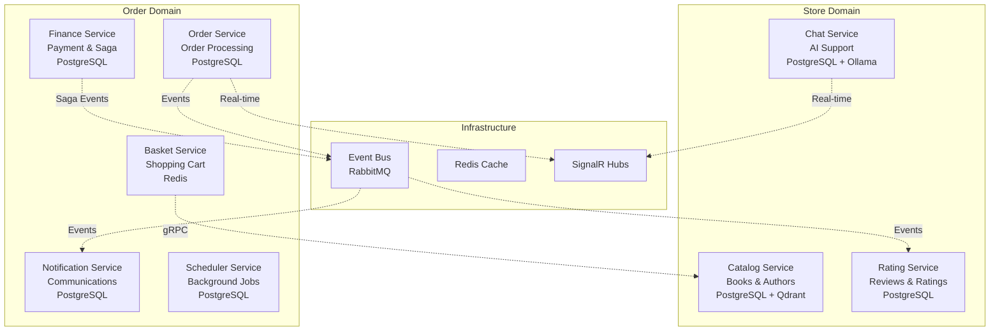

# ADR-001: Microservices Architecture

## Status

**Accepted** - July 2024

## Context

BookWorm is designed as a comprehensive cloud-native application that demonstrates modern enterprise patterns and practices. The system needs to support:

- Independent development and deployment of different business capabilities
- Scalability for different service workloads with varying performance characteristics
- Technology diversity for educational and demonstration purposes
- Team autonomy in development practices and technology choices
- Fault isolation and system resilience across distributed components
- Educational value to showcase real-world enterprise architecture patterns

A monolithic approach would be simpler to develop and deploy initially, but wouldn't demonstrate the complexities, benefits, and challenges of distributed systems that are prevalent in modern enterprise applications. Given the educational goals and the need to showcase cloud-native patterns, a distributed architecture is more aligned with the project objectives.

## Decision

Adopt a **microservices architecture** with domain-driven service boundaries, where each service represents a distinct business capability with clear ownership and responsibilities.

### Service Decomposition

The system is decomposed into the following services based on business capabilities and domain boundaries:

#### Store Domain Services

| Service             | Purpose                                                      | Database   | Key Dependencies                                            |
| ------------------- | ------------------------------------------------------------ | ---------- | ----------------------------------------------------------- |
| **Catalog Service** | Book and author management, product metadata, inventory      | PostgreSQL | Qdrant (vector search), Redis (caching), Azure Blob Storage |
| **Rating Service**  | Book reviews, ratings, and feedback management               | PostgreSQL | Event Bus (RabbitMQ)                                        |
| **Chat Service**    | AI-powered conversational interface for book recommendations | PostgreSQL | SignalR, MCP Tools, Ollama (LLM runtime)                    |

#### Order Domain Services

| Service                  | Purpose                                            | Database   | Key Dependencies              |
| ------------------------ | -------------------------------------------------- | ---------- | ----------------------------- |
| **Basket Service**       | Shopping cart functionality and session management | Redis      | Catalog Service (gRPC)        |
| **Ordering Service**     | Order lifecycle management and event sourcing      | PostgreSQL | Event Bus, SignalR            |
| **Finance Service**      | Payment processing and saga orchestration          | PostgreSQL | Event Bus (saga coordination) |
| **Notification Service** | Transactional emails and user communications       | PostgreSQL | MailPit/SendGrid, Event Bus   |
| **Scheduler Service**    | Background job processing and task scheduling      | PostgreSQL | TickerQ Dashboard             |

### Design Principles

- **Domain-Driven Design**: Services align with bounded contexts and business domains
- **Single Responsibility**: Each service has one clear business purpose and capability
- **Data Ownership**: Each service owns its data store and maintains its own schema
- **API-First Design**: Well-defined service contracts using REST APIs and gRPC
- **Event-Driven Communication**: Asynchronous integration through domain events
- **Autonomous Development**: Services can be developed, tested, and deployed independently

## Rationale

### Why Microservices?

1. **Educational Demonstration**: Showcases modern enterprise architecture patterns including DDD, CQRS, Event Sourcing, and Saga patterns
2. **Scalability Requirements**: Different services have distinct performance characteristics:
   - Catalog Service: Read-heavy with AI/vector search capabilities
   - Basket Service: High-throughput, session-based operations
   - Chat Service: Real-time communication with AI processing
   - Finance Service: Complex transaction orchestration
3. **Technology Diversity**: Enables demonstration of various .NET technologies and architectural patterns
4. **Team Simulation**: Models real-world development scenarios with service ownership
5. **Cloud-Native Alignment**: Integrates seamlessly with Aspire and Azure deployment strategies
6. **Fault Isolation**: Service failures don't cascade across the entire system

### Service Decomposition Strategy

Services were identified using:

- **Business Capability Mapping**: Each service represents a distinct business function
- **Data Ownership Boundaries**: Clear separation of data models and persistence concerns
- **Team Organization Considerations**: Services can be owned and maintained by separate teams
- **Scalability Requirements**: Different scaling patterns for read vs write operations
- **Technology Demonstration**: Opportunity to showcase various .NET patterns and frameworks

### Communication Patterns

## Consequences

### Positive Outcomes

- **Independent Deployment**: Services can be deployed separately with zero-downtime deployments
- **Technology Flexibility**: Different services can adopt optimal technology stacks
- **Team Autonomy**: Development teams can work independently with clear service boundaries
- **Fault Isolation**: Failures are contained within service boundaries
- **Independent Scaling**: Services scale based on individual demand patterns
- **Educational Value**: Demonstrates enterprise-grade distributed system patterns

### Challenges and Trade-offs

- **Operational Complexity**: Increased number of services to monitor, deploy, and maintain
- **Network Communication**: Inter-service communication introduces latency and potential failure points
- **Distributed System Complexity**:
  - Data consistency challenges across service boundaries
  - Distributed transaction management with saga patterns
  - Complex observability and debugging across services
- **Development Overhead**: Additional infrastructure setup and service orchestration
- **Testing Complexity**: Integration testing requires coordinating multiple services

### Risk Mitigation Strategies

- **Service Mesh**: Leverage Aspire for service discovery and communication management
- **Circuit Breakers**: Implement resilience patterns using Polly for fault tolerance
- **Distributed Tracing**: Use OpenTelemetry for end-to-end observability and debugging
- **API Versioning**: Implement versioning strategy for backward compatibility
- **Comprehensive Documentation**: Maintain clear service contracts and API documentation
- **Automated Testing**: Extensive unit, integration, and contract testing strategies

## Implementation Details

### Service Communication

- **Synchronous**: HTTP/REST APIs for direct service-to-service communication
- **Asynchronous**: Event-driven architecture using RabbitMQ with MassTransit
- **Real-time**: SignalR for bidirectional communication (Chat and Order updates)
- **Internal**: gRPC for high-performance internal service communication

### Data Management

- **Database per Service**: Each service maintains its own data store
- **Eventual Consistency**: Services achieve consistency through event-driven updates
- **CQRS Implementation**: Separate read and write models where appropriate
- **Event Sourcing**: Complete audit trail for critical business processes (Ordering)

### Cross-Cutting Concerns

- **Authentication/Authorization**: Centralized with Keycloak identity provider
- **Logging and Monitoring**: Structured logging with OpenTelemetry integration
- **Configuration Management**: Centralized configuration through Aspire
- **Health Checks**: Comprehensive health monitoring across all services

## Alternatives Considered

### Modular Monolith

- **Pros**: Simpler deployment model, better performance, easier debugging and testing
- **Cons**: Limited scalability, reduced technology diversity, single point of failure
- **Decision**: Rejected due to reduced educational value and limited cloud-native demonstration

### Service-Oriented Architecture (SOA)

- **Pros**: Service reuse capabilities, established enterprise integration patterns
- **Cons**: Too heavyweight for project scope, complex governance requirements
- **Decision**: Rejected as overkill for the educational goals and project complexity

### Serverless Architecture

- **Pros**: Auto-scaling, reduced operational overhead, pay-per-use model
- **Cons**: Vendor lock-in, limited long-running process support, complex local development
- **Decision**: Considered for specific services but microservices chosen for consistency

## Success Metrics

- **Service Independence**: Each service can be deployed without affecting others
- **Performance**: Individual services meet their specific performance requirements
- **Maintainability**: Clear service boundaries reduce cognitive load for developers
- **Observability**: Comprehensive monitoring and tracing across service boundaries
- **Educational Value**: Successfully demonstrates enterprise microservices patterns

## Related Architecture Decisions

- [ADR-002: Event-Driven Architecture with CQRS](./adr-002-event-driven-cqrs)
- [ADR-003: Aspire for Cloud-Native Development](./adr-003-aspire-cloud-native)
- [ADR-004: PostgreSQL as Primary Database](./adr-004-postgresql-database)
- [ADR-005: Keycloak for Identity Management](./adr-005-keycloak-identity)
- [ADR-011: RabbitMQ for Message Broker](./adr-011-rabbitmq-message)
