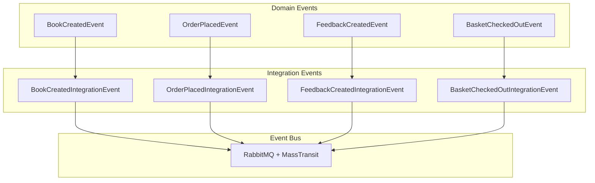
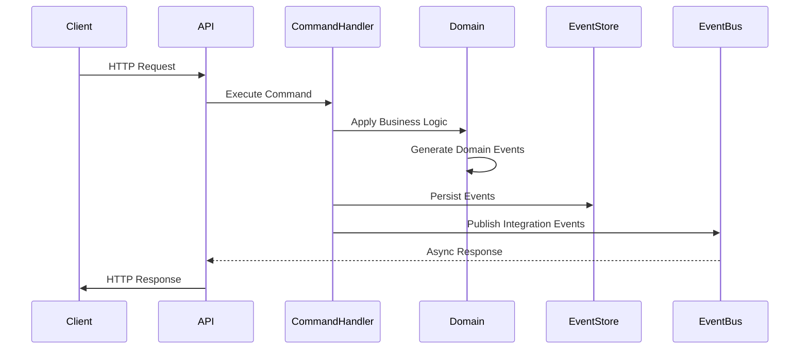
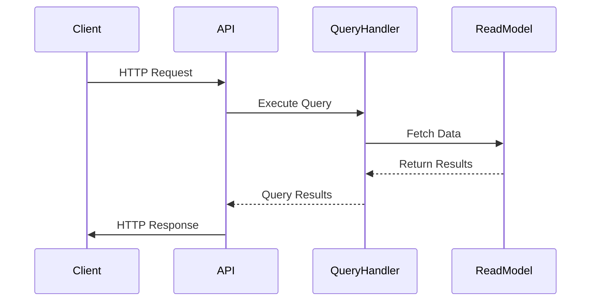
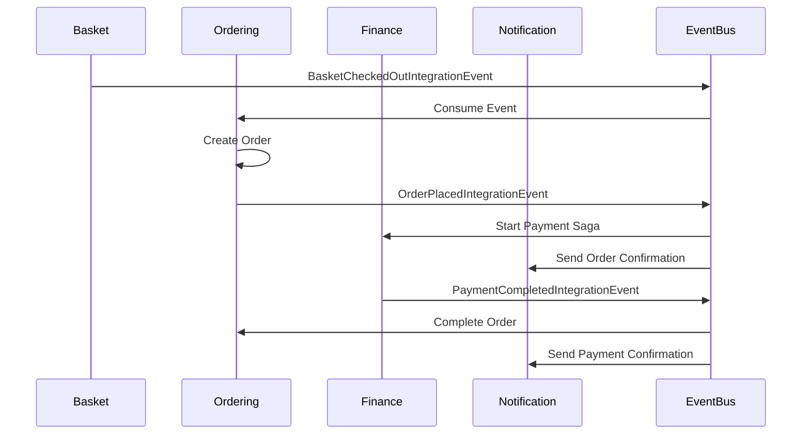
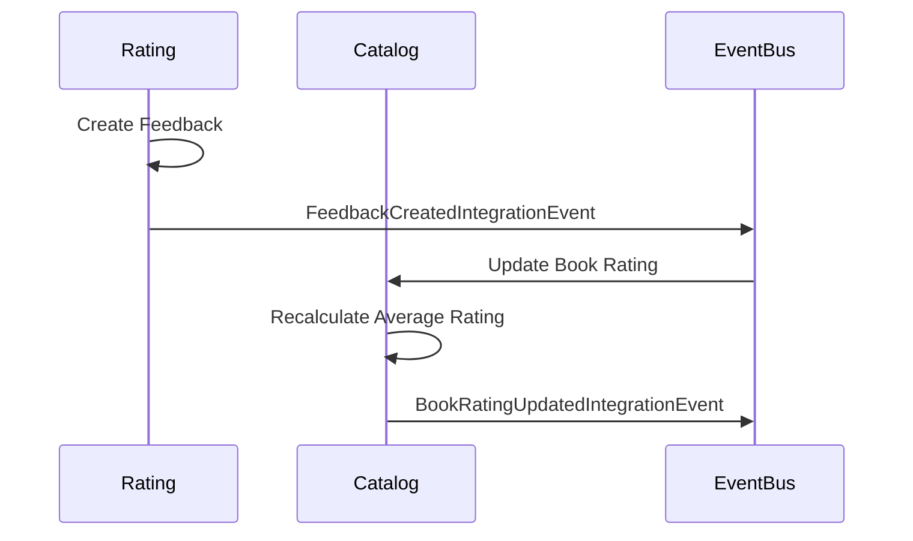

# ADR-002: Event-Driven Architecture with CQRS

## Status

**Accepted** - July 2024

## Context

BookWorm's microservices architecture requires effective patterns for managing data consistency,
service integration, and scalability across distributed services. The system faces several
architectural challenges:

- **Data Consistency**: Maintaining consistency across service boundaries without distributed
  transactions
- **Service Integration**: Loose coupling between services while ensuring reliable communication
- **Performance Requirements**: Different read and write patterns with varying performance
  characteristics
- **Scalability**: Independent scaling of read and write operations
- **Audit Requirements**: Complete traceability of business operations and state changes
- **Event Sourcing**: Maintaining immutable event history for critical business processes

Traditional request-response patterns and shared databases would create tight coupling and limit the
independence of microservices, contradicting the architectural goals of the system.

## Decision

Adopt **Event-Driven Architecture** combined with **Command Query Responsibility Segregation
(CQRS)** pattern to achieve loose coupling, eventual consistency, and optimized read/write
performance across the distributed system.

### Core Patterns Implementation

#### CQRS (Command Query Responsibility Segregation)

Separate read and write operations with distinct models optimized for their specific use cases:

- **Command Side**: Handles write operations, business logic validation, and domain event generation
- **Query Side**: Optimized read models with denormalized data for fast retrieval
- **Separate Data Stores**: Commands and queries can use different persistence strategies

#### Event-Driven Architecture

Implement asynchronous communication through domain and integration events:

- **Domain Events**: Internal service events representing business state changes
- **Integration Events**: Cross-service events for maintaining eventual consistency
- **Event Store**: Persistent storage for event history (Event Sourcing where applicable)

### Service Implementation Patterns

| Service          | CQRS Implementation                     | Event Patterns                               | Data Store Strategy             |
| ---------------- | --------------------------------------- | -------------------------------------------- | ------------------------------- |
| **Catalog**      | Full CQRS with vector search queries    | Domain events for catalog changes            | PostgreSQL + Qdrant (vector DB) |
| **Rating**       | CQRS with feedback aggregation          | Integration events to update catalog ratings | PostgreSQL                      |
| **Chat**         | Query-focused with conversation history | Real-time events via SignalR                 | PostgreSQL                      |
| **Basket**       | Command-heavy with session state        | Checkout events to ordering                  | Redis (in-memory)               |
| **Ordering**     | Full Event Sourcing + CQRS              | Complete event history with snapshots        | PostgreSQL (event store)        |
| **Finance**      | Saga orchestration with CQRS            | Compensation events for rollbacks            | PostgreSQL                      |
| **Notification** | Event consumer with query projections   | Email delivery status events                 | PostgreSQL                      |

## Rationale

### Why Event-Driven Architecture?

1. **Loose Coupling**: Services communicate through events without direct dependencies
2. **Scalability**: Asynchronous processing allows independent service scaling
3. **Resilience**: Event-driven systems are more resilient to service failures
4. **Temporal Decoupling**: Services don't need to be available simultaneously
5. **Audit Trail**: Complete history of business operations through event logs
6. **Integration Flexibility**: New services can easily subscribe to existing events

### Why CQRS?

1. **Performance Optimization**: Separate read and write models optimized for their specific use
   cases
2. **Scalability**: Independent scaling of read and write operations
3. **Complex Business Logic**: Commands can focus on business rules without query concerns
4. **Reporting and Analytics**: Query models can be optimized for reporting needs
5. **Technology Diversity**: Different technologies for reads and writes where appropriate

### Event Categories

## Implementation Patterns

### Command Processing Flow

### Query Processing Flow

### Event Processing Patterns

#### Inbox/Outbox Pattern

- **Outbox Pattern**: Ensures reliable event publishing by storing events in the same transaction as
  domain changes
- **Inbox Pattern**: Ensures idempotent event processing with deduplication
- **At-Least-Once Delivery**: Guarantees message delivery with idempotency handling

#### Event Sourcing (Ordering Service)

- **Event Store**: Complete history of domain events as the source of truth
- **Event Replay**: Reconstruct aggregate state from event history
- **Snapshots**: Performance optimization for large event streams
- **Projections**: Build read models from event streams

## Technology Stack

### Event Infrastructure

- **Message Broker**: RabbitMQ for reliable message delivery
- **Event Framework**: MassTransit for .NET integration and patterns
- **Event Store**: PostgreSQL for event sourcing implementation
- **Serialization**: System.Text.Json for event payloads

### CQRS Implementation

- **Command Bus**: Mediator for command/query dispatching
- **Validation**: FluentValidation for command validation
- **Mapping**: Mapster for object mapping between layers
- **Caching**: Redis for query result caching

## Consequences

### Positive Outcomes

- **Service Autonomy**: Services can evolve independently without breaking contracts
- **Performance**: Optimized read and write models for specific use cases
- **Scalability**: Independent scaling of different operational patterns
- **Resilience**: Asynchronous processing provides better fault tolerance
- **Audit Trail**: Complete business operation history through events
- **Integration Flexibility**: New services easily integrate through event subscriptions

### Challenges and Considerations

- **Eventual Consistency**: Data consistency across services is eventual, not immediate
- **Complexity**: Increased architectural complexity with multiple data models
- **Debugging Challenges**: Tracing operations across multiple services and events
- **Data Synchronization**: Managing consistency between command and query models
- **Event Schema Evolution**: Handling event schema changes over time
- **Operational Overhead**: Additional infrastructure for event processing and monitoring

### Risk Mitigation

- **Event Versioning**: Implement event versioning strategy for schema evolution
- **Monitoring**: Comprehensive event flow monitoring and alerting
- **Testing**: Extensive integration testing for event flows
- **Documentation**: Clear event contracts and service dependencies
- **Replay Mechanisms**: Ability to replay events for recovery scenarios

## Event Flow Examples

### Order Processing Flow

### Catalog Rating Update Flow

## Success Metrics

- **Message Processing**: Sub-second event processing latency
- **System Resilience**: Services continue operating during event processing failures
- **Data Consistency**: Eventual consistency achieved within acceptable time windows
- **Performance**: Read operations optimized independently from write operations
- **Maintainability**: Clear separation of concerns between commands and queries

## Alternatives Considered

### Synchronous Request-Response

- **Pros**: Simple to understand, immediate consistency
- **Cons**: Tight coupling, cascading failures, reduced scalability
- **Decision**: Rejected due to coupling concerns in microservices architecture

### Shared Database

- **Pros**: Immediate consistency, simple transactions
- **Cons**: Data coupling, single point of failure, schema evolution challenges
- **Decision**: Rejected as it contradicts microservices principles

### Basic CRUD Operations

- **Pros**: Simple implementation, familiar patterns
- **Cons**: Limited scalability, mixed read/write concerns, no audit trail
- **Decision**: Insufficient for complex business scenarios and performance requirements

## Related Architecture Decisions

- [ADR-001: Microservices Architecture](./adr-001-microservices-architecture)
- [ADR-011: RabbitMQ for Message Broker](./adr-011-rabbitmq-message)
- [ADR-016: Domain-Driven Design](./adr-016-ddd)
