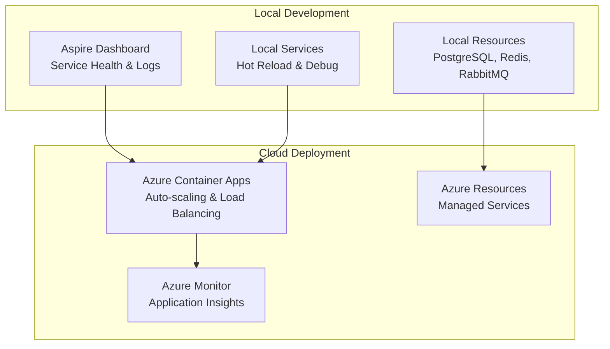
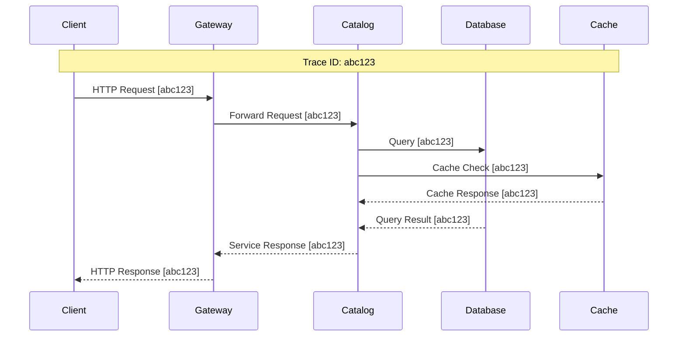

# ADR-003: .NET Aspire for Cloud-Native Development

## Status

**Accepted** - July 2024

## Context

BookWorm's microservices architecture requires sophisticated orchestration, service discovery, observability, and deployment capabilities. The development and operational challenges include:

- **Local Development Complexity**: Running and debugging multiple services simultaneously
- **Service Orchestration**: Managing dependencies and startup order across services
- **Observability**: Distributed tracing, logging, and metrics across service boundaries
- **Configuration Management**: Centralized configuration for multiple environments
- **Resource Management**: Efficient resource allocation and service discovery
- **Cloud Deployment**: Streamlined deployment to cloud platforms with minimal configuration
- **Development Experience**: Simplified developer onboarding and productivity

Traditional approaches would require significant custom infrastructure code, multiple configuration files, and complex setup procedures that would hinder development velocity and system maintainability.

## Decision

Adopt **.NET Aspire** as the cloud-native development framework to provide integrated service orchestration, observability, and deployment capabilities for the BookWorm microservices ecosystem.

### Core Aspire Components

#### App Host (`BookWorm.AppHost`)

Central orchestration point that defines:

- Service topology and dependencies
- Resource allocation and configuration
- Environment-specific settings
- Service discovery configuration

#### Service Defaults (`BookWorm.ServiceDefaults`)

Shared configuration package providing:

- Observability configuration (OpenTelemetry)
- Health checks setup
- Common middleware registration
- Cross-cutting concern implementations

### Service Integration Strategy

| Component         | Aspire Integration                        | Configuration Benefits            |
| ----------------- | ----------------------------------------- | --------------------------------- |
| **Microservices** | Service discovery and health checks       | Automatic endpoint resolution     |
| **PostgreSQL**    | Built-in database container orchestration | Connection string management      |
| **Redis**         | Cache and session store integration       | Distributed caching configuration |
| **RabbitMQ**      | Message broker orchestration              | Event bus connection management   |
| **Qdrant**        | Vector database integration               | AI search service configuration   |
| **Keycloak**      | Identity provider orchestration           | Authentication service setup      |
| **SignalR**       | Real-time communication hubs              | Hub discovery and scaling         |

## Rationale

### Why .NET Aspire?

1. **Integrated Development Experience**: Unified dashboard for monitoring all services during development
2. **Built-in Observability**: OpenTelemetry integration with minimal configuration
3. **Service Discovery**: Automatic service registration and endpoint resolution
4. **Resource Orchestration**: Simplified database, cache, and message broker management
5. **Cloud-Native Patterns**: Built-in support for cloud deployment patterns
6. **Configuration Management**: Centralized configuration with environment-specific overrides
7. **Educational Value**: Demonstrates modern cloud-native development practices

### Development Benefits

- **One-Click Startup**: Single command to start entire distributed system
- **Integrated Debugging**: Debug multiple services simultaneously with shared breakpoints
- **Live Reload**: Hot reload across all services during development
- **Service Health Monitoring**: Real-time health status across all components
- **Log Aggregation**: Centralized logging with structured output
- **Metrics Dashboard**: Built-in metrics visualization for performance monitoring

### Deployment Advantages



## Implementation Architecture

### App Host Configuration

The `BookWorm.AppHost` project orchestrates the entire system topology:

#### Service Registration Pattern

```csharp
// Core Infrastructure Services
var postgres = builder.AddPostgreSQL("postgres");
var redis = builder.AddRedis("redis");
var rabbitmq = builder.AddRabbitMQ("eventbus");
var qdrant = builder.AddQdrant("qdrant");

// Identity and Security
var keycloak = builder.AddKeycloak("keycloak", 8080);

// Microservices with Dependencies
var catalog = builder.AddProject<Projects.BookWorm_Catalog>("catalog")
    .WithReference(postgres)
    .WithReference(redis)
    .WithReference(qdrant);

var basket = builder.AddProject<Projects.BookWorm_Basket>("basket")
    .WithReference(redis)
    .WithReference(catalog);

var ordering = builder.AddProject<Projects.BookWorm_Ordering>("ordering")
    .WithReference(postgres)
    .WithReference(rabbitmq);
```

### Service Defaults Implementation

The `BookWorm.ServiceDefaults` package provides:

#### Observability Configuration

- OpenTelemetry tracing with W3C trace context
- Structured logging with correlation IDs
- Metrics collection for custom business metrics
- Health check endpoints with dependency verification

#### Cross-Cutting Concerns

- Exception handling middleware
- Request/response logging
- Performance monitoring
- Security headers configuration

### Resource Management

#### Database Management

- Automatic PostgreSQL container provisioning
- Schema migration during startup
- Connection pooling configuration
- Health check integration

#### Cache Configuration

- Redis container orchestration
- Distributed cache setup
- Session state configuration
- Cache warming strategies

#### Message Broker Setup

- RabbitMQ container provisioning
- Exchange and queue declarations
- Dead letter queue configuration
- Message retry policies

## Observability Integration

### Distributed Tracing



### Health Checks Strategy

- **Liveness Probes**: Service availability verification
- **Readiness Probes**: Service readiness for traffic
- **Dependency Checks**: Database, cache, and message broker health
- **Custom Health Checks**: Business-specific health indicators

### Metrics Collection

- **Infrastructure Metrics**: CPU, memory, network usage
- **Application Metrics**: Request rates, response times, error rates
- **Business Metrics**: Order processing rates, chat interactions
- **Custom Metrics**: Domain-specific performance indicators

## Development Workflow

### Local Development Process

1. **Startup**: `dotnet run --project BookWorm.AppHost` starts entire ecosystem
2. **Dashboard Access**: Aspire dashboard provides unified view of all services
3. **Service Debugging**: Attach debuggers to individual services
4. **Resource Monitoring**: Real-time monitoring of databases and message brokers
5. **Log Analysis**: Centralized log aggregation with filtering capabilities

### Testing Integration

- **Integration Tests**: Aspire test host for service interaction testing
- **Contract Tests**: Service contract verification across boundaries
- **Load Testing**: Performance testing with realistic service dependencies
- **Chaos Testing**: Resilience testing with controlled service failures

## Deployment Strategies

### Azure Container Apps Deployment

- **Automatic Scaling**: Based on HTTP traffic and custom metrics
- **Blue-Green Deployments**: Zero-downtime deployment strategies
- **Environment Promotion**: Consistent deployment across environments
- **Resource Optimization**: Efficient resource allocation and cost management

### Configuration Management

- **Environment-Specific**: Different configurations for dev/staging/production
- **Secret Management**: Secure handling of connection strings and API keys
- **Feature Flags**: Runtime feature toggling without deployments
- **Dynamic Configuration**: Hot-reload of configuration changes

## Consequences

### Positive Outcomes

- **Developer Productivity**: Significantly reduced setup time and complexity
- **Observability**: Out-of-the-box monitoring and debugging capabilities
- **Consistency**: Standardized patterns across all services
- **Cloud Integration**: Seamless Azure deployment with minimal configuration
- **Educational Value**: Demonstrates modern cloud-native development practices
- **Maintenance**: Reduced infrastructure code and configuration management

### Considerations and Trade-offs

- **Framework Dependency**: Tight coupling to .NET Aspire ecosystem
- **Learning Curve**: Team needs to understand Aspire-specific patterns
- **Azure Bias**: Optimized for Azure, may require additional work for other clouds
- **Version Dependencies**: Requires keeping up with Aspire framework updates
- **Debugging Complexity**: Understanding Aspire's abstraction layers

### Risk Mitigation

- **Documentation**: Comprehensive documentation of Aspire patterns and configurations
- **Training**: Team training on Aspire development and troubleshooting
- **Monitoring**: Enhanced monitoring to understand Aspire behavior
- **Fallback Plans**: Traditional deployment strategies as backup options
- **Version Management**: Careful management of Aspire version upgrades

## Performance Characteristics

### Development Performance

- **Startup Time**: Sub-30-second full system startup
- **Hot Reload**: Sub-second service reload during development
- **Memory Usage**: Optimized resource allocation across services
- **Network Efficiency**: Optimized service-to-service communication

### Production Performance

- **Auto-scaling**: Dynamic scaling based on demand
- **Resource Efficiency**: Optimized container resource utilization
- **Connection Pooling**: Efficient database and cache connections
- **Load Balancing**: Automatic traffic distribution across instances

## Success Metrics

- **Developer Onboarding**: New developers can run full system in under 15 minutes
- **Development Velocity**: Reduced debugging time for distributed issues
- **System Reliability**: Consistent health monitoring across all components
- **Deployment Success**: High success rate for automated deployments
- **Resource Utilization**: Optimized cloud resource usage and costs

## Alternatives Considered

### Docker Compose

- **Pros**: Simple container orchestration, wide ecosystem support
- **Cons**: Limited observability, manual configuration, no .NET integration
- **Decision**: Rejected due to lack of integrated .NET development experience

### Kubernetes with Custom Operators

- **Pros**: Industry standard, extensive ecosystem, cloud-agnostic
- **Cons**: High complexity, significant learning curve, operational overhead
- **Decision**: Too complex for development workflow and educational goals

### Manual Service Management

- **Pros**: Full control, no framework dependencies
- **Cons**: Significant development overhead, inconsistent patterns
- **Decision**: Contradicts goals of developer productivity and standardization

## Migration Considerations

### Existing System Integration

- **Gradual Adoption**: Incremental migration of services to Aspire
- **Legacy Support**: Support for services not yet migrated
- **Data Migration**: Seamless data migration during transition
- **Rollback Strategy**: Ability to revert to previous orchestration if needed

## Related Architecture Decisions

- [ADR-001: Microservices Architecture](./adr-001-microservices-architecture)
- [ADR-004: PostgreSQL as Primary Database](./adr-004-postgresql-database)
- [ADR-007: Azure Container Apps Deployment](./adr-007-aca-deployment)
