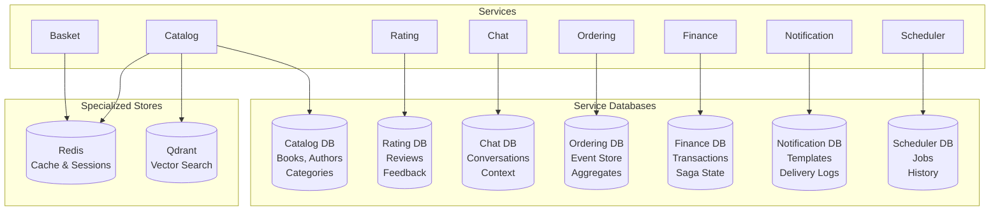

# ADR-004: PostgreSQL as Primary Database

## Status

**Accepted** - July 2024

## Context

BookWorm's microservices architecture requires a robust, scalable, and feature-rich database solution that can support diverse data patterns across multiple services. The system has specific requirements:

- **Complex Data Relationships**: Books, authors, categories, orders, and user relationships
- **JSON Document Storage**: Flexible schema for configuration and metadata
- **ACID Compliance**: Strong consistency for financial and order transactions
- **Performance Requirements**: Sub-second response times for catalog queries
- **Scalability**: Support for high read volumes and concurrent write operations
- **Advanced Features**: Full-text search, indexing strategies, and query optimization
- **Event Sourcing**: Reliable event storage with transactional guarantees
- **Cloud Integration**: Managed database services for production deployment
- **Development Experience**: Excellent .NET integration and tooling support

The database choice significantly impacts development velocity, operational complexity, and long-term maintainability of the entire system.

## Decision

Adopt **PostgreSQL** as the primary relational database for all services requiring persistent data storage, with specialized data stores (Redis, Qdrant) for specific use cases.

### Service Database Allocation

| Service          | Database Usage                        | Key Features Utilized                         |
| ---------------- | ------------------------------------- | --------------------------------------------- |
| **Catalog**      | Book metadata, authors, categories    | JSONB, full-text search, complex queries      |
| **Rating**       | Reviews and feedback data             | Aggregations, indexing, referential integrity |
| **Chat**         | Conversation history and context      | JSONB for flexible conversation data          |
| **Ordering**     | Event sourcing and order aggregates   | ACID transactions, event storage              |
| **Finance**      | Financial transactions and saga state | Strong consistency, transactional integrity   |
| **Notification** | Email templates and delivery logs     | JSONB for template storage                    |
| **Scheduler**    | Background job state and history      | Reliable job queue with ACID guarantees       |

### Database Design Principles

- **Database per Service**: Each microservice maintains its own PostgreSQL database
- **Schema Ownership**: Services have full control over their database schema
- **No Shared Tables**: No cross-service database dependencies
- **Event Storage**: Reliable storage for domain and integration events
- **Audit Capabilities**: Built-in support for data change tracking

## Rationale

### Why PostgreSQL?

#### Technical Advantages

1. **ACID Compliance**: Full transactional integrity for critical business operations
2. **Advanced Data Types**: Native JSON/JSONB support for flexible schema requirements
3. **Performance**: Excellent query optimization and indexing capabilities
4. **Extensibility**: Rich ecosystem of extensions (PostGIS, pg_vector, etc.)
5. **Concurrency**: MVCC (Multi-Version Concurrency Control) for high-throughput scenarios
6. **Full-Text Search**: Built-in text search capabilities for catalog functionality

#### Ecosystem Integration

1. **.NET Integration**: Excellent support through Npgsql and Entity Framework Core
2. **Cloud Services**: Managed PostgreSQL available on all major cloud platforms
3. **Development Tools**: Rich tooling ecosystem for development and administration
4. **Community Support**: Large, active community with extensive documentation
5. **Standards Compliance**: Full SQL standard compliance with advanced features

#### Operational Benefits

1. **Proven Reliability**: Battle-tested in high-scale production environments
2. **Backup and Recovery**: Robust backup and point-in-time recovery capabilities
3. **Monitoring**: Comprehensive monitoring and performance analysis tools
4. **Security**: Advanced security features including row-level security
5. **Compliance**: Supports various compliance requirements (GDPR, SOC2, etc.)

### Service-Specific Rationale

#### Catalog Service

```sql
-- Complex queries with JSON data
SELECT b.*, array_agg(a.name) as authors
FROM books b
JOIN book_authors ba ON b.id = ba.book_id
JOIN authors a ON ba.author_id = a.id
WHERE b.metadata @> '{"genre": "Technology"}'
  AND to_tsvector('english', b.title || ' ' || b.description)
      @@ plainto_tsquery('programming')
GROUP BY b.id;
```

## Implementation Strategy

### Database Architecture per Service



### Connection Management

#### Entity Framework Core Integration

- **Connection Pooling**: Optimized connection pool management
- **Migration Strategy**: Code-first migrations with version control
- **Query Optimization**: LINQ to SQL with performance monitoring
- **Lazy Loading**: Strategic use of lazy loading and explicit loading

#### Performance Optimization

- **Indexing Strategy**: Comprehensive indexing based on query patterns
- **Query Analysis**: Regular analysis of slow queries and optimization
- **Connection Pooling**: Configured for optimal concurrency
- **Read Replicas**: Potential read replica setup for high-read scenarios

### Schema Management

#### Database Configuration

- **Naming Conventions**: Consistent snake_case naming across all services
- **Data Types**: Strategic use of appropriate PostgreSQL data types
- **Constraints**: Proper foreign key and check constraints
- **Indexes**: Performance-optimized indexing strategy

## Advanced Features Utilization

### JSONB for Flexible Schema

```sql
-- Flexible metadata storage
ALTER TABLE books ADD COLUMN metadata JSONB;
CREATE INDEX idx_books_metadata_gin ON books USING gin(metadata);

-- Query JSON data efficiently
SELECT * FROM books
WHERE metadata @> '{"publisher": "O''Reilly"}';
```

### Event Storage Patterns

```sql
-- Event sourcing with snapshots
CREATE TABLE snapshots (
    aggregate_id UUID PRIMARY KEY,
    aggregate_type VARCHAR(255) NOT NULL,
    data JSONB NOT NULL,
    version INTEGER NOT NULL,
    created_at TIMESTAMP WITH TIME ZONE DEFAULT NOW()
);
```

### Audit Trail Implementation

```sql
-- Automatic audit trail
CREATE TABLE audit_log (
    id UUID PRIMARY KEY DEFAULT gen_random_uuid(),
    table_name VARCHAR(255) NOT NULL,
    operation VARCHAR(10) NOT NULL,
    old_data JSONB,
    new_data JSONB,
    changed_by UUID,
    changed_at TIMESTAMP WITH TIME ZONE DEFAULT NOW()
);
```

## Performance Considerations

### Indexing Strategy

- **Primary Keys**: UUID vs Sequential ID analysis per service
- **Foreign Keys**: Automatic indexing of foreign key columns
- **Composite Indexes**: Multi-column indexes for complex queries
- **Partial Indexes**: Conditional indexes for filtered queries
- **GIN Indexes**: For JSONB and full-text search functionality

### Query Optimization

- **Query Plans**: Regular analysis of execution plans
- **Statistics**: Automated statistics collection and analysis
- **Prepared Statements**: Use of prepared statements for frequent queries
- **Connection Pooling**: Optimized connection pool configuration

### Scalability Features

- **Read Replicas**: Configuration for read-heavy workloads
- **Partitioning**: Table partitioning for large datasets
- **Connection Limits**: Proper connection limit management
- **Resource Monitoring**: CPU, memory, and I/O monitoring

## Backup and Recovery Strategy

### Backup Mechanisms

- **Continuous Archiving**: WAL-based point-in-time recovery
- **Regular Backups**: Automated daily backups with retention policies
- **Cross-Region Backups**: Geo-redundant backup storage
- **Testing**: Regular backup restoration testing

### Disaster Recovery

- **RTO/RPO Targets**: Recovery Time/Point Objectives definition
- **Failover Procedures**: Documented failover procedures
- **Data Replication**: Synchronous/asynchronous replication strategies
- **Recovery Testing**: Regular disaster recovery testing

## Security Implementation

### Access Control

- **Role-Based Access**: Service-specific database users with minimal privileges
- **Connection Security**: SSL/TLS encrypted connections
- **Authentication**: Strong password policies and rotation
- **Network Security**: Database firewall and network isolation

### Data Protection

- **Encryption at Rest**: Transparent data encryption
- **Encryption in Transit**: SSL/TLS for all connections
- **Sensitive Data**: Proper handling of PII and financial data
- **Compliance**: GDPR and other regulatory compliance measures

## Consequences

### Positive Outcomes

- **Data Integrity**: ACID properties ensure consistent data across services
- **Performance**: Excellent query performance with proper indexing
- **Flexibility**: JSON support allows schema evolution without migrations
- **Reliability**: Proven track record in enterprise environments
- **Tooling**: Rich ecosystem of development and administrative tools
- **Cloud Integration**: Managed services available across cloud providers

### Challenges and Considerations

- **Operational Complexity**: Multiple databases to manage and monitor
- **Resource Usage**: Higher memory and CPU requirements compared to simpler databases
- **Expertise Required**: Need for PostgreSQL-specific knowledge and optimization
- **Cost**: Higher licensing and operational costs compared to simpler alternatives
- **Schema Evolution**: Managing schema changes across service boundaries

### Risk Mitigation

- **Monitoring**: Comprehensive database monitoring and alerting
- **Performance Testing**: Regular performance testing and optimization
- **Backup Strategy**: Robust backup and recovery procedures
- **Documentation**: Clear documentation of schema and operational procedures
- **Team Training**: PostgreSQL training for development and operations teams

## Success Metrics

- **Query Performance**: 95% of queries under 100ms response time
- **Availability**: 99.9% uptime for database services
- **Data Integrity**: Zero data consistency issues
- **Backup Success**: 100% successful backup completion rate
- **Recovery Time**: Mean recovery time under 15 minutes

## Alternatives Considered

### SQL Server

- **Pros**: Excellent .NET integration, familiar tooling, enterprise features
- **Cons**: Higher licensing costs, Windows dependency, less cloud-agnostic
- **Decision**: Rejected due to cost and platform lock-in concerns

### MySQL

- **Pros**: Wide adoption, good performance, cloud availability
- **Cons**: Limited JSON support, fewer advanced features, licensing complexity
- **Decision**: Insufficient advanced features for complex requirements

### MongoDB

- **Pros**: Document-based, flexible schema, good for rapid development
- **Cons**: Limited ACID support, less mature .NET integration, different query model
- **Decision**: Rejected due to ACID requirements for financial transactions

### SQLite

- **Pros**: Simple deployment, no server required, good for development
- **Cons**: Limited scalability, no concurrent writes, not suitable for production
- **Decision**: Insufficient for distributed microservices architecture

## Migration Considerations

### Data Migration Strategy

- **Zero-Downtime Migration**: Blue-green deployment with data synchronization
- **Schema Versioning**: Backward-compatible schema changes
- **Data Validation**: Comprehensive data validation during migration
- **Rollback Plans**: Quick rollback procedures in case of issues

### Performance Migration

- **Query Analysis**: Analysis of existing query patterns
- **Index Migration**: Recreation of optimal indexes
- **Configuration Tuning**: PostgreSQL-specific performance tuning
- **Load Testing**: Comprehensive load testing post-migration

## Related Architecture Decisions

- [ADR-001: Microservices Architecture](./adr-001-microservices-architecture)
- [ADR-002: Event-Driven Architecture with CQRS](./adr-002-event-driven-cqrs)
- [ADR-003: .NET Aspire for Cloud-Native Development](./adr-003-aspire-cloud-native)
- [ADR-013: Event Sourcing for Ordering Service](./adr-013-ordering-eventsoucring)
