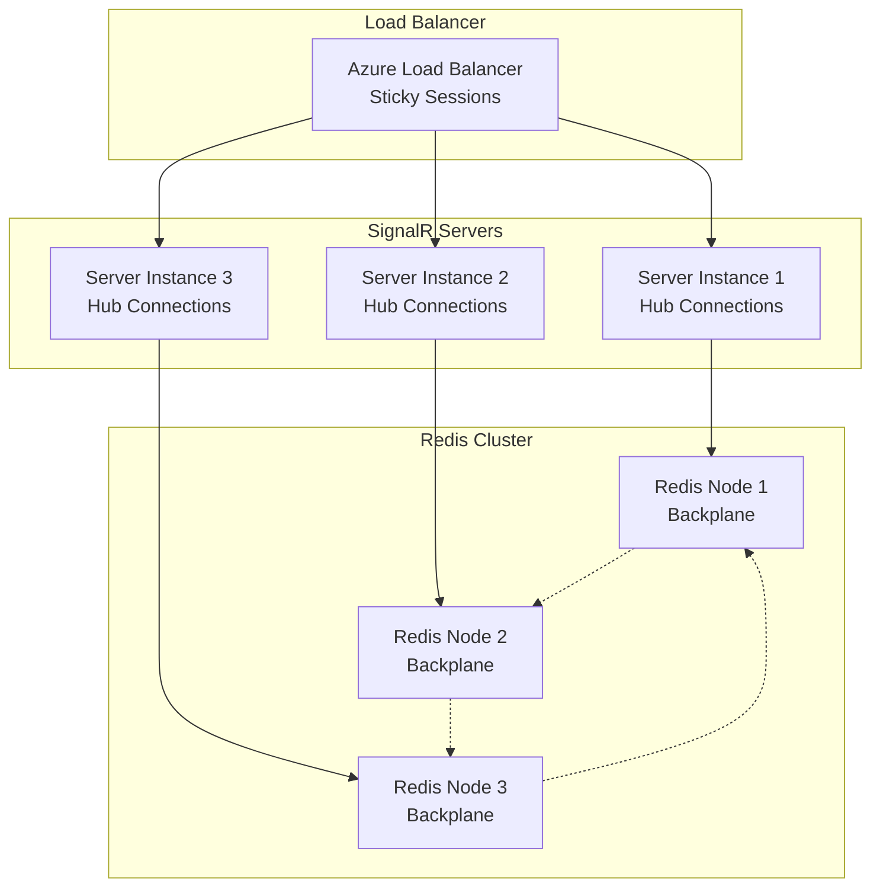
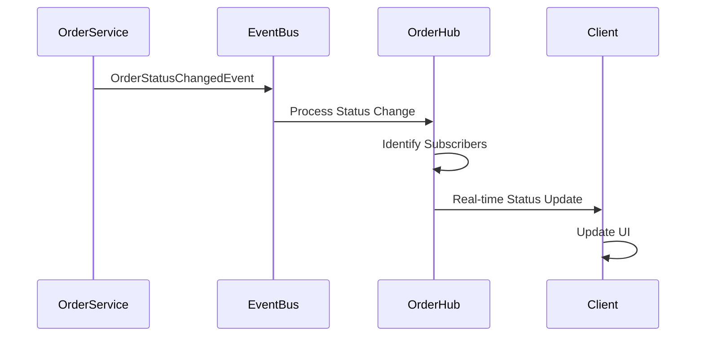

# ADR-006: SignalR for Real-time Communication

## Status

**Accepted** - July 2024

## Context

BookWorm requires real-time communication capabilities to enhance user experience and provide
immediate feedback for various business scenarios. The system needs:

- **Real-time Chat**: Interactive chat support with AI-powered responses
- **Order Updates**: Live order status updates and notifications
- **System Notifications**: Instant system-wide alerts and announcements
- **User Presence**: Online/offline status and activity indicators
- **Collaborative Features**: Potential future collaborative book reading features
- **Admin Dashboard**: Real-time monitoring and system status updates
- **Performance Requirements**: Sub-second message delivery with high throughput
- **Scalability**: Support for thousands of concurrent connections
- **Cross-platform Support**: Web browsers, mobile apps, and desktop clients
- **Security Integration**: Authentication and authorization for real-time connections

Traditional HTTP polling would be inefficient for real-time scenarios, while WebSocket libraries
alone would require significant custom implementation for connection management and scaling.

## Decision

Adopt **SignalR** as the real-time communication framework for streaming AI chat responses in the
BookWorm Chat service, providing bidirectional communication for interactive AI-powered
conversations.

### Implementation Strategy

#### Chat Streaming Hub

BookWorm implements a focused SignalR solution specifically for AI chat streaming:

- **ChatStreamHub**: Single hub dedicated to streaming AI responses
- **Message Fragments**: Real-time streaming of message fragments as AI generates responses
- **Redis Backplane**: Custom Redis backplane for cross-instance message delivery
- **Stateful Reconnects**: Support for connection recovery and message replay

#### Service Integration

- **Chat Service**: Primary consumer using SignalR for AI response streaming
- **Redis Integration**: Custom backplane implementation for scalability
- **Authentication**: Required authorization for all hub connections

## Rationale

### Why SignalR?

#### Technical Advantages

1. **Streaming Support**: Built-in support for `IAsyncEnumerable` streaming
2. **Transport Negotiation**: Automatic fallback from WebSockets to alternative transports
3. **Connection Management**: Built-in connection lifetime management and reconnection
4. **Custom Backplane**: Integration with custom Redis backplane implementation
5. **Security Integration**: Seamless integration with ASP.NET Core authentication

#### AI Chat Streaming Benefits

1. **Real-time AI Responses**: Stream AI-generated text as it's being produced
2. **Message Fragments**: Break long AI responses into manageable fragments
3. **Connection Recovery**: Stateful reconnects ensure no message loss
4. **Rate Limiting**: Built-in per-user rate limiting for hub methods
5. **Cancellation Support**: Proper cancellation of AI generation streams

### Implementation Overview

BookWorm's SignalR implementation focuses specifically on AI chat streaming rather than general
real-time communication.

## Implementation Architecture

### Client-Side Implementation

#### JavaScript Client Integration

```javascript
const chatConnection = new signalR.HubConnectionBuilder()
  .withUrl("/chathub", {
    accessTokenFactory: () => getAccessToken(),
  })
  .withAutomaticReconnect([0, 2000, 10000, 30000])
  .configureLogging(signalR.LogLevel.Information)
  .build();

chatConnection.on("ReceiveMessage", (message) => {
  displayChatMessage(message);
});

chatConnection.onreconnected(() => {
  console.log("Reconnected to chat hub");
  rejoinChatRooms();
});
```

#### Mobile Client Integration

```csharp
// Xamarin/MAUI client
var orderConnection = new HubConnectionBuilder()
    .WithUrl("https://api.bookworm.com/orderhub", options =>
    {
        options.AccessTokenProvider = () => Task.FromResult(GetAccessToken());
    })
    .WithAutomaticReconnect()
    .Build();

orderConnection.On<string, OrderStatus>("OrderStatusChanged",
    (orderId, status) =>
    {
        Device.BeginInvokeOnMainThread(() =>
        {
            UpdateOrderStatus(orderId, status);
        });
    });
```

## Scaling and Performance

### Redis Backplane Configuration

#### Scale-out Setup

```csharp
services.AddSignalR()
    .AddStackExchangeRedis(connectionString, options =>
    {
        options.Configuration.ChannelPrefix = "bookworm";
    });
```

#### Connection Distribution



### Performance Optimization

#### Connection Management

- **Connection Pooling**: Efficient connection reuse
- **Heartbeat**: Automatic connection health monitoring
- **Reconnection**: Exponential backoff for reconnection attempts
- **Message Buffering**: Client-side message queuing during disconnection

#### Message Optimization

- **MessagePack**: Binary serialization for high-throughput scenarios
- **Compression**: Automatic message compression for large payloads
- **Batching**: Message batching for improved throughput
- **Selective Broadcasting**: Targeted message delivery to reduce noise

## Integration with Business Services

### Event-Driven Integration

#### Order Status Updates



### Service-to-Hub Communication

```csharp
public class NotificationService
{
    private readonly IHubContext<NotificationHub, INotificationClient> _hubContext;

    public async Task SendUserNotification(string userId, Notification notification)
    {
        await _hubContext.Clients.User(userId)
            .ReceiveNotification(notification);
    }

    public async Task SendSystemAlert(SystemAlert alert)
    {
        await _hubContext.Clients.Group("administrators")
            .ReceiveSystemAlert(alert);
    }
}
```

## Monitoring and Observability

### Connection Monitoring

- **Connection Count**: Real-time connection count monitoring
- **Connection Duration**: Average connection lifetime tracking
- **Message Throughput**: Messages per second metrics
- **Error Rates**: Connection and message error tracking

### Performance Metrics

- **Latency**: End-to-end message delivery latency
- **Memory Usage**: Server memory consumption for connections
- **CPU Usage**: SignalR processing CPU overhead
- **Network Bandwidth**: Message payload and frequency analysis

### Key Features

#### AI Response Streaming

- **Fragment-based Streaming**: AI responses streamed as `ClientMessageFragment` objects
- **Stateful Reconnects**: Automatic recovery from connection loss with message replay
- **Cancellation Support**: Proper cancellation of long-running AI generation
- **Rate Limiting**: Per-user rate limiting to prevent abuse

#### Custom Redis Integration

- **Custom Backplane**: Integration with BookWorm's custom Redis backplane
- **Message Buffering**: Redis-based message buffering for connection recovery
- **Cross-instance Communication**: Seamless message delivery across service instances

## Consequences

### Positive Outcomes

- **Real-time AI Chat**: Seamless streaming of AI responses for enhanced user experience
- **Connection Reliability**: Stateful reconnects ensure no message loss during interruptions
- **Scalability**: Custom Redis backplane enables horizontal scaling of chat functionality
- **Security**: Built-in authorization and rate limiting for secure communication
- **Performance**: Efficient streaming of message fragments optimized for AI responses

### Challenges and Considerations

- **Connection Management**: Complex connection lifecycle management for streaming scenarios
- **Custom Backplane**: Requires maintenance of custom Redis backplane implementation
- **Resource Usage**: Memory and CPU overhead for maintaining persistent connections
- **AI Integration**: Coordination between AI generation and real-time streaming

### Risk Mitigation

- **Connection Recovery**: Stateful reconnects with message replay capability
- **Rate Limiting**: Built-in protection against connection and message abuse
- **Error Handling**: Comprehensive error handling for AI generation failures
- **Monitoring**: Integration with logging and monitoring systems for observability

## Implementation Status

### Current Implementation

- ✅ ChatStreamHub for AI response streaming
- ✅ Stateful reconnects with message replay
- ✅ Custom Redis backplane integration
- ✅ Per-user rate limiting and authorization
- ✅ Fragment-based AI response streaming
- ✅ Cancellation support for AI generation

### Future Enhancements

- Additional hub types for other real-time scenarios
- Enhanced monitoring and performance metrics
- Advanced connection grouping strategies

## Related Architecture Decisions

- [ADR-005: Keycloak for Identity Management](./adr-005-keycloak-identity)
- [ADR-009: AI Integration Strategy](./adr-009-ai-integration)
- [ADR-010: Redis for Caching and SignalR Scale](./adr-010-redis-signalr-scale)
- [ADR-011: RabbitMQ for Message Broker](./adr-011-rabbitmq-message)
