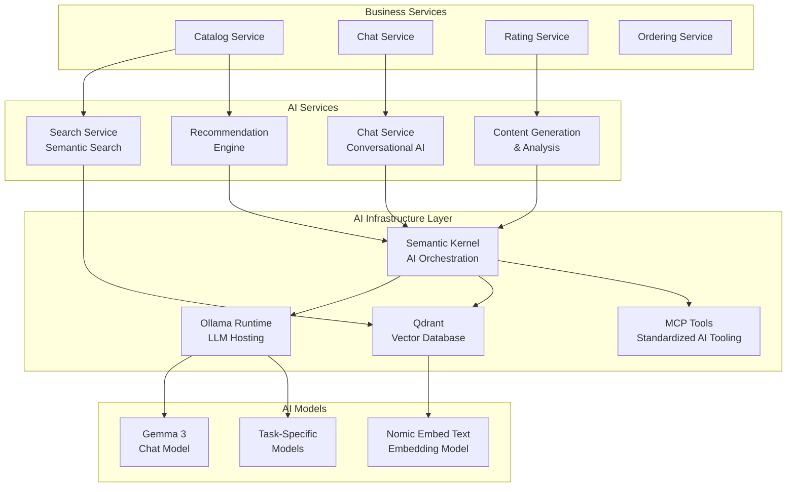

# ADR-009: AI Integration Strategy

## Status

**Accepted** - March 2025

## Context

BookWorm aims to enhance user experience through intelligent features that leverage artificial intelligence capabilities. The system requires AI integration for several key scenarios:

- **Conversational Support**: Interactive chat support with natural language understanding
- **Book Recommendations**: Personalized book suggestions based on user preferences and behavior
- **Content Search**: Semantic search capabilities beyond traditional keyword matching
- **Content Generation**: Automated content creation for descriptions and summaries
- **User Assistance**: Intelligent help and guidance for user interactions
- **Data Analytics**: AI-powered insights from user behavior and system metrics
- **Content Moderation**: Automated review and moderation of user-generated content
- **Performance Requirements**: Sub-second response times for interactive features
- **Cost Management**: Balance between AI capabilities and operational costs
- **Privacy and Security**: Ensure user data protection in AI processing workflows

The choice of AI technologies and integration patterns significantly impacts user experience, operational costs, development complexity, and long-term maintainability.

## Decision

Implement a **comprehensive AI integration strategy** using **Ollama** for local LLM hosting, **Semantic Kernel** for orchestration, **Model Context Protocol (MCP)** for standardized tooling, and **multi-agent workflows** for complex AI operations.

### AI Architecture Components

#### Core AI Infrastructure

- **Ollama Runtime**: Local LLM hosting and model management
- **Semantic Kernel**: AI orchestration and workflow management
- **MCP Tools**: Standardized AI tool integration
- **Vector Database**: Qdrant for embedding storage and semantic search
- **Agent Framework**: Multi-agent coordination for complex workflows

#### Model Selection Strategy

- **Chat Model**: Gemma 3 for conversational interactions
- **Embedding Model**: Nomic Embed Text for semantic search
- **Task-Specific Models**: Specialized models for specific use cases
- **Model Versioning**: Controlled model updates and rollback capabilities

### Service AI Integration Map

| Service          | AI Capabilities                              | Models Used      | Integration Pattern       |
| ---------------- | -------------------------------------------- | ---------------- | ------------------------- |
| **Chat**         | Conversational AI, context understanding     | Gemma 3          | Direct Ollama integration |
| **Catalog**      | Semantic search, recommendation engine       | Nomic Embed Text | Vector similarity search  |
| **Rating**       | Sentiment analysis, review insights          | Gemma 3          | Batch processing          |
| **Ordering**     | Order assistance, problem resolution         | Gemma 3          | Agent workflows           |
| **Finance**      | Fraud detection, transaction analysis        | Custom models    | ML.NET integration        |
| **Notification** | Content personalization, timing optimization | Gemma 3          | Template generation       |

## Rationale

### Why This AI Strategy?

#### Local-First AI Approach

1. **Data Privacy**: Keep sensitive data within controlled infrastructure
2. **Cost Control**: Avoid per-request charges from cloud AI services
3. **Performance**: Reduce latency by eliminating external API calls
4. **Reliability**: Independent operation without external service dependencies
5. **Customization**: Full control over model fine-tuning and optimization

#### Ollama for LLM Runtime

1. **Ease of Deployment**: Simple container-based LLM deployment
2. **Model Management**: Easy model switching and version control
3. **Resource Efficiency**: Optimized inference performance
4. **API Compatibility**: OpenAI-compatible API for easy integration
5. **Local Operation**: Complete on-premises operation

#### Semantic Kernel Orchestration

1. **.NET Integration**: Native .NET AI orchestration framework
2. **Plugin System**: Extensible plugin architecture for AI functions
3. **Planning Capabilities**: Multi-step AI workflow planning
4. **Memory Management**: Context and conversation state management
5. **Microsoft Support**: Enterprise-grade support and documentation

### AI Architecture Overview



## Implementation Strategy

### Ollama Configuration and Model Management

#### Model Deployment

```dockerfile
# Ollama container configuration
FROM ollama/ollama:latest

# Pre-load models during build
RUN ollama pull gemma2:2b
RUN ollama pull nomic-embed-text
RUN ollama pull llama3.1:8b

# Custom model configuration
COPY ./models/bookworm-fine-tuned.gguf /root/.ollama/models/
```

### Resource Management

#### Model Loading Strategy

- **Lazy Loading**: Load models only when needed
- **Model Rotation**: Unload unused models to free memory
- **GPU Optimization**: Utilize GPU acceleration when available
- **Memory Management**: Monitor and control memory usage

## Security and Privacy

### Data Privacy

- **Local Processing**: All AI processing happens within controlled infrastructure
- **Data Minimization**: Only process necessary data for AI features
- **Anonymization**: Remove or anonymize personal information where possible
- **Audit Logging**: Track all AI processing for compliance

### Model Security

- **Model Validation**: Verify model integrity and authenticity
- **Input Sanitization**: Validate and sanitize all inputs to AI models
- **Output Filtering**: Filter AI outputs for inappropriate content
- **Access Control**: Restrict access to AI capabilities based on user roles

## Consequences

### Positive Outcomes

- **Enhanced User Experience**: Intelligent features improve user engagement
- **Cost Control**: Local hosting reduces per-request AI service costs
- **Data Privacy**: Keep sensitive data within controlled infrastructure
- **Performance**: Low-latency AI responses for interactive features
- **Customization**: Full control over AI behavior and fine-tuning
- **Innovation**: Platform for rapid AI feature development

### Challenges and Considerations

- **Resource Requirements**: Significant compute resources for local AI hosting
- **Model Management**: Complexity of managing multiple AI models
- **Development Expertise**: Requires AI/ML expertise on development team
- **Infrastructure Costs**: Additional infrastructure for AI processing
- **Model Updates**: Managing model versions and updates

### Risk Mitigation

- **Fallback Strategies**: Graceful degradation when AI services are unavailable
- **Monitoring**: Comprehensive monitoring of AI service health and performance
- **Resource Scaling**: Auto-scaling for AI workloads based on demand
- **Model Governance**: Clear processes for model updates and rollbacks
- **Team Training**: Invest in team AI/ML capabilities and knowledge

## Success Metrics

- **Response Quality**: User satisfaction ratings for AI-generated responses
- **Performance**: Sub-second response times for 95% of AI requests
- **Accuracy**: High accuracy rates for recommendations and search results
- **Cost Efficiency**: 60% cost reduction compared to cloud AI services
- **User Engagement**: Increased user interaction with AI-powered features

## Alternatives Considered

### OpenAI API

- **Pros**: State-of-the-art models, excellent API, extensive capabilities
- **Cons**: High costs at scale, data privacy concerns, external dependency
- **Decision**: Rejected due to cost and privacy requirements

### Azure Cognitive Services

- **Pros**: Enterprise features, Azure integration, managed services
- **Cons**: Azure lock-in, limited customization, ongoing costs
- **Decision**: Insufficient customization and control for requirements

### AWS Bedrock

- **Pros**: Multiple model providers, managed infrastructure, enterprise features
- **Cons**: AWS lock-in, high costs, limited local deployment
- **Decision**: Cloud dependency conflicts with local-first strategy

### Custom Model Training

- **Pros**: Complete control, optimized for specific use cases
- **Cons**: Significant development effort, expertise required, ongoing maintenance
- **Decision**: Too resource-intensive for initial implementation

## Implementation Roadmap

### Phase 1: Foundation (Months 1-2)

- Ollama deployment and model setup
- Basic Semantic Kernel integration
- Simple chat functionality

### Phase 2: Core Features (Months 3-4)

- Vector search implementation
- Recommendation engine
- MCP tool standardization

### Phase 3: Advanced Features (Months 5-6)

- Multi-agent workflows
- Content generation and analysis
- Performance optimization

### Phase 4: Optimization (Months 7-8)

- Model fine-tuning
- Advanced caching strategies
- Comprehensive monitoring and analytics

## Related Architecture Decisions

- [ADR-012: Ollama for LLM Runtime](./adr-012-ollama-llm-runtime)
- [ADR-020: MCP Tools for Standardization](./adr-020-mcp-tools-standardize)
- [ADR-021: Agent-to-Agent Communication](./adr-021-agent-to-agent-via-a2a)
- [ADR-006: SignalR for Real-time Communication](./adr-006-signalr-realtime)
