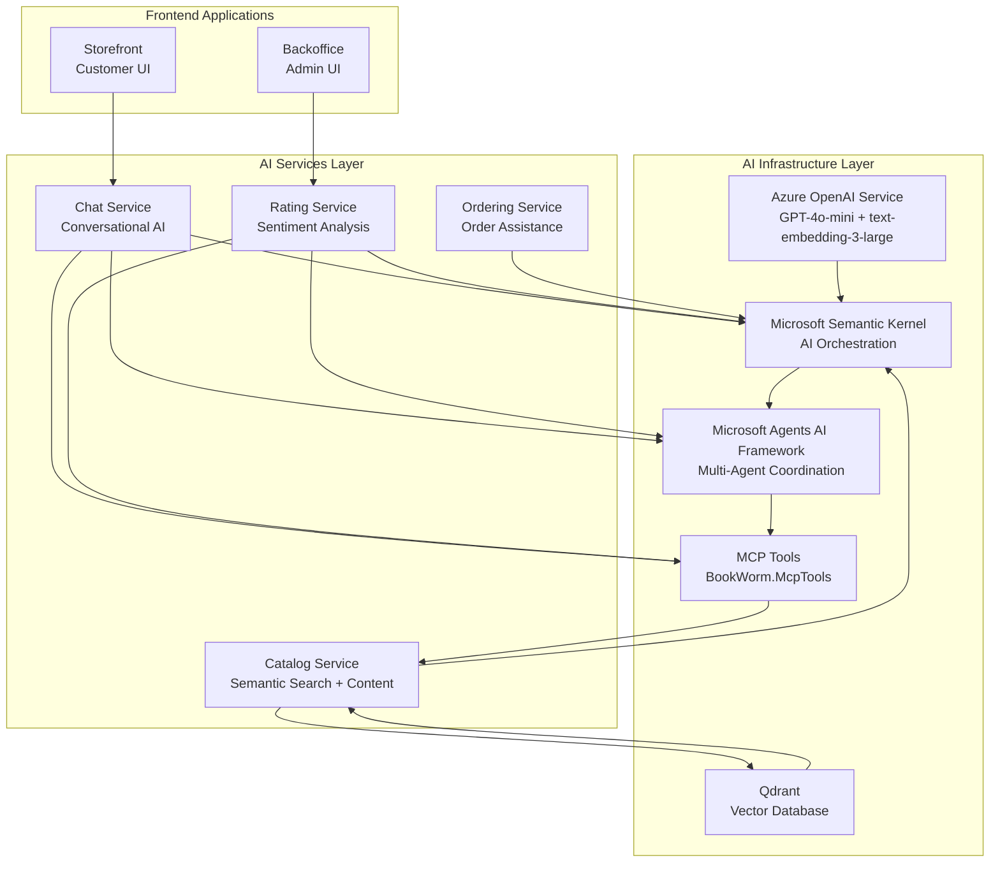

# ADR-009: AI Integration Strategy

## Status

**Accepted** - March 2025 (Updated: Migrated from Ollama to Azure OpenAI)

## Context

BookWorm aims to enhance user experience through intelligent features that leverage artificial
intelligence capabilities. The system requires AI integration for several key scenarios:

- **Conversational Support**: Interactive chat support with natural language understanding
- **Book Recommendations**: Personalized book suggestions based on user preferences and behavior
- **Content Search**: Semantic search capabilities beyond traditional keyword matching
- **Content Generation**: Automated content creation for descriptions and summaries
- **User Assistance**: Intelligent help and guidance for user interactions
- **Data Analytics**: AI-powered insights from user behavior and system metrics
- **Content Moderation**: Automated review and moderation of user-generated content
- **Performance Requirements**: Sub-second response times for interactive features
- **Cost Management**: Balance between AI capabilities and operational costs
- **Privacy and Security**: Ensure user data protection in AI processing workflows
- **Enterprise Requirements**: SLA guarantees, managed scaling, and Microsoft ecosystem integration
- **Model Quality**: Latest models with superior reasoning and embedding capabilities

The choice of AI technologies and integration patterns significantly impacts user experience,
operational costs, development complexity, and long-term maintainability.

## Decision

Implement a **comprehensive AI integration strategy** using **Azure OpenAI Service** for
enterprise-grade AI models, **Microsoft Semantic Kernel** for orchestration, **Microsoft Agents AI
Framework** for multi-agent workflows, and **Model Context Protocol (MCP)** for standardized
tooling.

### AI Architecture Components

#### Core AI Infrastructure

- **Azure OpenAI Service**: Enterprise-grade managed AI service with GPT-4o-mini and
  text-embedding-3-large
- **Microsoft Semantic Kernel**: .NET-native AI orchestration and workflow management
- **Microsoft Agents AI Framework**: Multi-agent coordination with A2A Protocol
- **MCP Tools**: Standardized AI tool integration via BookWorm.McpTools
- **Vector Database**: Qdrant for embedding storage and semantic search

#### Model Selection Strategy

- **Chat Model**: GPT-4o-mini for cost-effective conversational interactions
- **Embedding Model**: text-embedding-3-large (3072 dimensions) for semantic search
- **Model Versioning**: Azure-managed model lifecycle with automatic updates
- **Health Monitoring**: Aspire-integrated health checks for model availability

### Service AI Integration Map

| Service          | AI Capabilities                              | Models Used            | Integration Pattern            |
| ---------------- | -------------------------------------------- | ---------------------- | ------------------------------ |
| **Chat**         | Conversational AI, context understanding     | GPT-4o-mini            | Semantic Kernel + A2A Protocol |
| **Catalog**      | Semantic search, recommendation engine       | text-embedding-3-large | Vector similarity search       |
| **Rating**       | Sentiment analysis, review insights          | GPT-4o-mini            | Semantic Kernel + MCP Tools    |
| **Ordering**     | Order assistance, problem resolution         | GPT-4o-mini            | Agent workflows                |
| **Finance**      | Fraud detection, transaction analysis        | Custom models          | ML.NET integration             |
| **Notification** | Content personalization, timing optimization | GPT-4o-mini            | Template generation            |

## Rationale

### Why Azure OpenAI Over Ollama?

#### Enterprise-Grade Capabilities

1. **Service Level Agreement**: 99.9% uptime SLA with Microsoft support
2. **Managed Scaling**: Automatic scaling based on demand without infrastructure management
3. **Model Quality**: Access to latest OpenAI models (GPT-4o-mini, text-embedding-3-large)
4. **Security and Compliance**: Enterprise security, compliance certifications, and data residency
5. **Microsoft Integration**: Seamless integration with Azure ecosystem and Microsoft AI tools

#### Performance and Cost Benefits

1. **No Infrastructure Management**: Eliminate costs for GPU infrastructure and maintenance
2. **Pay-Per-Use**: Cost-effective pricing with no idle capacity costs
3. **Token Optimization**: GPT-4o-mini provides excellent quality at lower cost per token
4. **Elastic Scaling**: Handle traffic spikes without capacity planning
5. **Global Distribution**: Multi-region deployment for low-latency access

#### Development Experience

1. **Semantic Kernel Native**: First-class support in Microsoft Semantic Kernel
2. **Health Check Integration**: Aspire health checks for model availability monitoring
3. **Streaming Support**: Native streaming for real-time chat experiences
4. **Azure AD Integration**: Managed identity authentication without API key management
5. **Monitoring Integration**: Azure Monitor and Application Insights telemetry

### Microsoft Semantic Kernel Orchestration

1. **.NET Integration**: Native .NET AI orchestration framework with strong typing
2. **Plugin System**: Extensible plugin architecture for AI functions
3. **Planning Capabilities**: Multi-step AI workflow planning and execution
4. **Memory Management**: Context and conversation state management
5. **Microsoft Support**: Enterprise-grade support and continuous updates

### AI Architecture Overview



## Implementation Strategy

### Azure OpenAI Configuration

#### Model Deployment

```csharp
// AppHost.cs - Azure OpenAI integration
var openai = builder.AddOpenAI(Components.OpenAI.Resource);

var chat = openai
    .AddModel(Components.OpenAI.Chat, Components.OpenAI.OpenAIGpt4oMini)
    .WithHealthCheck();

var embedding = openai
    .AddModel(Components.OpenAI.Embedding, Components.OpenAI.TextEmbedding3Large)
    .WithHealthCheck();

// Service references
var chatService = builder
    .AddProject<BookWorm_Chat>(Services.Chatting)
    .WithReference(chat)
    .WithReference(embedding);
```

#### Semantic Kernel Configuration

```csharp
// Service configuration with Semantic Kernel
builder.Services.AddKernel()
    .AddAzureOpenAIChatCompletion(
        deploymentName: "gpt-4o-mini",
        endpoint: azureOpenAIEndpoint,
        credential: new DefaultAzureCredential())
    .AddAzureOpenAITextEmbeddingGeneration(
        deploymentName: "text-embedding-3-large",
        endpoint: azureOpenAIEndpoint,
        credential: new DefaultAzureCredential());
```

### Resource Management

#### Token Usage Optimization

- **Prompt Engineering**: Optimize prompts for token efficiency
- **Streaming Responses**: Use streaming for real-time user feedback
- **Caching**: Cache frequent AI responses using Hybrid Cache
- **Rate Limiting**: Implement quota management per tenant/user

#### Cost Management Strategy

- **GPT-4o-mini**: Cost-effective model for most conversational scenarios
- **Batch Processing**: Use batch API for non-real-time operations
- **Response Caching**: Cache AI responses for repeated queries
- **Quota Monitoring**: Track token usage and set alerts

## Security and Privacy

### Data Privacy

- **Azure Data Residency**: Data processed in specified Azure regions
- **No Training on Customer Data**: Azure OpenAI doesn't use customer data for training
- **Data Minimization**: Only send necessary context to AI models
- **Audit Logging**: Track all AI API calls for compliance via Azure Monitor

### Model Security

- **Managed Identity**: Use Azure AD managed identity for authentication
- **Network Security**: Private endpoints for Azure OpenAI access
- **Input Sanitization**: Validate and sanitize all inputs to AI models
- **Output Filtering**: Filter AI outputs for inappropriate content via content filters
- **Access Control**: Restrict access to AI capabilities based on user roles and RBAC

## Consequences

### Positive Outcomes

- **Enhanced User Experience**: Intelligent features improve user engagement and satisfaction
- **Enterprise-Grade Service**: 99.9% SLA with Microsoft support ensures reliability
- **Microsoft Ecosystem Integration**: Seamless integration with Azure services and .NET tools
- **Latest Models**: Access to cutting-edge GPT-4o-mini and text-embedding-3-large models
- **Managed Scaling**: Automatic scaling eliminates capacity planning concerns
- **Developer Productivity**: Microsoft Semantic Kernel and Agents AI Framework accelerate
  development
- **Security**: Enterprise security, compliance certifications, and managed identity authentication

### Challenges and Considerations

- **Cloud Dependency**: Requires reliable internet connectivity and Azure availability
- **Token Costs**: Pay-per-use pricing requires careful cost management and monitoring
- **Quota Management**: Need to manage Azure OpenAI quotas and rate limits
- **Data Transfer**: Latency considerations for data sent to Azure OpenAI API
- **Vendor Lock-in**: Azure OpenAI-specific integrations create platform dependency

### Risk Mitigation

- **Fallback Strategies**: Graceful degradation when AI services are unavailable with cached
  responses
- **Monitoring**: Azure Monitor and Application Insights for AI service health and token usage
- **Cost Controls**: Budget alerts, quota management, and response caching with Hybrid Cache
- **Redundancy**: Multi-region deployment for high availability
- **Team Training**: Invest in team Azure OpenAI and Semantic Kernel capabilities

## Success Metrics

- **Response Quality**: User satisfaction ratings &gt;85% for AI-generated responses
- **Performance**: Sub-500ms response times for 95% of AI requests (excluding streaming)
- **Accuracy**: &gt;90% accuracy rates for recommendations and search results
- **Cost Efficiency**: Token cost per user interaction &lt;$0.01
- **User Engagement**: 40% increase in user interaction with AI-powered features
- **Availability**: 99.9% uptime for AI-powered features via Azure SLA

## Alternatives Considered

### Ollama (Local LLM Hosting)

- **Pros**: Data privacy, no per-request costs, full control, offline capability
- **Cons**: Infrastructure costs, GPU requirements, model management complexity, lower model quality
- **Decision**: **Replaced by Azure OpenAI** - Enterprise requirements for SLA, model quality, and
  managed scaling outweighed local hosting benefits

### OpenAI API (Direct)

- **Pros**: State-of-the-art models, excellent API, extensive capabilities
- **Cons**: No enterprise SLA, less Azure integration, limited compliance features
- **Decision**: Azure OpenAI preferred for enterprise features and Microsoft ecosystem integration

### AWS Bedrock

- **Pros**: Multiple model providers, managed infrastructure, enterprise features
- **Cons**: AWS lock-in, less .NET integration, multi-cloud complexity
- **Decision**: Azure OpenAI chosen for Microsoft ecosystem alignment and .NET tooling

### Custom Model Training

- **Pros**: Complete control, optimized for specific use cases, potential cost savings
- **Cons**: Significant development effort, expertise required, ongoing maintenance, GPU
  infrastructure
- **Decision**: Too resource-intensive; Azure OpenAI provides sufficient capabilities

## Implementation Roadmap

### Phase 1: Foundation (Completed)

- Azure OpenAI Service deployment with GPT-4o-mini and text-embedding-3-large
- Microsoft Semantic Kernel integration in Chat and Rating services
- Basic chat functionality with streaming support
- Health checks integration with Aspire

### Phase 2: Core Features (Current)

- Vector search implementation
- Recommendation engine
- MCP tool standardization

### Phase 3: Advanced Features (Months 5-6)

- Multi-agent workflows
- Content generation and analysis
- Performance optimization

### Phase 4: Optimization (Months 7-8)

- Model fine-tuning
- Advanced caching strategies
- Comprehensive monitoring and analytics

## Related Architecture Decisions

- [ADR-012: Ollama for LLM Runtime](./adr-012-ollama-llm-runtime)
- [ADR-020: MCP Tools for Standardization](./adr-020-mcp-tools-standardize)
- [ADR-021: Agent-to-Agent Communication](./adr-021-agent-to-agent-via-a2a)
- [ADR-006: SignalR for Real-time Communication](./adr-006-signalr-realtime)
