# ADR-012: Ollama for LLM Runtime

## Status

**Accepted** - July 2024

## Context

BookWorm's AI-enhanced features require a robust, scalable, and cost-effective Large Language Model
(LLM) runtime to power intelligent functionalities across the platform. The requirements include:

- **Book Recommendations**: Personalized book suggestions based on reading history and preferences
- **Content Analysis**: Automatic book categorization, summary generation, and metadata extraction
- **Search Enhancement**: Semantic search capabilities with natural language query understanding
- **Customer Support**: AI-powered chatbot for customer inquiries and support
- **Content Moderation**: Automated review and rating content moderation
- **Inventory Intelligence**: Demand prediction and inventory optimization insights
- **User Experience**: Natural language interfaces for complex queries and interactions
- **Performance**: Low-latency inference for real-time user interactions
- **Cost Control**: Predictable and scalable cost structure without per-token pricing
- **Privacy**: On-premises or private cloud deployment for sensitive data handling
- **Flexibility**: Support for multiple model architectures and easy model switching

The choice of LLM runtime significantly impacts system performance, operational costs, data privacy,
and the overall quality of AI-powered features.

## Decision

Adopt **Ollama** as the primary Large Language Model runtime, integrated with **Microsoft Agent
Framework** for AI orchestration, to provide powerful, cost-effective, and privacy-conscious AI
capabilities across BookWorm's platform.

### AI Architecture Strategy

#### Ollama Model Management

- **Model Repository**: Centralized management of multiple LLM models for different use cases
- **Resource Optimization**: GPU-aware deployment with automatic GPU detection
- **Container Integration**: Aspire-based deployment with OpenWebUI interface
- **Azure Container App Support**: Scalable cloud deployment with min replicas configuration

#### Chat Service Agent Orchestration

- **Sequential Processing**: Multi-agent pipeline for comprehensive chat responses
- **Specialized Agents**: BookAgent, LanguageAgent, SentimentAgent, SummarizeAgent
- **RAG Integration**: Hybrid search capabilities with vector embeddings
- **Real-time Streaming**: Live response streaming with Redis backplane

### BookWorm AI Agents

| Agent              | Purpose                             | Integration               | Capabilities                              |
| ------------------ | ----------------------------------- | ------------------------- | ----------------------------------------- |
| **BookAgent**      | Book search and recommendations     | Catalog search, MCP tools | Personalized suggestions, catalog queries |
| **LanguageAgent**  | Translation and language processing | Text processing           | Multi-language support                    |
| **SentimentAgent** | Emotion analysis                    | Customer feedback         | Positive/Negative/Neutral classification  |
| **SummarizeAgent** | Content summarization               | Text processing           | Key insights extraction                   |

## Rationale

### Why Ollama?

#### Cost-Effective and Predictable

1. **No Token-Based Pricing**: Fixed infrastructure costs without per-request charges
2. **Open Source Models**: Access to state-of-the-art models without licensing fees
3. **Resource Efficiency**: Optimized model serving with quantization and optimization
4. **Horizontal Scaling**: Scale compute resources based on actual usage patterns
5. **Multi-Tenancy**: Serve multiple applications from shared infrastructure

#### Privacy and Data Control

1. **On-Premises Deployment**: Complete control over data and model inference
2. **No External API Calls**: All AI processing happens within private infrastructure
3. **Data Sovereignty**: Compliance with data protection regulations and policies
4. **Model Customization**: Fine-tune models on proprietary data without external exposure
5. **Audit Trail**: Complete visibility into AI processing and decision-making

#### Performance and Reliability

1. **Low Latency**: Direct model access without network round-trips to external services
2. **High Throughput**: Optimized inference serving with batching and caching
3. **Offline Capability**: Continue AI functionality during internet connectivity issues
4. **Custom Optimization**: Hardware-specific optimizations for GPU and CPU inference
5. **Availability Control**: Service-level agreements based on internal infrastructure

#### Flexibility and Model Diversity

1. **Multiple Model Support**: Run different models for specialized tasks
2. **Model Versioning**: A/B test different model versions and capabilities
3. **Custom Models**: Deploy fine-tuned or domain-specific models
4. **Easy Migration**: Switch between models without changing application code
5. **Experimentation**: Rapid prototyping with new models and approaches

### Why Agent Framework Integration?

#### .NET Ecosystem Alignment

1. **Native .NET Integration**: First-class support for .NET applications and patterns
2. **Dependency Injection**: Seamless integration with ASP.NET Core DI container
3. **Configuration**: Familiar configuration patterns and environment management
4. **Testing**: Comprehensive testing framework for AI-powered applications
5. **Observability**: Built-in telemetry, logging, and performance monitoring

#### Enterprise AI Patterns

1. **Prompt Engineering**: Centralized prompt management with versioning and testing
2. **Function Calling**: Integrate AI with business logic through semantic functions
3. **Memory Systems**: Persistent context and conversation state management
4. **Plugin Architecture**: Modular AI capabilities with reusable components
5. **Security**: Built-in security patterns for AI applications and data handling

### LLM Architecture Overview

```mermaid
graph TB
    subgraph "Client Applications"
        WebApp[BookWorm Web App<br/>User Interface]
        MobileApp[BookWorm Mobile<br/>iOS/Android]
        AdminPanel[Admin Panel<br/>Management Interface]
        API[BookWorm API<br/>External Integrations]
    end

    subgraph "Agent Framework Layer"
        SKOrchestrator[Agent Framework<br/>Orchestrator]

        subgraph "AI Services"
            ChatService[Chat Service<br/>Customer Support]
            RecommendationService[Recommendation Service<br/>Book Suggestions]
            SearchService[Search Service<br/>Semantic Search]
            ContentService[Content Service<br/>Analysis & Moderation]
        end

        subgraph "Plugins"
            BookPlugin[Book Plugin<br/>Catalog Operations]
            UserPlugin[User Plugin<br/>Profile Management]
            OrderPlugin[Order Plugin<br/>Transaction Data]
            AnalyticsPlugin[Analytics Plugin<br/>Insights & Metrics]
        end

        subgraph "Memory & Context"
            ConversationMemory[Conversation Memory<br/>Chat Context]
            UserMemory[User Memory<br/>Preferences & History]
            SemanticMemory[Semantic Memory<br/>Knowledge Base]
        end
    end

    subgraph "Ollama Runtime Cluster"
        OllamaLB[Load Balancer<br/>Request Distribution]

        subgraph "Ollama Nodes"
            Ollama1[Ollama Node 1<br/>GPU: A100 x2]
            Ollama2[Ollama Node 2<br/>GPU: A100 x2]
            Ollama3[Ollama Node 3<br/>GPU: A100 x2]
        end

        subgraph "Model Repository"
            LlamaModel[Llama 3.1 8B<br/>General Purpose]
            CodeModel[Code Llama<br/>Technical Analysis]
            EmbeddingModel[BGE Embeddings<br/>Semantic Search]
            ChatModel[Llama 3.1 Chat<br/>Conversational AI]
        end
    end

    subgraph "Storage & Cache"
        ModelCache[Model Cache<br/>Redis Cluster]
        VectorDB[Vector Database<br/>Qdrant/Weaviate]
        ContextStore[Context Store<br/>PostgreSQL]
    end

    subgraph "Monitoring"
        Prometheus[Prometheus<br/>Metrics Collection]
        Grafana[Grafana<br/>AI Analytics Dashboard]
        AppInsights[Application Insights<br/>Telemetry & Tracing]
    end

    WebApp --> SKOrchestrator
    MobileApp --> SKOrchestrator
    AdminPanel --> SKOrchestrator
    API --> SKOrchestrator

    SKOrchestrator --> ChatService
    SKOrchestrator --> RecommendationService
    SKOrchestrator --> SearchService
    SKOrchestrator --> ContentService

    ChatService --> BookPlugin
    RecommendationService --> UserPlugin
    SearchService --> OrderPlugin
    ContentService --> AnalyticsPlugin

    SKOrchestrator --> ConversationMemory
    SKOrchestrator --> UserMemory
    SKOrchestrator --> SemanticMemory

    ChatService --> OllamaLB
    RecommendationService --> OllamaLB
    SearchService --> OllamaLB
    ContentService --> OllamaLB

    OllamaLB --> Ollama1
    OllamaLB --> Ollama2
    OllamaLB --> Ollama3

    Ollama1 --> LlamaModel
    Ollama1 --> CodeModel
    Ollama2 --> EmbeddingModel
    Ollama3 --> ChatModel

    SKOrchestrator --> ModelCache
    SearchService --> VectorDB
    ConversationMemory --> ContextStore

    OllamaLB --> Prometheus
    SKOrchestrator --> AppInsights
    Prometheus --> Grafana
```



## Implementation Strategy

### Ollama Deployment with Aspire

```csharp
public static async Task AddOllama(
    this IDistributedApplicationBuilder builder,
    Action<IResourceBuilder<OllamaResource>>? configure = null)
{
    var ollama = builder
        .AddOllama(Components.Ollama.Resource)
        .WithDataVolume()
        .WithOpenWebUI()
        .WithImagePullPolicy(ImagePullPolicy.Always)
        .WithLifetime(ContainerLifetime.Persistent)
        .PublishAsAzureContainerApp((_, app) => app.Template.Scale.MinReplicas = 0);

    if (await ollama.IsUseGpu())
    {
        ollama.WithGPUSupport();
    }

    configure?.Invoke(ollama);
}
```

### Agent Orchestration Service

```csharp
public sealed class AgentOrchestrationService : IAgentOrchestrationService
{
    public async Task<string> ProcessAgentsSequentiallyAsync(
        string userMessage,
        Guid conversationId,
        Guid assistantReplyId,
        CancellationToken cancellationToken = default)
    {
        var runtime = new InProcessRuntime();
        await runtime.StartAsync(cancellationToken);

        SequentialOrchestration orchestration = new(
            orchestrateAgents.LanguageAgent,
            orchestrateAgents.SummarizeAgent,
            orchestrateAgents.SentimentAgent,
            orchestrateAgents.BookAgent)
        {
            ResponseCallback = ResponseCallbackAsync,
        };

        var result = await orchestration.InvokeAsync(userMessage, runtime, cancellationToken);
        var finalResults = await result.GetValueAsync(TimeSpan.FromSeconds(60), cancellationToken);


```

### RAG Hybrid Search

```csharp
public sealed class HybridSearch : ISearch
{
    public async Task<IReadOnlyList<TextSnippet>> SearchAsync(
        string text,
        ICollection<string> keywords,
        int maxResults = 20,
        CancellationToken cancellationToken = default)
    {
        var vector = await embeddingGenerator.GenerateVectorAsync(
            text, cancellationToken: cancellationToken);

        await collection.EnsureCollectionExistsAsync(cancellationToken);
        var vectorCollection = (IKeywordHybridSearchable<TextSnippet>)collection;

        var options = new HybridSearchOptions<TextSnippet>
        {
            VectorProperty = r => r.Vector,
            AdditionalProperty = r => r.Description,
        };

        var nearest = vectorCollection.HybridSearchAsync(
            vector, keywords, maxResults, options, cancellationToken);

        return await nearest.ToListAsync(cancellationToken);
    }
}
```

## Consequences

### Benefits

- **Cost predictability** with fixed infrastructure costs vs per-token pricing
- **Data privacy** with on-premises processing and no external API calls
- **Performance control** with direct model access and hardware optimization
- **Agent orchestration** enabling complex multi-step AI workflows
- **Hybrid search** combining vector similarity with keyword matching
- **Real-time streaming** for responsive chat experiences

### Trade-offs

- **Infrastructure complexity** requiring GPU management and model deployment
- **Operational overhead** for model updates and performance monitoring
- **Resource requirements** for GPU-enabled hardware and memory management
- **Expertise needs** for AI model optimization and troubleshooting

## Alternatives Considered

### OpenAI GPT API

- **Pros**: Best-in-class performance, managed service, extensive capabilities
- **Cons**: High per-token costs, data privacy concerns, external dependency
- **Decision**: Cost and privacy concerns outweigh performance benefits

### Azure OpenAI Service

- **Pros**: Enterprise-grade security, Microsoft ecosystem integration
- **Cons**: External dependency, significant costs at scale, limited model control
- **Decision**: Preference for self-hosted solution with complete control

### Hugging Face Transformers

- **Pros**: Open source, extensive model library, community support
- **Cons**: Complex deployment, requires ML expertise, optimization challenges
- **Decision**: Ollama provides better production-ready deployment
