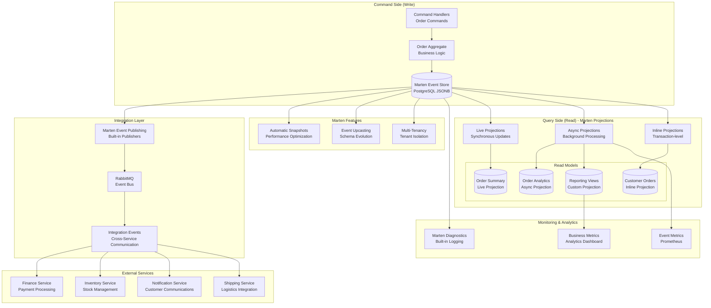

# ADR-013: Event Sourcing for Ordering Service

## Status

**Accepted** - September 2024

## Context

BookWorm's ordering service requires sophisticated state management to handle complex business workflows, maintain comprehensive audit trails, and support advanced analytics. The ordering domain involves intricate business processes with multiple state transitions, compensation scenarios, and regulatory requirements:

- **Complex Order Lifecycle**: Orders transition through multiple states (placed, paid, shipped, delivered, cancelled, returned)
- **Business Rule Evolution**: Pricing rules, discount calculations, and tax regulations change frequently
- **Audit Requirements**: Complete audit trail for financial transactions and regulatory compliance
- **Analytics and Reporting**: Historical analysis of order patterns, customer behavior, and business metrics
- **Temporal Queries**: Ability to reconstruct system state at any point in time
- **Event-Driven Integration**: Seamless integration with other services through domain events
- **Compensation Handling**: Saga patterns for distributed transaction management
- **Performance Requirements**: High-throughput order processing with eventual consistency
- **Data Recovery**: Point-in-time recovery and replay capabilities for disaster scenarios
- **Compliance**: GDPR, PCI-DSS, and financial regulatory requirements

Traditional CRUD-based approaches struggle with these requirements due to data loss during updates, limited audit capabilities, and tight coupling between current state and historical context.

## Decision

Implement **Event Sourcing** pattern for the Ordering Service using **Marten** as the event sourcing framework, leveraging **PostgreSQL** as the event store with **projections** for read models and **subscriptions** for event publishing.

### Event Sourcing Architecture Strategy

#### Marten Integration Features

- **PostgreSQL Event Store**: Uses PostgreSQL JSONB for efficient event storage and querying
- **Async Daemon**: Background processing for projections and subscriptions
- **Event Publishing**: Automatic event publishing to RabbitMQ via MassTransit
- **Real-time Notifications**: SignalR integration for live updates
- **OpenTelemetry**: Comprehensive observability and distributed tracing

#### Core Components

- **Domain Events**: Simple domain events published when aggregate state changes
- **Event Subscriptions**: MartenEventPublisher handles integration events and SignalR notifications
- **Projections**: OrderSummary projections for efficient querying
- **Telemetry Integration**: Full observability with OpenTelemetry tracing and metrics

### BookWorm Order Events

| Event                   | Purpose            | Trigger               | Integration                    |
| ----------------------- | ------------------ | --------------------- | ------------------------------ |
| **OrderPlacedEvent**    | Order creation     | New Order constructor | Finance, Notification services |
| **OrderCompletedEvent** | Order completion   | MarkAsCompleted()     | Finance, Notification services |
| **OrderCancelledEvent** | Order cancellation | MarkAsCanceled()      | Finance, Notification services |

## Rationale

### Why Marten for Event Sourcing?

1. **PostgreSQL-Native**: Uses PostgreSQL JSONB for efficient event storage and advanced indexing
2. **BookWorm Integration**: Seamless integration with existing PostgreSQL infrastructure
3. **Async Daemon**: Background processing for projections and event subscriptions
4. **OpenTelemetry**: Built-in observability and distributed tracing support
5. **Developer Experience**: Code-first approach with LINQ querying and strong typing

### Event Sourcing Benefits for BookWorm

1. **Audit Trail**: Complete history of order state changes for compliance
2. **Performance**: Optimized event appending with PostgreSQL JSONB storage
3. **Scalability**: Async projections and subscriptions for high throughput
4. **Integration**: Automatic event publishing to RabbitMQ for service communication
5. **Real-time Updates**: SignalR integration for live order status updates
6. **Time Travel Debugging**: Debug issues by replaying events with Marten's event replay features
7. **Historical Analytics**: Analyze business trends using Marten's projection rebuilding capabilities
8. **Retroactive Changes**: Apply new business rules to historical data through projection updates
9. **What-If Analysis**: Simulate scenarios using Marten's event stream querying

#### Business Flexibility with Marten

1. **Schema Evolution**: Add new event types and fields using Marten's upcasting features
2. **New Projections**: Create new read models from existing event history with zero downtime
3. **Business Rule Changes**: Implement new logic using Marten's projection versioning
4. **Compensation Logic**: Handle complex workflows with Marten's saga support
5. **Event Replay**: Test new features using Marten's event stream replay capabilities

#### Integration and Scalability

1. **Natural Event Publishing**: Events are first-class citizens for integration
2. **Independent Scaling**: Read and write sides can scale independently
3. **Eventual Consistency**: Better performance through asynchronous processing
4. **Microservice Integration**: Clean boundaries through domain events
5. **Horizontal Scalability**: Events can be partitioned and processed in parallel

### Event Sourcing with Marten Architecture Overview



## Implementation Strategy

### Marten Configuration

```csharp
public static class StoreConfigs
{
    public static StoreOptions SetStoreOptions(MartenConfigs martenConfig)
    {
        var options = new StoreOptions();
        options.AutoCreateSchemaObjects = AutoCreate.CreateOrUpdate;
        options.UseSystemTextJsonForSerialization(EnumStorage.AsString);

        // Event store optimization
        options.Events.AppendMode = EventAppendMode.Quick;
        options.Events.UseIdentityMapForAggregates = true;
        options.Events.UseArchivedStreamPartitioning = true;

        // Metadata tracking
        options.Events.MetadataConfig.CausationIdEnabled = true;
        options.Events.MetadataConfig.CorrelationIdEnabled = true;

        // OpenTelemetry integration
        options.OpenTelemetry.TrackConnections = TrackLevel.Normal;
        options.OpenTelemetry.TrackEventCounters();

        return options;
    }
}
```

### Domain Events Implementation

```csharp
// Simple domain events with Order aggregate
public sealed class OrderPlacedEvent(Order order) : DomainEvent
{
    public Order Order { get; } = order;
}

public sealed class OrderCompletedEvent(Order order) : DomainEvent
{
    public Order Order { get; } = order;
}

public sealed class OrderCancelledEvent(Order order) : DomainEvent
{
    public Order Order { get; } = order;
}
```

### Order Aggregate

```csharp
public sealed class Order : AuditableEntity, IAggregateRoot
{
    public Order(Guid buyerId, string? note, List<OrderItem> orderItems)
    {
        BuyerId = buyerId;
        Note = note;
        Status = Status.New;
        _orderItems = orderItems;
        RegisterDomainEvent(new OrderPlacedEvent(this));
    }

    public void MarkAsCompleted()
    {
        if (Status == Status.New)
        {
            Status = Status.Completed;
            RegisterDomainEvent(new OrderCompletedEvent(this));
        }
    }

    public void MarkAsCanceled()
    {
        if (Status == Status.New)
        {
            Status = Status.Cancelled;
            RegisterDomainEvent(new OrderCancelledEvent(this));
        }
    }
}
```

### Event Publishing with Marten Subscriptions

```csharp
public sealed class MartenEventPublisher : SubscriptionBase
{
    public override async Task<IChangeListener> ProcessEventsAsync(
        EventRange page,
        ISubscriptionController controller,
        IDocumentOperations operations,
        CancellationToken cancellationToken)
    {
        foreach (var @event in page.Events)
        {
            using var scope = scopeFactory.CreateScope();
            var eventDispatcher = scope.ServiceProvider.GetRequiredService<IEventDispatcher>();

            if (@event.Data is DomainEvent domainEvent)
            {
                await eventDispatcher.DispatchAsync(domainEvent, cancellationToken);
            }
        }

        return NullChangeListener.Instance;
    }
}
```

## Consequences

### Benefits

- **Complete audit trail** for order state changes
- **Real-time integration** with other BookWorm services via event publishing
- **Performance optimization** with async daemon processing
- **Observability** through OpenTelemetry integration
- **Future flexibility** for temporal queries and event replay

### Trade-offs

- **Learning curve** for developers new to event sourcing
- **Storage growth** from immutable event streams
- **Projection management** complexity
- **Event versioning** considerations for schema evolution

## Alternatives Considered

### Traditional CRUD Repository

- **Pros**: Simple implementation, immediate consistency
- **Cons**: No audit trail, limited integration capabilities
- **Decision**: Insufficient for BookWorm's audit and integration requirements

### Event Store Database (EventStoreDB)

- **Pros**: Purpose-built features, strong consistency guarantees
- **Cons**: Additional infrastructure, operational complexity
- **Decision**: Marten provides sufficient event sourcing with existing PostgreSQL stack

## Related Decisions

- [ADR-002: Event-Driven Architecture](./adr-002-event-driven-cqrs)
- [ADR-004: PostgreSQL Database](./adr-004-postgresql-database)
