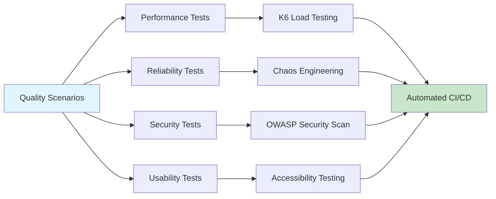

# Quality Scenarios

## Overview

Quality scenarios provide concrete examples of how BookWorm should behave under specific conditions. Each scenario follows the standard format: Source → Stimulus → Environment → Artifact → Response → Response Measure.

## Performance Scenarios

### P-1: Peak Shopping Load

- **Source**: 1000 concurrent users browsing the catalog
- **Stimulus**: Search and filter requests during peak hours (Black Friday)
- **Environment**: Production environment under normal operation
- **Artifact**: Catalog service and database
- **Response**: System maintains response times under 2 seconds
- **Response Measure**: 95th percentile response time < 2000ms, throughput > 500 RPS

### P-2: Book Search Performance

- **Source**: User searching for books with complex filters
- **Stimulus**: Search query with multiple filters and sorting
- **Environment**: Production with full catalog (100k+ books)
- **Artifact**: Search service and Elasticsearch index
- **Response**: Search results returned quickly with relevance ranking
- **Response Measure**: Search response time < 500ms for 99% of queries

### P-3: Real-time Chat Performance

- **Source**: 200 concurrent chat sessions
- **Stimulus**: Real-time message exchange between users and AI
- **Environment**: Production with SignalR hub scaling
- **Artifact**: Chat service and WebSocket connections
- **Response**: Messages delivered in real-time with AI responses
- **Response Measure**: Message delivery latency < 100ms, AI response < 3s

## Reliability Scenarios

### R-1: Database Failure Recovery

- **Source**: Primary PostgreSQL database becomes unavailable
- **Stimulus**: Database connection failure due to infrastructure issue
- **Environment**: Production during business hours
- **Artifact**: All services using PostgreSQL
- **Response**: System switches to read replicas, writes queued for retry
- **Response Measure**: Service restored within 5 minutes, zero data loss

### R-2: External Service Degradation

- **Source**: AI service (Ollama) experiencing high latency
- **Stimulus**: AI chat requests timing out or responding slowly
- **Environment**: Production during chat operations
- **Artifact**: Chat service AI integration
- **Response**: Circuit breaker activates, fallback responses provided
- **Response Measure**: System remains operational, users receive feedback < 5s

### R-3: Container Instance Failure

- **Source**: Container instance crashes due to memory leak
- **Stimulus**: Application exception causing container termination
- **Environment**: Azure Container Apps production environment
- **Artifact**: Any microservice instance
- **Response**: Health checks detect failure, new instance started automatically
- **Response Measure**: Service automatically recovers within 30 seconds

## Scalability Scenarios

### S-1: Traffic Surge Handling

- **Source**: 10x normal traffic load during promotional event
- **Stimulus**: Sudden increase in concurrent users (viral social media post)
- **Environment**: Production during promotional events
- **Artifact**: All services and Azure Container Apps infrastructure
- **Response**: Auto-scaling triggers, additional instances deployed
- **Response Measure**: System handles increased load without degradation < 2 minutes

### S-2: Geographic Expansion

- **Source**: New market launch requiring regional deployment
- **Stimulus**: Need for reduced latency in new geographic region
- **Environment**: Multi-region Azure deployment
- **Artifact**: Complete application stack and data replication
- **Response**: Services deployed to new region with data synchronization
- **Response Measure**: Regional latency < 100ms, data consistency maintained

### S-3: Storage Scaling

- **Source**: Catalog grows from 100k to 1M books
- **Stimulus**: Large volume of new book data and images
- **Environment**: Production with increasing data storage needs
- **Artifact**: Database and Azure Storage services
- **Response**: Storage automatically scales, indexing performance maintained
- **Response Measure**: Search performance remains < 500ms despite 10x data growth

## Security Scenarios

### SEC-1: Authentication Attack

- **Source**: Malicious user attempting brute force login
- **Stimulus**: Multiple failed authentication attempts from same IP
- **Environment**: Production API gateway and Keycloak
- **Artifact**: Authentication service and rate limiting
- **Response**: Account locked after 5 attempts, IP blocked, security team notified
- **Response Measure**: Attack mitigated within 1 minute, zero unauthorized access

### SEC-2: Data Breach Attempt

- **Source**: Unauthorized attempt to access customer data
- **Stimulus**: SQL injection or API manipulation attempt
- **Environment**: Production database and API services
- **Artifact**: Data access layer and API endpoints
- **Response**: Request blocked by input validation, attempt logged, alerts triggered
- **Response Measure**: Zero unauthorized data access, full audit trail maintained

### SEC-3: Token Compromise

- **Source**: JWT token potentially compromised
- **Stimulus**: Token usage from unusual geographic location
- **Environment**: Production API services
- **Artifact**: JWT validation and Keycloak token introspection
- **Response**: Token revoked, user session terminated, re-authentication required
- **Response Measure**: Compromise contained within 2 minutes, user notified

## Maintainability Scenarios

### M-1: New Feature Development

- **Source**: Development team adding new AI book recommendation feature
- **Stimulus**: Business requirement for personalized book recommendations
- **Environment**: Development and staging environments
- **Artifact**: Catalog service and new AI recommendation service
- **Response**: Feature implemented without affecting existing functionality
- **Response Measure**: Development completed in 2 weeks, zero regression tests failed

### M-2: Technology Migration

- **Source**: Need to migrate from PostgreSQL to newer version
- **Stimulus**: Performance optimization and security updates
- **Environment**: Production environment with zero downtime requirement
- **Artifact**: Data access layer and migration scripts
- **Response**: Migration completed with data consistency maintained
- **Response Measure**: Zero downtime, all data migrated successfully, performance improved

### M-3: Service Refactoring

- **Source**: Technical debt reduction in ordering service
- **Stimulus**: Code complexity metrics exceed threshold
- **Environment**: Development with automated testing
- **Artifact**: Ordering service business logic and API contracts
- **Response**: Service refactored while maintaining API compatibility
- **Response Measure**: Code complexity reduced 50%, test coverage maintained > 80%

## Usability Scenarios

### U-1: Mobile User Experience

- **Source**: User browsing catalog on mobile device
- **Stimulus**: Searching and filtering books on small screen
- **Environment**: Mobile browser with varying network conditions
- **Artifact**: Web application responsive design
- **Response**: Interface adapts to screen size, touch-friendly controls
- **Response Measure**: Task completion rate > 90%, user satisfaction score > 4/5

### U-2: Accessibility Compliance

- **Source**: Visually impaired user using screen reader
- **Stimulus**: Navigating catalog and placing order
- **Environment**: Desktop with assistive technology
- **Artifact**: Web application accessibility features
- **Response**: All functionality accessible via keyboard and screen reader
- **Response Measure**: WCAG 2.1 AA compliance verified, zero accessibility barriers

### U-3: Error Recovery

- **Source**: User encounters form submission error
- **Stimulus**: Network timeout during checkout process
- **Environment**: Web browser with intermittent connectivity
- **Artifact**: Error handling and user feedback systems
- **Response**: Clear error message displayed, user can retry or recover
- **Response Measure**: User completes task within 3 attempts, error recovery rate > 95%

## Testing Integration

### Scenario-Driven Testing

Each quality scenario maps to specific testing approaches:

### Continuous Validation

Quality scenarios are continuously validated through:

- **Automated Testing**: K6 performance tests, security scans
- **Production Monitoring**: Real-time metrics and alerting
- **User Feedback**: Analytics and experience surveys
- **Regular Reviews**: Quality scenario updates and improvements
