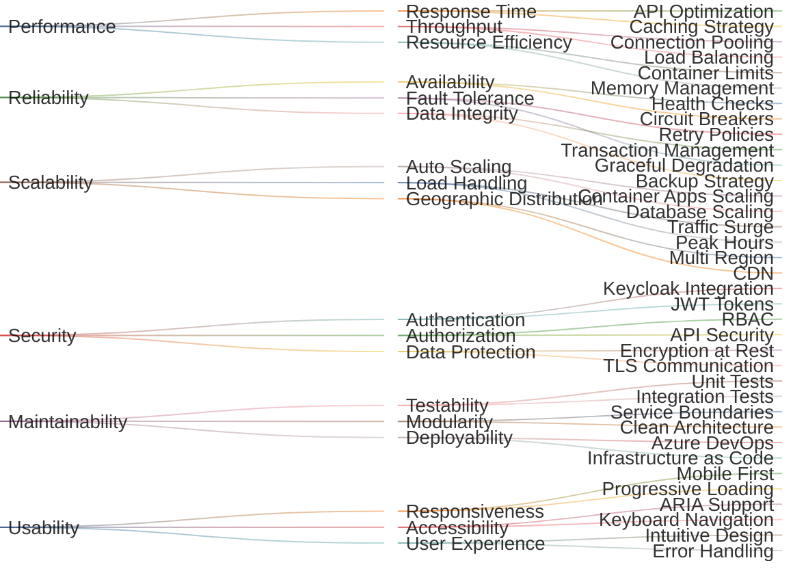
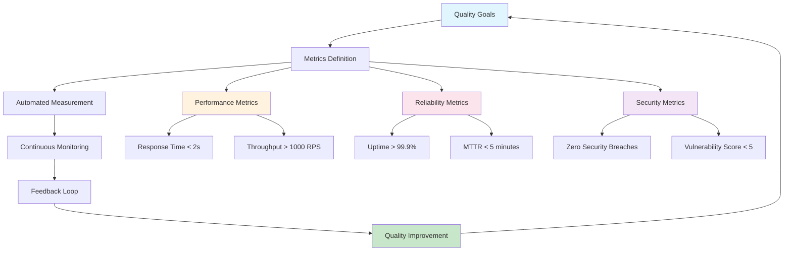

# Quality Tree

## Overview

The quality tree visualizes the hierarchical relationship between BookWorm's quality goals and their
specific implementation measures. This Sankey diagram shows the flow from high-level quality
attributes to concrete technical implementations.

## Quality Attribute Flow

## Quality Priority Matrix

| Quality Attribute   | Business Impact | Technical Complexity | Priority |
| ------------------- | --------------- | -------------------- | -------- |
| **Reliability**     | High            | Medium               | Critical |
| **Security**        | High            | High                 | Critical |
| **Performance**     | High            | Medium               | High     |
| **Scalability**     | Medium          | High                 | High     |
| **Maintainability** | Medium          | Medium               | Medium   |
| **Usability**       | Medium          | Low                  | Medium   |

## Implementation Mapping

### High Priority (Critical)

**Reliability → Availability**

- Health checks on all services
- Circuit breaker pattern implementation
- Automated failover mechanisms

**Security → Authentication & Authorization**

- Keycloak identity provider integration
- JWT token-based authentication
- Role-based access control (RBAC)

### Medium Priority (High)

**Performance → Response Time**

- Redis caching implementation
- Database query optimization
- CDN for static content delivery

**Scalability → Auto Scaling**

- Azure Container Apps horizontal scaling
- Database read replicas
- Load balancing across instances

### Standard Priority (Medium)

**Maintainability → Testability**

- 80% minimum code coverage
- Automated testing pipeline
- Architecture compliance tests

**Usability → Responsiveness**

- Mobile-first responsive design
- Progressive web application features
- Accessible user interface components

## Quality Measurement Framework

## Quality Assurance Strategy

### Automated Quality Gates

1. **Development Phase**
   - Unit test coverage > 80%
   - Code quality analysis (SonarQube)
   - Security vulnerability scanning

2. **Integration Phase**
   - API contract testing
   - Performance baseline validation
   - Cross-service integration tests

3. **Deployment Phase**
   - Infrastructure validation
   - Security configuration verification
   - Production readiness checks

4. **Production Phase**
   - Real-time monitoring and alerting
   - Performance trend analysis
   - User experience metrics tracking
