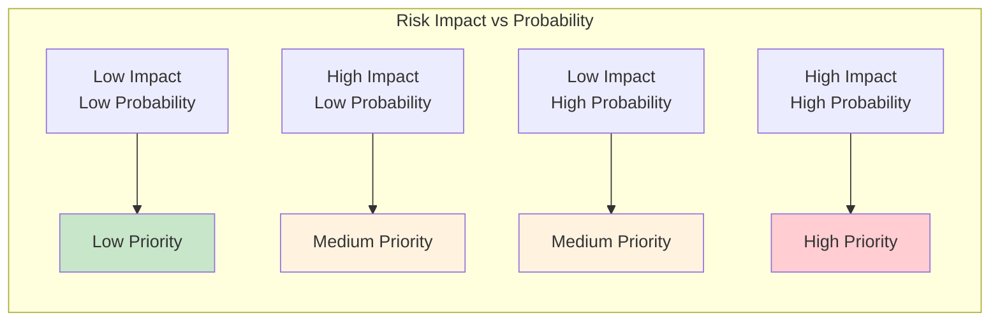
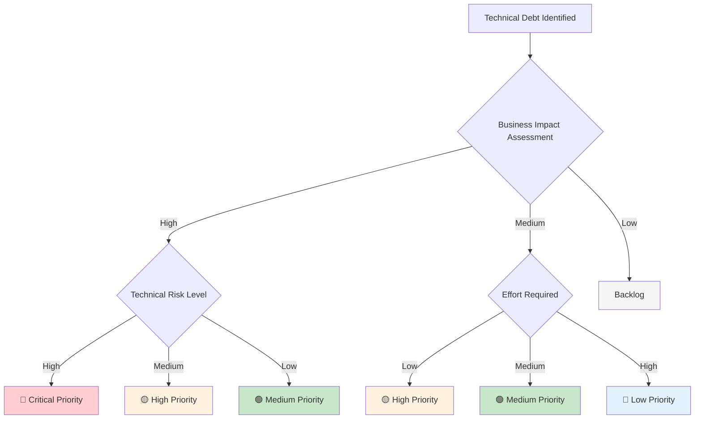

# Technical Risks and Debts

## Introduction

This section identifies and analyzes technical risks that could impact BookWorm's development, deployment, and operation. It also documents current technical debt and strategies for continuous risk management and debt reduction.

## Technical Risks

### High-Priority Risks

#### RISK-001: External AI Service Dependencies 🔴

- **Risk Level**: HIGH
- **Probability**: Medium (30-50%)
- **Impact**: High - AI features unavailable, degraded user experience

**Description**: BookWorm relies on external AI services (Nomic Embed Text, Gemma models) for enhanced search and chat functionality. Service outages, API changes, or rate limiting could significantly impact core features.

**Mitigation Strategies**:
- Implement circuit breaker pattern for AI service calls
- Develop fallback mechanisms (cached responses, basic text search)
- Create abstraction layer for easy AI provider switching
- Establish SLA monitoring and alerting
- Maintain local cache of common AI responses

**Contingency Plan**:
- Graceful degradation to traditional text search when AI unavailable
- Queue AI requests for processing during outages
- Pre-computed recommendation fallbacks

---

#### RISK-002: Database Performance Bottlenecks 🟡

- **Risk Level**: MEDIUM-HIGH
- **Probability**: High (60-80%)
- **Impact**: Medium - System slowdown, poor user experience

**Description**: As BookWorm scales, PostgreSQL databases may become performance bottlenecks, especially for catalog searches and complex queries with large datasets.

**Mitigation Strategies**:
- Implement read replicas for query distribution
- Database connection pooling and query optimization
- Comprehensive Redis caching strategy
- Continuous database performance monitoring
- Plan for database sharding if needed

**Contingency Plan**:
- Emergency horizontal scaling with read replicas
- Cache warming procedures for critical data
- Database query optimization sprints

---

#### RISK-003: Azure Container Apps Limitations 🟡

- **Risk Level**: MEDIUM
- **Probability**: Medium (40-60%)
- **Impact**: Medium - Deployment issues, scaling limitations

**Description**: Azure Container Apps platform limitations or service outages could affect deployment, scaling, and service discovery capabilities.

**Mitigation Strategies**:
- Infrastructure as Code (IaC) with azd and Bicep
- Automated health checks for all services
- Container image security scanning
- Rollback procedures for failed deployments
- Multi-region deployment capability

**Contingency Plan**:
- Manual service restart procedures
- Alternative cloud provider migration plan
- Emergency scaling protocols

### Medium-Priority Risks

#### RISK-004: Keycloak Single Point of Failure 🟡

- **Risk Level**: MEDIUM
- **Probability**: Low (20-30%)
- **Impact**: High - Complete authentication failure

**Description**: Keycloak as the central identity provider could become a single point of failure, preventing all user authentication and authorization.

**Mitigation Strategies**:
- Keycloak high availability setup with clustering
- Regular backup of realm configuration and user data
- Health monitoring and automated recovery
- PostgreSQL backend for Keycloak data persistence

**Contingency Plan**:
- Emergency Keycloak instance deployment
- Cached JWT validation for temporary operation
- Manual user verification procedures

---

#### RISK-005: SignalR Scaling Challenges 🟡

- **Risk Level**: MEDIUM
- **Probability**: Medium (30-50%)
- **Impact**: Medium - Chat functionality degradation

**Description**: SignalR with custom Redis backplane may face scaling challenges under high concurrent chat loads, affecting real-time communication.

**Mitigation Strategies**:
- Custom Redis backplane optimization
- Connection monitoring and management
- Load testing for concurrent chat sessions
- Graceful connection handling and reconnection logic

**Contingency Plan**:
- Connection limit enforcement
- Fallback to polling-based communication
- Chat service horizontal scaling

### Low-Priority Risks

#### RISK-006: Technology Stack Evolution 🟢

- **Risk Level**: LOW
- **Probability**: High (70-90%)
- **Impact**: Low - Gradual obsolescence

**Description**: Rapid evolution of .NET Aspire, Azure services, and related technologies could lead to technical debt accumulation over time.

**Mitigation Strategies**:
- Regular technology stack updates and assessments
- Modular architecture for easy component replacement
- Continuous team training and knowledge updates
- Technology radar for emerging alternatives

**Contingency Plan**:
- Gradual migration strategies for major technology changes
- Legacy system support procedures

## Technical Debt Inventory

### Current Technical Debt

#### DEBT-001: Missing Integration Tests 🟡

- **Severity**: Medium
- **Effort to Fix**: 3-4 weeks
- **Interest Rate**: Low - Gradual increase in debugging time

**Description**: While unit tests provide good coverage, comprehensive integration tests between microservices are missing, making cross-service issue detection difficult.

**Impact**:
- Potential integration bugs in production
- Longer debugging time for cross-service issues
- Reduced deployment confidence

**Remediation Plan**:
1. Define integration test strategy using TestContainers
2. Implement contract testing between services
3. Create end-to-end test scenarios for critical user journeys
4. Integrate testing into CI/CD pipeline with quality gates

---

#### DEBT-002: Advanced Observability Gaps 🟡

- **Severity**: Medium
- **Effort to Fix**: 2-3 weeks
- **Interest Rate**: Medium - Increasing troubleshooting complexity

**Description**: Current monitoring setup lacks advanced features like distributed tracing correlation, custom business metrics dashboards, and proactive alerting.

**Impact**:
- Difficult production issue troubleshooting
- Limited system performance visibility
- Reactive rather than proactive monitoring

**Remediation Plan**:
1. Implement comprehensive OpenTelemetry distributed tracing
2. Create custom business metrics dashboards in Azure Monitor
3. Set up proactive alerting rules with escalation procedures
4. Develop runbook procedures for common operational issues

---

#### DEBT-003: Security Hardening Requirements 🔴

- **Severity**: High
- **Effort to Fix**: 4-6 weeks
- **Interest Rate**: High - Security vulnerability exposure

**Description**: Security implementation is functional but lacks advanced features like comprehensive rate limiting, input validation, and detailed audit logging.

**Impact**:
- Vulnerability to various attack vectors (DDoS, injection attacks)
- Compliance gaps with security standards
- Limited forensic capabilities for security incidents

**Remediation Plan**:
1. Implement comprehensive input validation and sanitization
2. Add rate limiting and DDoS protection at API gateway level
3. Enhance audit logging with security event correlation
4. Conduct automated security scanning in CI/CD pipeline
5. Perform regular penetration testing and vulnerability assessments

---

#### DEBT-004: Documentation and Runbooks 🟡

- **Severity**: Medium
- **Effort to Fix**: 2-3 weeks
- **Interest Rate**: Low - Slower team onboarding

**Description**: While API documentation exists, operational runbooks, troubleshooting guides, and deployment procedures need enhancement for production operations.

**Impact**:
- Slower onboarding for new team members
- Increased incident resolution time
- Knowledge silos and single points of expertise

**Remediation Plan**:
1. Create comprehensive operational runbooks for each service
2. Document troubleshooting procedures with decision trees
3. Enhance deployment and scaling guides with examples
4. Implement documentation as code with automated updates

## Risk Management Strategy

### Risk Assessment Matrix

### Monitoring and Alerting

| Risk Category | Key Metrics | Alert Thresholds | Response Actions |
|---------------|-------------|------------------|------------------|
| **External Dependencies** | AI service availability, response times | Availability < 99%, Response > 5s | Circuit breaker activation, fallback modes |
| **Database Performance** | Query execution time, connection pool | Query time > 100ms, Pool exhaustion | Query optimization, scaling triggers |
| **Authentication** | Failed login attempts, token validation | > 10 failures/minute, Validation errors | Account lockout, security alerts |
| **Container Health** | Service availability, resource usage | Unhealthy containers, CPU > 80% | Auto-scaling, health check failures |

### Incident Response Procedures

#### Severity Classification

- **P1 (Critical)**: Complete service outage affecting all users
- **P2 (High)**: Major feature unavailable or severe performance degradation
- **P3 (Medium)**: Minor feature issues or localized performance problems
- **P4 (Low)**: Cosmetic issues or minor inconveniences

#### Response Timeline

| Severity | Response Time | Resolution Target | Escalation |
|----------|---------------|-------------------|------------|
| **P1** | 15 minutes | 1 hour | Immediate CTO notification |
| **P2** | 1 hour | 4 hours | Technical lead notification |
| **P3** | 4 hours | 24 hours | Team lead notification |
| **P4** | Next business day | 1 week | Standard process |

### Technical Debt Management

#### Debt Prioritization Framework

#### Debt Reduction Strategy

**Sprint Integration**:
- Allocate 20% of each sprint to technical debt reduction
- Prioritize high-impact, low-effort debt items first
- Track debt reduction metrics and progress over time

**Quality Gates**:
- No new high-severity debt introduction without explicit approval
- Monthly technical debt review sessions with stakeholders
- Quarterly architecture review meetings for major decisions

**Automation**:
- Automated code quality analysis with SonarQube
- Security vulnerability scanning in CI/CD pipeline
- Performance regression testing with quality thresholds

## Continuous Improvement

### Risk Management Maturity

- **Current State**: Reactive risk management with basic monitoring
- **Target State**: Proactive risk management with predictive analytics
- **Improvement Plan**: Quarterly maturity assessments and capability enhancements

### Learning from Incidents

1. **Post-Mortem Process**: Blameless post-mortems for all P1/P2 incidents
2. **Root Cause Analysis**: Systematic analysis using Five Whys methodology
3. **Action Items**: Concrete improvement actions with owners and timelines
4. **Knowledge Sharing**: Regular sharing of lessons learned across teams

### Technology Evolution Strategy

- **Technology Radar**: Quarterly assessment of emerging technologies
- **Proof of Concepts**: Controlled evaluation of new technologies
- **Migration Planning**: Systematic approach to technology updates
- **Training Investment**: Continuous team skill development and knowledge updates

## Related Documentation

- [Quality Requirements](./quality-requirements/overview): Quality scenarios and requirements
- [Architecture Decisions](./architecture-decisions/overview): ADRs documenting key technical decisions
- [Deployment View](./deployment-view/overview): Infrastructure and deployment considerations
