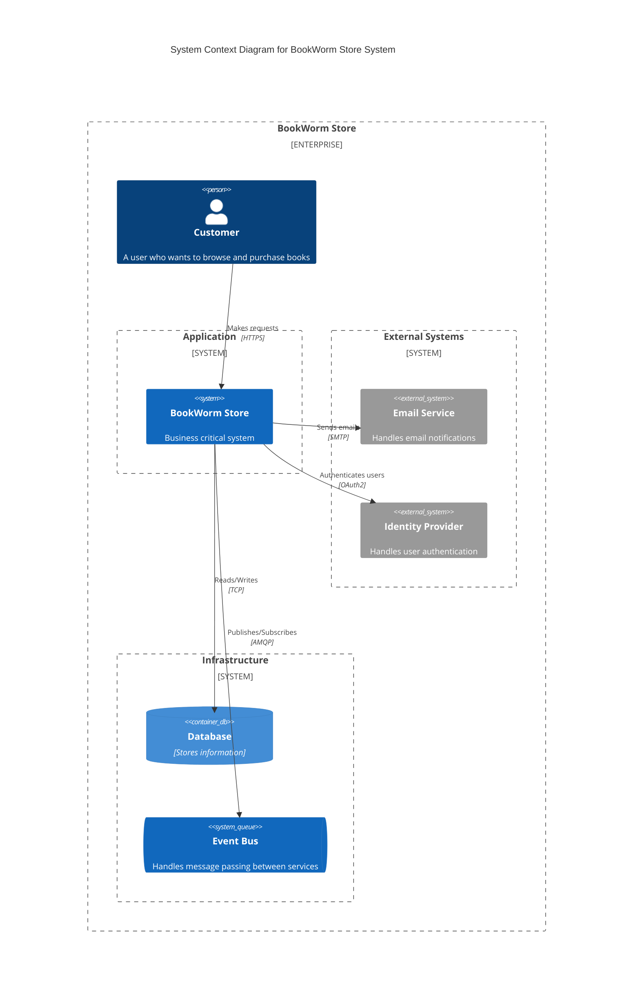
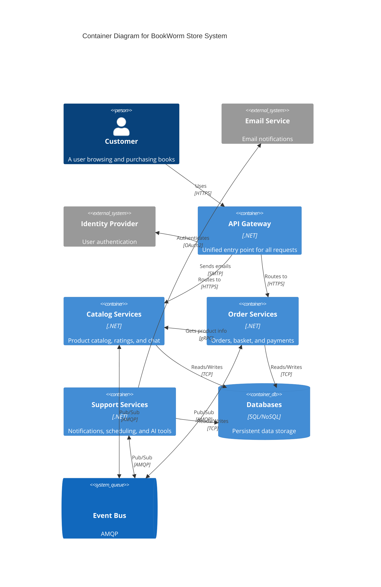

<Tiles>
	<Tile
		icon="UserGroupIcon"
		href="/docs/users/nhanxnguyen"
		title="Contact the author"
		description="Any questions? Feel free to contact the owners"
	/>
	<Tile
		icon="RectangleGroupIcon"
		href={`/visualiser/domains/${frontmatter.id}/${frontmatter.version}`}
		title="Domain Architecture"
		description="Explore our domain structure and service interactions"
	/>
</Tiles>

## Overview

The Store domain represents the heart of BookWorm's business operations, orchestrating all aspects of the online bookstore experience from product discovery to order fulfillment.

## 🎯 Domain Vision

To create a seamless, scalable, and maintainable e-commerce platform that delights book lovers while demonstrating modern software architecture best practices.

## 🏗️ Strategic Design

### Domain Boundaries

The Store domain is strategically divided into two subdomains based on our [microservices architecture](https://foxminchan.github.io/BookWorm/architecture-decisions/adr-001-microservices-architecture):

1. **[Catalog Subdomain](/docs/domains/catalog/1.0.0)** - Core subdomain
   - Product information management
   - Search and discovery
   - Ratings and reviews
   - AI-powered recommendations

2. **[Orders Subdomain](/docs/domains/orders/1.0.0)** - Core subdomain
   - Shopping cart management
   - Order processing workflow
   - Payment orchestration
   - Customer notifications

### Ubiquitous Language

| Term        | Definition                                               |
| ----------- | -------------------------------------------------------- |
| **Book**    | A physical or digital publication available for purchase |
| **Basket**  | A temporary collection of items selected by a customer   |
| **Order**   | A confirmed purchase request with payment information    |
| **Catalog** | The complete inventory of available books                |
| **Rating**  | Customer feedback including stars and written reviews    |
| **Saga**    | A distributed transaction pattern for order processing   |

## 💼 Event Storming

We conducted an [event storming](https://www.eventstorming.com/) session for the Store domain to understand its complexities and subdomain interactions. This session helped us map key events, commands, and aggregates, aligning our technical implementation with business needs for robust functionality.

Our implementation follows an [event-driven architecture with CQRS pattern](https://foxminchan.github.io/BookWorm/architecture-decisions/adr-002-event-driven-cqrs) to ensure scalability and loose coupling between services.

<Miro boardId="uXjVIG4lIr0=/" moveToWidget="3458764623724644744" edit={false} />

## 📊 High-level architecture

To effectively visualize and understand the architecture of the BookWorm system, we will employ the [C4 model](https://c4model.com/). This model allows us to represent the system at various levels of abstraction, providing a comprehensive view of its structure and interactions.

Our architecture follows several key architectural decisions:

- [Microservices Architecture](https://foxminchan.github.io/BookWorm/architecture-decisions/adr-018-k6-performance-testing) for service boundaries
- [Aspire for Cloud-Native Development](https://foxminchan.github.io/BookWorm/architecture-decisions/adr-003-aspire-cloud-native) for orchestration
- [Container-First Deployment Strategy](https://foxminchan.github.io/BookWorm/architecture-decisions/adr-007-aca-deployment) for consistency
- [API Gateway Pattern](https://foxminchan.github.io/BookWorm/architecture-decisions/adr-008-api-gateway) for unified access

### System Context Diagram

### Container Diagram

The data storage strategy is detailed in our [PostgreSQL database decision](https://foxminchan.github.io/BookWorm/architecture-decisions/adr-004-postgresql-database), with event-driven communication patterns outlined in our [Event-Driven CQRS approach](https://foxminchan.github.io/BookWorm/architecture-decisions/adr-002-event-driven-cqrs).

AI-powered features are implemented following our [AI Integration Strategy](https://foxminchan.github.io/BookWorm/architecture-decisions/adr-009-ai-integration), while real-time communication uses [SignalR](https://foxminchan.github.io/BookWorm/architecture-decisions/adr-006-signalr-realtime).

## 🔄 Interactive Architecture Diagram

The following diagram provides an interactive view of the architecture of the BookWorm system. You can explore the components, their relationships, and the flow of data between them.

<DrawIO url="https://viewer.diagrams.net/?tags=%7B%7D&lightbox=1&target=blank&highlight=0000ff&layers=1&nav=1&title=BookWorm&dark=0#Uhttps%3A%2F%2Fdrive.google.com%2Fuc%3Fid%3D14OKRv9-iGiyCvOu4qwSnh1Mk6e5f_XWg%26export%3Ddownload" />

## Current Production Architecture

Below is the interactive event-driven architecture diagram for the BookWorm Store system.

<NodeGraph mode="full" />

## 📈 Domain Metrics

### Service Level Objectives (SLOs)

| Metric                 | Target  | Description                   |
| ---------------------- | ------- | ----------------------------- |
| **Availability**       | 99.9%   | Uptime for critical services  |
| **Response Time**      | < 200ms | P95 latency for API calls     |
| **Order Success Rate** | > 98%   | Successful order completions  |
| **Event Processing**   | < 1s    | Time to process domain events |

### Key Performance Indicators (KPIs)

- **Orders per Hour**: Average throughput capacity
- **Catalog Search Speed**: Time to return search results
- **Cart Abandonment Rate**: Percentage of uncompleted orders
- **Service Health Score**: Composite reliability metric

## 📈 Domain Metrics

### Service Level Objectives (SLOs)

| Metric                 | Target  | Description                   |
| ---------------------- | ------- | ----------------------------- |
| **Availability**       | 99.9%   | Uptime for critical services  |
| **Response Time**      | < 200ms | P95 latency for API calls     |
| **Order Success Rate** | > 98%   | Successful order completions  |
| **Event Processing**   | < 1s    | Time to process domain events |

### Key Performance Indicators (KPIs)

- **Orders per Hour**: Average throughput capacity
- **Catalog Search Speed**: Time to return search results
- **Cart Abandonment Rate**: Percentage of uncompleted orders
- **Service Health Score**: Composite reliability metric

## 🛡️ Security & Compliance

### Security Measures

- **Authentication**: JWT-based user authentication via [Keycloak Identity Management](https://foxminchan.github.io/BookWorm/architecture-decisions/adr-005-keycloak-identity)
- **Authorization**: Role-based access control (RBAC)
- **Encryption**: TLS 1.3 for all communications
- **Data Protection**: PCI DSS compliance for payments

### Audit & Compliance

- Complete audit trail via event sourcing
- GDPR compliance for user data
- Regular security assessments
- Automated compliance checking

## 🔍 Observability

Our observability strategy is built on modern cloud-native principles, following our [Aspire cloud-native development approach](https://foxminchan.github.io/BookWorm/architecture-decisions/adr-003-aspire-cloud-native) and [container-first deployment strategy](https://foxminchan.github.io/BookWorm/architecture-decisions/adr-007-aca-deployment).

### Three Pillars

1. **Metrics**: Prometheus + Grafana dashboards
2. **Logging**: Structured logging with Serilog
3. **Tracing**: Distributed tracing with OpenTelemetry

### Monitoring Dashboards

- Service health and availability
- Business metrics and KPIs
- Performance bottleneck detection
- Error rate tracking
