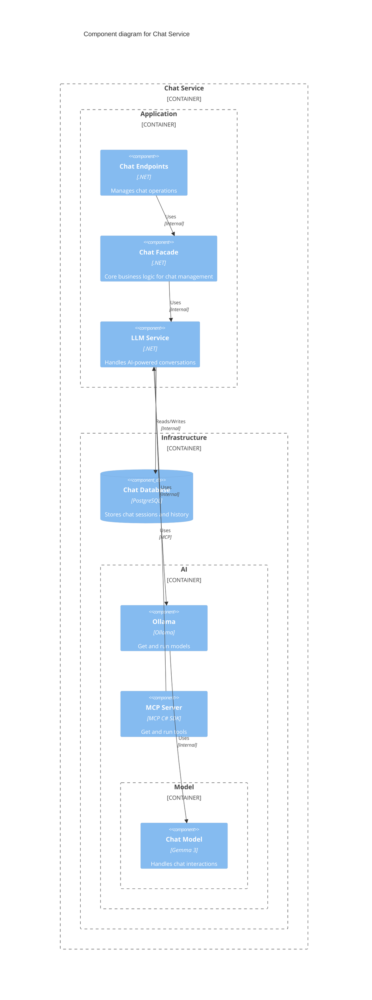

<Tiles>
  <Tile
    icon="DocumentIcon"
    href={`/docs/services/${frontmatter.id}/${frontmatter.version}/changelog`}
    title="View the changelog"
    description="Want to know the history of this service? View the change logs"
  />
  <Tile
    icon="UserGroupIcon"
    href="/docs/users/nhanxnguyen"
    title="Contact the author"
    description="Any questions? Feel free to contact the owners"
  />
  <Tile
    icon="BoltIcon"
    href={`/visualiser/services/${frontmatter.id}/${frontmatter.version}`}
    title={`Receives ${frontmatter.receives.length} messages`}
    description="This service receives messages from other services"
  />
</Tiles>

## Overview

The Chat Service is a specialized bounded context within the BookWorm ecosystem that implements natural language processing capabilities to provide interactive conversations with users, following our [AI Integration Strategy](https://foxminchan.github.io/BookWorm/architecture-decisions/adr-009-ai-integration). This service is responsible for:

- Processing user chat prompts and generating contextually relevant responses
- Maintaining chat session state and history
- Providing book recommendations and information through conversational interfaces
- Leveraging large language models (LLMs) to understand and respond to user queries
- Integrating with the catalog service to access book metadata and information

The domain model follows strategic DDD patterns with clearly defined aggregates, entities, and value objects. The Chat domain enforces business rules such as prompt validation, session management, and response generation.

### Key Capabilities

- **Conversational AI**: Natural language understanding and generation using state-of-the-art LLMs
- **Context Management**: Maintains conversation history and context for coherent multi-turn dialogues
- **Tool Integration**: Leverages Model Context Protocol (MCP) for dynamic tool usage
- **Streaming Responses**: Real-time streaming of AI responses using [SignalR](https://foxminchan.github.io/BookWorm/architecture-decisions/adr-006-signalr-realtime) for better user experience

## Component Diagram

## Core Features

| Feature               | Description                                                                                    |
| --------------------- | ---------------------------------------------------------------------------------------------- |
| **Create Chat**       | Initialize a new chat session with a prompt and receive a unique identifier.                   |
| **Cancel Chat**       | Terminate an existing chat session.                                                            |
| **Conversational AI** | Engage with an AI assistant that can answer questions about books and provide recommendations. |
| **Context Awareness** | Maintain conversation context across multiple interactions within a session.                   |

## Architecture diagram

<NodeGraph />

## Infrastructure

The Chat Service is deployed on Microsoft Azure and leverages various Azure services for scalability, reliability, and performance. The infrastructure components include:

```mermaid
architecture-beta
    group api(logos:microsoft-azure)[API]

    service server(logos:docker-icon)[Server] in api
    service llm(server)[LLM] in api

    server:L -- R:llm
    llm:L -- R:server
```

## Security Considerations

- **Authentication**: JWT-based authentication with user context isolation
- **Rate Limiting**: Per-user request throttling to prevent abuse
- **Content Filtering**: Automated moderation of inappropriate content
- **Data Privacy**: Conversation history encrypted at rest
- **Prompt Injection Protection**: Input sanitization and validation
- **API Key Management**: Secure storage of LLM API credentials in Azure Key Vault

## Monitoring and Observability

### Key Metrics

- **Response Latency**: Time to first token and total generation time
- **Token Usage**: Track token consumption per user and model
- **Conversation Quality**: User satisfaction and engagement metrics
- **Error Rates**: Failed generations and timeout occurrences
- **Tool Usage**: Frequency and success rate of MCP tool calls
