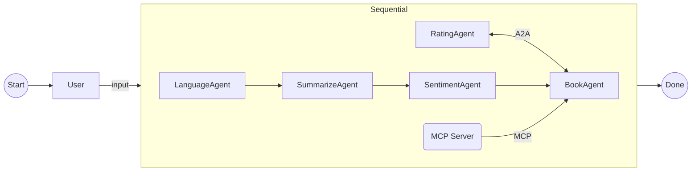

## Overview

The Chat Stream service provides a real-time WebSocket connection for users to interact with the BookWorm platform. It allows users to send and receive messages in real-time, enabling dynamic conversations and interactions with the system.

## Implementation Details

The Chat Stream service is built on a microservices architecture, utilizing various agents to process user messages and generate responses.



## Architecture

<NodeGraph />

## WebSocket `wss://api.bookworm.com/api/v1/chats/stream`

The Chat Stream service uses WebSocket for real-time communication. Users can connect to the WebSocket endpoint to send and receive messages.

### Example Usage

```js title="chat-stream.js"
const connection = new signalR.HubConnectionBuilder()
	.withUrl("wss://api.bookworm.com/api/v1/chats/stream", {
    accessTokenFactory: ()
    	return "YOUR_ACCESS_TOKEN";
	})
	.withAutomaticReconnect()
	.build();

await connection.start();

connection.on("ReceiveMessage", (message) => {
	console.log("Received message:", message);
});

connection.onclose(() => {
	console.log("Connection closed");
});

connection.onreconnected(() => {
	console.log("Reconnected to the chat stream");
});
```
