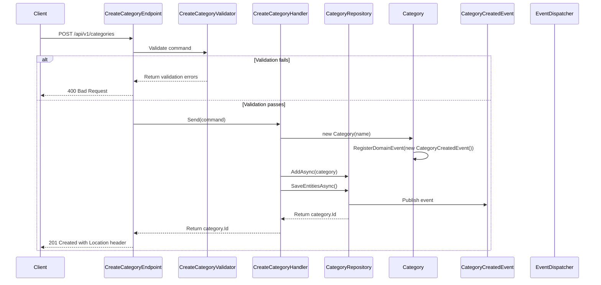

## Overview

The Create Category endpoint allows administrators to add new categories to the Catalog domain. This operation follows Domain-Driven Design principles by:

1. Validating the category entity against domain rules and invariants
2. Creating a new aggregate root in the Categories collection
3. Publishing a `CategoryCreatedEvent` that other bounded contexts can subscribe to

This endpoint represents the command side of our CQRS pattern implementation. The category entity becomes immediately available for queries after successful creation.

:::note
Category creation requires proper authentication with Admin privileges, as indicated by the badge.
:::

## Implementation Details

The Create Category operation is implemented using the CQRS pattern with a dedicated command handler:



### Key Components

1. **CreateCategoryCommand**: Implements `ICommand<Guid>` to create a new category
2. **CreateCategoryHandler**: Processes the command using repository pattern
3. **CreateCategoryValidator**: Validates the command parameters using FluentValidation
4. **CreateCategoryEndpoint**: Maps the HTTP POST request to the command handler
5. **Category Entity**: Domain entity that encapsulates category data and business rules
6. **CategoryCreatedEvent**: Domain event raised when category is created

### Technical Implementation

The implementation uses several patterns and techniques:

1. **CQRS**: Separates the write model (command) from the read model (query)
2. **Repository Pattern**: The `ICategoryRepository` abstracts the data access layer
3. **Domain-Driven Design**: Uses domain entities and events to encapsulate business logic
4. **Minimal API**: Uses .NET's minimal API approach with endpoint mapping
5. **FluentValidation**: Validates the command parameters

The command execution flow:

1. The endpoint receives the HTTP POST request with the category data
2. The validator ensures all business rules are satisfied
3. The command handler creates a new Category entity
4. The entity registers a domain event
5. The repository persists the entity and publishes domain events
6. The endpoint returns a 201 Created response with the category ID and location header

### Security

- This endpoint requires admin authorization through a policy-based security check
- Only authenticated users with admin privileges can access this endpoint

### Validation Rules

- Category name is required and cannot be empty
- Category name has a maximum length defined by `DataSchemaLength.Medium`
- Validation is handled by FluentValidation

### Technical Implementation

- Uses CQRS pattern with Mediator pattern (`ISender`)
- Returns a `201 Created` response with the new category's GUID
- Location header includes a versioned URL to the newly created resource
- Implements optimistic concurrency through Unit of Work pattern

## Architecture

<NodeGraph />

## POST `(/api/v1/categories)`

### Request Body

<SchemaViewer file="request-body.json" maxHeight="500" id="request-body" />

### Example Usage

```bash
curl -X POST https://api.bookworm.com/api/v1/categories \
  -H "Authorization: Bearer <admin-token>" \
  -H "Content-Type: application/json" \
  -d '{
    "name": "New Category"
  }'
```

### Responses

#### <span className="text-green-500">200 Ok</span>

- Returns the newly created category's GUID

#### <span className="text-orange-500">400 Bad Request</span>

Returned when validation fails (e.g., empty name or name too long)

<SchemaViewer file="response-400.json" maxHeight="500" id="response-400" />

#### <span className="text-orange-500">409 Conflict</span>

Returned when a category with the same name already exists

#### <span className="text-red-500">401 Unauthorized</span>

Returned when the request lacks valid authentication credentials

#### <span className="text-red-500">403 Forbidden</span>

Returned when the authenticated user lacks admin privileges
