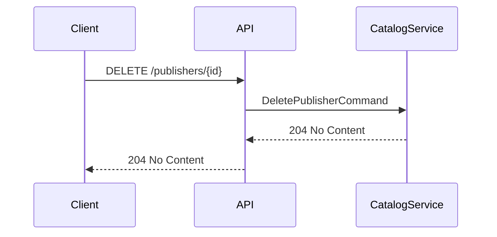

## Overview

This endpoint allows for the removal of a Publisher entity from the Catalog domain. Following Domain-Driven Design principles, this operation:

- Respects the Publisher aggregate boundary
- Enforces domain invariants and business rules
- Validates that the publisher can be safely removed without violating referential integrity
- Returns proper error responses if the operation violates any domain constraints
- Requires administrative privileges to execute

The implementation uses CQRS (Command Query Responsibility Segregation) pattern with a `DeletePublisherCommand` processed by MediatR, maintaining separation between the command interface and the domain logic.

:::warning
This endpoint requires administrative privileges. Only users with the Admin policy can perform this operation.
:::

:::note[Important Validation Rules]
1. Publishers with associated books cannot be deleted until those relationships are removed first
2. The publisher ID must exist in the system
3. The publisher ID must be a valid GUID format
:::

## Architecture

<NodeGraph />

### Sequence Diagram



## Example Usage

```bash
curl -X DELETE "https://api.bookworm.com/api/v1/publishers/123e4567-e89b-12d3-a456-426614174000" \
		-H "Authorization: Bearer YOUR_ACCESS_TOKEN"
```

### Responses

#### <span className="text-green-500">204 No Content</span>

Successful deletion of the author.

#### <span className="text-red-500">404 Not Found</span>

Returned when the specified author ID does not exist in the system.

#### <span className="text-red-500">401 Unauthorized</span>

Returned when the user is not authenticated.

#### <span className="text-red-500">403 Forbidden</span>

Returned when the authenticated user does not have administrative privileges.
