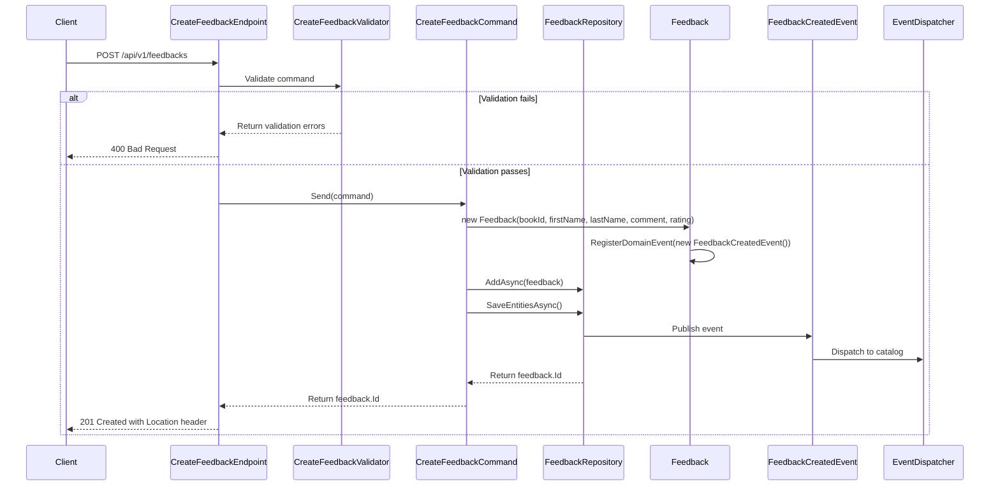

## Overview

The `Create Feedback` endpoint allows users to submit reviews and ratings for books within the BookWorm ecosystem. This operation is part of the Rating domain's bounded context, responsible for managing user feedback and book evaluations.

## Implementation Details

The Create Feedback operation is implemented using the CQRS pattern with a dedicated command handler:



### Key Components

1. **CreateFeedbackCommand**: Implements `ICommand<Guid>` to create a new feedback
2. **CreateFeedbackHandler**: Processes the command using repository pattern
3. **CreateFeedbackValidator**: Validates the command parameters using FluentValidation
4. **CreateFeedbackEndpoint**: Maps the HTTP POST request to the command handler
5. **Feedback Entity**: Domain entity that encapsulates feedback data and business rules
6. **FeedbackCreatedEvent**: Domain event raised when feedback is created

## Domain Context

In our domain model, `Feedback` represents a core aggregate that encapsulates:

- Unique identifier (Id)
- Book reference (BookId)
- Customer information (FirstName, LastName)
- Review content (Comment)
- Rating score (numerical evaluation on a scale of 0-5)

The Create Feedback command is a write operation that:

1. Validates the input parameters
2. Creates a new Feedback entity
3. Registers a FeedbackCreatedEvent domain event
4. Persists the entity to the repository
5. Returns the unique identifier of the created feedback

## Business Rules

- BookId must be provided and valid
- FirstName and LastName are required
- Comment is optional but has a maximum length constraint
- Rating must be between 0 and 5 (inclusive)
- The operation raises a domain event that can trigger side effects in other bounded contexts

## Technical Implementation

The implementation uses several patterns and techniques:

1. **CQRS**: Separates the write model (command) from the read model (query)
2. **Repository Pattern**: The `IFeedbackRepository` abstracts the data access layer
3. **Domain-Driven Design**: Uses domain entities and events to encapsulate business logic
4. **Minimal API**: Uses .NET's minimal API approach with endpoint mapping
5. **FluentValidation**: Validates the command parameters

The command execution flow:

1. The endpoint receives the HTTP POST request with the feedback data
2. The validator ensures all business rules are satisfied
3. The command handler creates a new Feedback entity
4. The entity registers a domain event
5. The repository persists the entity and publishes domain events
6. The endpoint returns a 201 Created response with the feedback ID and location header

## Integration Points

This endpoint interacts with other bounded contexts through domain events:

- The Catalog service receives the FeedbackCreatedEvent to update book ratings
- The UI components use this endpoint to submit user reviews
- The Recommendation engine may analyze new feedback to update recommendations

## Request Body

```json title="Payload Example"
{
  "bookId": "3fa85f64-5717-4562-b3fc-2c963f66afa6",
  "firstName": "John",
  "lastName": "Doe",
  "comment": "Great book, highly recommended!",
  "rating": 5
}
```

## Example Usage

```bash
curl -X POST "https://api.bookworm.com/api/v1/feedbacks" \
    -H "Content-Type: application/json" \
    -d '{
        "bookId": "3fa85f64-5717-4562-b3fc-2c963f66afa6",
        "firstName": "John",
        "lastName": "Doe",
        "comment": "Great book, highly recommended!",
        "rating": 5
    }'
```

## Architecture

<NodeGraph />

## POST `(/api/v1/feedbacks)`

### Request Body

| Field     | Type   | Required | Description                               |
| --------- | ------ | -------- | ----------------------------------------- |
| bookId    | Guid   | Yes      | The ID of the book to create feedback for |
| firstName | string | Yes      | The first name of the reviewer            |
| lastName  | string | Yes      | The last name of the reviewer             |
| comment   | string | No       | The feedback comment text                 |
| rating    | int    | Yes      | The rating score (0-5)                    |

<SchemaViewer file="request-body.json" maxHeight="500" id="request-body" />

### Validation Rules

- bookId must not be empty
- firstName must not be empty
- lastName must not be empty
- comment must not exceed the maximum length
- rating must be between 0 and 5 (inclusive)

### Responses

#### <span className="text-green-500">200 Ok</span>

- Returns the ID of the newly created feedback.

#### <span className="text-orange-500">400 Bad Request</span>

Returned when validation fails for the provided parameters.
